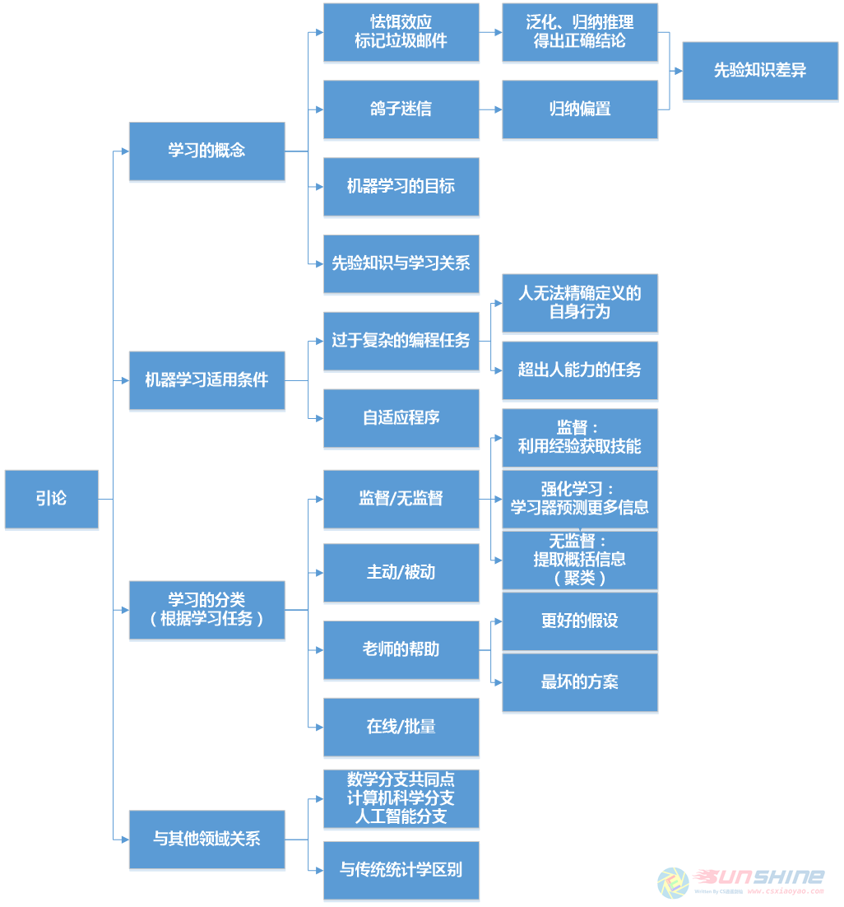

# 深入理解机器学习：从原理到算法 学习笔记-第1周 01引论

> Write By [CS逍遥剑仙](http://home.ustc.edu.cn/~cssjf/)   
> 我的主页: [csxiaoyao.com](https://csxiaoyao.com)   
> GitHub: [github.com/csxiaoyaojianxian](https://github.com/csxiaoyaojianxian)   
> Email: [sunjianfeng@csxiaoyao.com](mailto:sunjianfeng@csxiaoyao.com)  
> QQ: [1724338257](http://wpa.qq.com/msgrd?uin=1724338257&site=qq&menu=yes)

机器学习就是自动学习，是计算机程序将经验和训练数据转化为知识的过程

## 1.1 什么是学习
&emsp;&emsp;以老鼠怯饵效应为例，老鼠根据过往的经验预测所食的食物未来对自己的影响，这就是一种学习机制。再如垃圾邮件过滤机制也是如此，虽然垃圾邮件的判别可以通过已存在的邮件库进行搜索匹配，但是这种“通过记忆进行学习”的过程缺乏标记未见邮件的能力。一个成功的学习器应该能够从个别例子进行泛化，也就是所谓的“归纳推理”。
&emsp;&emsp;但是，归纳推理也可能会推导出错误的结论。例如“鸽子迷信”实验，实验者人为加强了食物送达和鸽子进食行为的联系，这就是所谓的形成迷信的学习机制。这两个例子的区别就在于先验知识的引入使学习机制产生偏差，也成为“归纳偏置”。
&emsp;&emsp;机器学习理论的核心目标就是发现定义明确、清晰的规则，防止程序得出无意义或无用的结论。
## 1.2 什么时候需要机器学习
&emsp;&emsp;当编程任务过于复杂时，人类对自身如何完成任务的内省机制还不够精细，机器学习能够帮助人“从经验中学习”，从而达到较为满意的结果；当出现超出人类能力的任务，例如庞大天文、医疗数据，人类很难直接从中发现隐含的、有价值的信息，机器学习为这些领域开辟了新的视野；编程自身有其刻板性，程式一成不变不利于适应环境，机器学习能够将程序自适应环境，与环境互动。
## 1.3 学习的四种分类
**监督与无监督**：以垃圾邮件检测为例，学习是一种利用经验获得技能的过程，监督学习的训练数据和测试数据不同，训练数据包含了显著信息（是/否为垃圾邮件），从而来预测测试数据中缺失的这部分显著信息；无监督学习的训练数据和测试数据并没有区别，其目标在于提取概括信息，例如“聚类”（相似数据归为一类）。还有一种情况，训练数据比测试数据明显包含更多信息，要求预测更多内容，例如判断棋牌类比赛过程中黑白棋谁更有利，也称作“强化学习”。

**主动学习器与被动学习器**：根据角色划分，主动学习器就是在通过提问或实验方式与环境交互；被动学习器，以垃圾邮件过滤为例，则是等待用户标记是否为垃圾邮件。

**老师的帮助**：正反面考虑问题

**在线与批量**：在线响应或是在对大量训练数据处理后得出结论。
这本书的重点是对被动的、有监督的、统计批量学习，同时对在线学习和无监督批量学习（聚类）做了简单的介绍。
## 1.4 与其他领域的关系
&emsp;&emsp;机器学习的任务是处理一些背景下的随机生成样本，得出与背景相符的结论，通过自动化技术发现被人类忽略的、有意义的模式或假设。
&emsp;&emsp;与统计学不同的是，算法作为机器学习的核心，更关注算法的实用性和计算效率，统计学更加关心算法的渐近性。机器学习常考虑“非参数”背景，对数据分布的性质假设尽可能少，学习算法自己找出最接近数据生成过程的模型。

