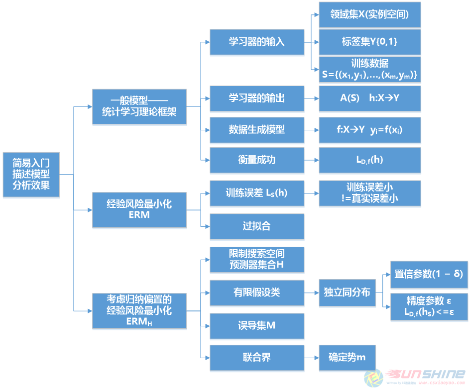
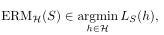
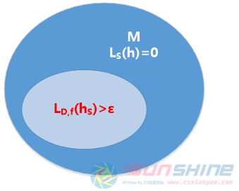

# 深入理解机器学习：从原理到算法 学习笔记-第1周 02简易入门

> Write By [CS逍遥剑仙](http://home.ustc.edu.cn/~cssjf/)   
> 我的主页: [csxiaoyao.com](https://csxiaoyao.com)   
> GitHub: [github.com/csxiaoyaojianxian](https://github.com/csxiaoyaojianxian)   
> Email: [sunjianfeng@csxiaoyao.com](mailto:sunjianfeng@csxiaoyao.com)  
> QQ: [1724338257](http://wpa.qq.com/msgrd?uin=1724338257&site=qq&menu=yes)

第二章分析并证明学习问题中需要考虑的因素。以木瓜为例，要学会判断木瓜是否好吃，需要观察木瓜的颜色和软硬程度以及亲口尝试来确定是否好吃。

首先是描述一个能够刻画类似学习任务的形式化模型。

## 2.1 一般模型——统计学习理论框架
### 1 学习器的输入
领域集：X，例如所有木瓜的集合。
标签集：Y，目前仅讨论二元集合，如{0,1}或者{−1,+1}，表示木瓜好吃和不好吃。
训练数据：形如S = ((x 1 ,y 1 )…(x m ,y m ))的有限序列，其中的元素以X ×Y形式成对出现，S称为训练集。
### 2 学习器的输出
&emsp;&emsp;学习器输出预测规则h：X→Y，该函数也称为预测器、假设或分类器，例如预测某农贸市场的木瓜是否好吃。A(S)表示学习算法A在给定的训练序列S的情况下得出的假设。
### 3 一个简单的数据生成模型
&emsp;&emsp;训练数据如何产生？首先假设实例（木瓜）根据某些概率分布D（岛上环境）采样获得。此时学习器并不知道此概率分布的任何信息。假设存在（学习器并不知道）正确的标记函数f：X→Y，使对任意i，yi=f(xi)，学习器的任务仅需要指出样本的正确标签（木瓜是否好吃）。综上，训练集S的产生过程是：首先根据概率分布D采集样本点xi，然后利用正确的标记函数f为其赋予标签。（h是预测结果，f是已知关系函数）
### 4 衡量成功
&emsp;&emsp;分类器（预测）误差：即h的误差，也就是h(x)!=f(x)的概率，其中x是根据分布D采集的随机样本。
&emsp;&emsp;形式上，给定一个领域子集A ⊂ X，概率分布D，D(A)决定了取到x∈A的概率，A更像一个表达式π：X→{0,1}，即A= {x∈X：π(x) = 1}，判断A是否在X中，此时D(A)可用P x∼D [π(x)]表示。
预测准则h：X→Y的错误率定义为：
L D,f (h)=Px∼D [h(x)!=f(x)]= D({x：h(x)!=f(x)})
&emsp;&emsp;其中x是X的一个随机样本，L D,f (h)也称为泛化误差、损失或h的真实误差。L（loss）代表误差。
### 5 注意事项：学习器可接触到的信息
&emsp;&emsp;分布D和标记函数f对学习器都是未知的，学习者需要观察训练集。
## 2.2 经验风险最小化

&emsp;&emsp;由于学习器不知道D和f，所以无法直接获知真实误差，只能计算出训练误差：

&emsp;&emsp;其中[m] = {1,…,m}，从预测器h出发到最小化LS(h)称为经验最小化，简称ERM。ERM可能会出现过拟合，LS(h)小不代表L D,f (h)小。
## 2.3 考虑归纳偏置的经验风险最小化

&emsp;&emsp;修正ERM通常的解决方案是在一个受限的搜索空间中使用ERM，学习器应该在接触到数据之前提前选择预测器的集合（假设类H），ERMH学习器根据在S上的最小化概率误差，利用ERM规则选择选择一个h∈H：

&emsp;&emsp;因为这种选择决定于学习器接触数据之前，因此需要一些学习问题的先验知识，虽然选择受限的假设类可以防止过拟合，但是也带来了更强的归纳偏置。
&emsp;&emsp;对于一个类来说，最简单的一种限制就是限定其势的上界（H中h的个数）。机器学习中通常假设S中训练样本是从D中独立同分布抽取的，但是仍然可能存在着训练样本对于分布D完全不具有代表性，因此我们将采样到非代表性样本的概率表示为δ，同时(1− δ) 称为置信参数。
&emsp;&emsp;由于无法摆在标签预测的绝对的准确性，引入一个参数评价预测的质量，称为精度参数，记为ε，如果L D,f (hs)<=ε，我们认为得到了一个近似正确的预测。

**误导集**：

总结：对于足够大的m，由ERMH规则生成的有限假设类将会概率（置信度为1 − δ）近似（误差上界为ε）正确。

