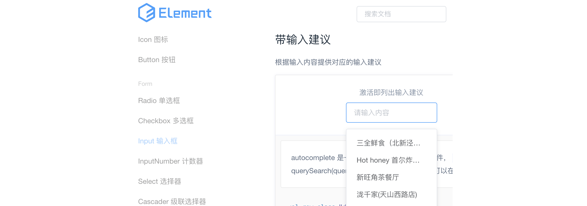
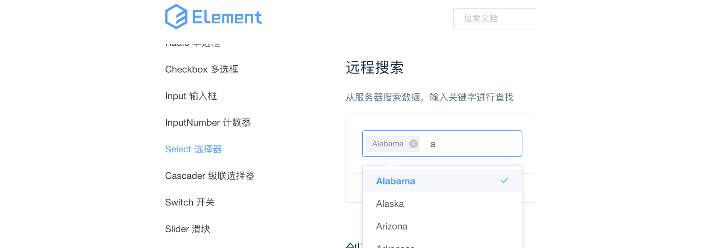
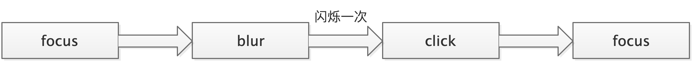
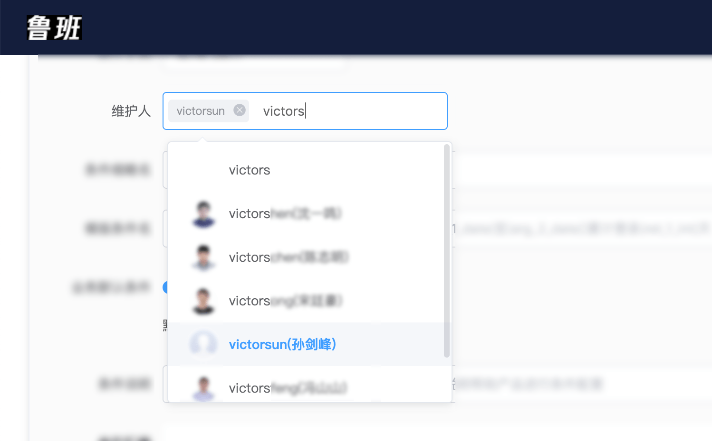

# vue封装带提示框的单选/多选文本框组件

> Write By [CS逍遥剑仙](http://home.ustc.edu.cn/~cssjf/)   
> 我的主页: [csxiaoyao.com](https://csxiaoyao.com)   
> GitHub: [github.com/csxiaoyaojianxian](https://github.com/csxiaoyaojianxian)   
> Email: [sunjianfeng@csxiaoyao.com](mailto:sunjianfeng@csxiaoyao.com)  
> QQ: [1724338257](http://wpa.qq.com/msgrd?uin=1724338257&site=qq&menu=yes)

## 1. 组件化思想

在web开发中，经常会遇到公共模块复用的问题，例如页头、页脚、导航条等，传统的后端视图引擎如smarty、服务器配置SSI、或是纯前端的嵌套iframe、js请求模板资源动态渲染等方式的表现都只差强人意。而现代前端框架，尤其是vue的组件化彻底改变了前端开发模式，大大提升多人合作开发效率。

组件化是vue的核心思想之一，vue官网花大篇幅介绍组件化思想。所谓组件化，是指将完整页面拆解为多个独立组件，每个组件依赖各自的template、js、css等，组件可以独立开发维护，并可以被不断复用。

在最近的vue+element的前端项目中，需要实现动态渲染带提示框的单选/多选文本框，具体的效果如下图所示，在输入框聚焦时，前端组件通过接收的kv参数渲染出选项，用户点击选项选中，可以将选择的选项的key值拼装到输入框中，反之删除key值，同时允许用户自由输入。

由于项目中使用的element-ui，首选考虑使用UI框架中的input和select组件，然而实际使用中参考文档发现框架提供的组件不能很好满足此需求。例如，使用带输入建议的input组件，能够实现提示框和单选，但并不能方便地实现多选(若重复选择会覆盖输入框内的内容)。

而使用框架提供的select选择器的搜索建议或远程搜索功能，虽然能够实现提示框，也能轻松实现单选与多选，但用户自由输入内容较为繁琐，即使开启了自定义输入，输入内容也是作为自定义选项存在，不能方便地实现字符串拼接效果。

再加上设计上需要实现三列布局，最终的返回结果需要动态拼装选项key值，虽然需求不复杂，但若对现有的element组件进行改造成本过高，因此，尝试封装带提示框的单选/多选文本框组件，记录下封装过程中组件交互方面遇到的问题。

## 2. 接口参数设计
组件支持传入6个参数，分别为
1. v-model  (输入值，String，双向绑定)

2. size  (尺寸，String， medium / small / mini)

3. opt  (选项列表，Array，kv数组形如[{key:1, value:xxx}])

4. seperator  (分隔符，String，如','、'|'、'-')

5. multiple  (是否支持多选，Boolean)

6. placeholder  (提示，String)

  调用方式如下：
```
<cs-select
  v-model="value" // value
  size="mini" // 尺寸
  :opt="optParams.kv" // 选项 
  seperator="," // 分隔符
  :multiple="true">
</cs-select>
```

## 3. 提示框显示隐藏交互实现

细化上述需求，需要在用户点击输入框(获取焦点)时，显示提示框，在用户点击空白区域时隐藏提示框，点击组件自身时不做任何操作。组件的模板结构如下，通过show变量控制提示框的显示与隐藏，在组件的输入框绑定聚焦和失焦事件： `@focus="onfocus"` 和 `@blur="onblur"`，在`focus`时设置变量`show`为true，`blur`时为false。

```
<template>
  <div>
  	<!-- 输入框 -->
    <el-input
      @focus="onfocus
      @blur="onblur>
    </el-input>
    <!-- 提示框 -->
    <div v-if="show && opt.length > 0">
      <el-row>
        <el-col :span="8" v-for="(item, index) in opt" :key="index">
          {{item.value}}
        </el-col>
      </el-row>
    </div>
  </div>
</template>
```
此处有一个小小的细节，由于选项元素在输入框外，用户点击输入框外的选项元素必然会导致输入框失焦从而触发`blur`自动关闭，如下图所示。对于多选，此时不应该关闭提示框，所有问题的关键在于如何实现点击提示选项而不隐藏提示框。


### 3.1 尝试方案1: click事件主动聚焦

根据上述需求，毫无疑问联想到可以为选项绑定`click`事件，调用el-input的`focus()`方法进行主动聚焦，实现如下，此处使用了vue的ref，通过`$ref`来查找dom元素。
```
clickEvent () {
  this.show = true // 设置提示框显示
  this.$refs.input.$el.querySelector('input').focus() // 设置主动聚焦
}
```
**问题：**实际开发过程中发现，每次点击提示选项后，提示框会闪烁一次，原因在于js的事件机制，`blur`事件先于`click`事件执行，导致提示框隐藏后再显示，造成**闪烁**。



### 3.2 尝试方案2: blur事件添加延时器 + 开关变量
由于方案1`blur`事件先于`click`事件执行，因此考虑使用`settimeout`延时器来改变执行时间，实现如下。
```
blurEvent () {
  setTimeout(() => {
    this.show = false
  }, 200)
}
```
**问题：**实际开发过程中发现，延时器延时执行关闭操作，导致输入框获取焦点后，主动关闭了提示框，不再自动打开，不满足需求，因此考虑使用开关变量`canClose`判断当前是否需要执行关闭，实现如下。
```
focusEvent () {
  this.show = true
  this.canClose = true // 聚焦时打开开关
},
blurEvent () {
  if (this.canClose) {
    setTimeout(() => {
      this.show = false // 只有开关打开时才执行关闭
    }, 200)
  }
},
clickEvent (key) {
  this.canClose = false // 点击提示选项，关闭开关
  this.show = true
  ...
}
```
**问题：**实际开发过程中发现，大多数情况下，提示框能够显示与隐藏，但是当操作较快时，会**偶尔出现提示框不能关闭或提前关闭**的情况，分析原因在于，延时器期间任何对开关的操作可能导致组件开关状态变化，致使状态紊乱。

### 3.3 尝试方案3: 不使用blur，关闭方法改为事件委托
如果关闭不使用`blur`，而是通过点击事件手动触发，则不会存在上述时序问题，因此考虑使用全局事件委托，监听用户的点击事件，通过判断节点特殊class来区分点击的是空白部分还是提示选项以实现提示框关闭，实现如下。
```
$('body').on('click', (event) => {
  this.show = false
})
$('body').on('click', className, (event) => {
  this.show = true
})
```
**问题1：**事件委托，使用固定的class，当同时渲染多个组件时，无法实现单独管理提示框的开关，因此**无法同时渲染多个组件**，因此class使用动态绑定，即每个组件使用不同的class。
**问题2：**阻止冒泡，如果组件的父容器已经阻止了冒泡，则无法触发在body上绑定的关闭方法，需要针对父容器单独处理。

```
let randId = Math.round(Math.random()*100000)
this.className = `cs-select-${randId}`
// 单独处理父容器，在父容器上绑定关闭事件
...
```
改造后的组件表面看起来基本可用，实际存在诸多问题：
**问题1：**组件中对父组件绑定了事件，违反了迪米特法则，**增加了组件间的耦合**，不利于后期维护。
**问题2：**上述操作只考虑了点击事件的关闭，忽略了其他可能需要关闭的情况，如使用`tab`按键切换输入框时也需要能正常显示与隐藏提示框。
**问题3：**绑定事件过多会带来性能隐患甚至导致意想不到的问题发生。 

### 3.4 尝试方案4: onfocus + onblur + mousedown + 开关
由于`focus`事件先于`click`事件执行，导致了上述方案1和方案2问题的产生，如果能够解决这两个事件的执行时序问题，问题则迎刃而解。通过查阅MDN文档可知，`mousedown`事件先于`blur`事件执行，因此，使用`onfocus` + `onblur` + `mousedown` + 开关能够很好解决上述执行时序问题，具体实现如下。
```
focusEvent () {
  this.show = true
  this.canClose = true // 聚焦时打开开关
},
blurEvent () {
  if (this.canClose) {
    this.show = false // 只有开关打开时才执行关闭
  }
},
mousedownEvent (key) {
  this.canClose = false // 点击提示选项，关闭开关
  this.show = true
  this.$refs.input.$el.querySelector('input').focus()
  ...
}
```
而此时的事件执行时序为：


**问题：**实际开发中发现，由于组件是动态渲染的，mousedownEvent事件中无法直接获取到当前对象的dom元素`this.$refs.xxx`，导致自动聚焦失败。

### 3.5 实现方案
在方案4的基础上，使用`nextTick`修改focus事件在**异步更新队列**清空后执行，能够解决dom渲染的时序问题，具体实现针对方案4稍作修改即可。
> `$nextTick`: 
> 在vue官方深入响应式原理中说明了 vue 实现响应式并不是数据发生变化之后 DOM 立即变化，而是在下次 DOM 更新循环结束之后执行延迟回调，在修改数据之后使用 $nextTick，则可以在回调中获取更新后的 DOM，官方示例：[https://cn.vuejs.org/v2/guide/reactivity.html#search-query-sidebar](https://cn.vuejs.org/v2/guide/reactivity.html#search-query-sidebar)

```
focusEvent () {
  this.show = true
  this.canClose = true // 聚焦时打开开关
},
blurEvent () {
  if (this.canClose) {
    this.show = false // 只有开关打开时才执行关闭
  }
},
mousedownEvent (key) {
  this.canClose = false // 点击提示选项，关闭开关
  this.show = true
  this.$nextTick(() => {
    this.$refs.input.$el.querySelector('input').focus()
  })
  ...
}
```


## 4. 组件数据双向绑定的实现

### 4.1 父子组件数据双向绑定

用户的选择和输入数据不仅需要在子组件内处理，还要能够方便地更新数据到父组件，对于输入框最常见的做法是为组件绑定`v-model`，但`v-model`默认作用于原生h5的`input`等标签，而对本文封装后的文本框是自定义组件，直接使用`v-model`是无效的。vue2.2.0+ 新增的自定义组件`v-model`和vue2.3.0+ 新增的`.sync修饰符`都能轻松地解决自定义组件的双向数据绑定，`.sync`的实现方式如下，通过添加watcher观察器，监听输入值的变化，并通过`$emit`方法同步到父组件中，实现数据的双向绑定。

```
watch: {
  inputVal: {
    handler () {
      ...
      let selectArray = this.inputFilter()
      this.inputVal = selectArray.join(this.seperator)
      // 同步数据
      this.$emit('update:value', this.inputVal)
    },
    immediate: true
  }
}
```

此时，父组件的调用方式则为：

```
<cs-select
  :value.sync="cond.value"
  ...>
</cs-select>
```

而使用`v-model`方式，组件上的`v-model`默认会利用名为`value`的`prop`和名为`input`的事件，也可以设置`model`选项来自定义，实现如下：

```
model: {
  prop: 'value',
  event: 'change'
},
props: {
  value: String
},
watch: {
  inputVal: {
    handler () {
      let selectArray = this.inputFilter()
      this.inputVal = selectArray.join(this.seperator)
      // 同步数据
      this.$emit('change', this.inputVal)
    },
    immediate: true
  }
}
```

`v-model`方式进行双向数据绑定对开发者更友好，因此更加推荐。

### 4.2 输入值与选中状态双向绑定

对于输入值和选中状态的处理，根据需求，选项与输入值能够双向绑定。举例来说，用户选择或取消选择了某个选项，输入框的值需要同步更新；用户手动在输入框内输入了数据，选项需要能够根据用户输入自动选中或取消。为了避免循环更新，此处只对输入值添加watcher监听器，用户手动输入数据，触发监听器更新选中状态；用户选择或取消选择选项，则直接更新对应的输入值。


```
watch: {
  inputVal: {
    handler () {
      // 更新选中状态
      this.updateActive()
      ...
    },
    immediate: true
  }
},
methods: {
  select (item) {
	  ...
    // 处理选择的数据，区分单选和多选
    // let reg = new RegExp(`(^${item.key})|(,${item.key}$)|(,${item.key},)`, 'g')
    if (this.multiple === true) {
      // 多选
      if (this.active[item.key]) {
        // 取消
        if (index >= 0) {
          selectArray.splice(index, 1)
        }
      } else {
        // 选中
        if (index < 0) {
          selectArray.push(item.key)
        }
      }
    } else {
      // 单选
      selectArray = [item.key]
    }
    // 更新输入值
    this.inputVal = selectArray.join(this.seperator)
  },
  // 根据input更新选中状态
  updateActive () {
    ...
  }
}
```

## 5. 组件应用与改进

带提示框的单选/多选文本框组件的应用场景除了本项目的需求，还可以应用于企业联系人选择器等，用户输入用户名关键词，提示框显示相关联系人，同时允许用户自由输入用户名。



此外，组件还有不少可以改进的地方，例如：

1. 目前的提示框的显示隐藏是通过监听mousedown等事件，很明显不能兼容移动端，可以考虑添加touch相关事件；  
2. 在css布局方面没有判断用户可见的友好性，在极端情况下可能会超出屏幕范围；  
3. 还不支持slot插槽和动态class属性等。

随着整体项目的迭代和需求的变更可以逐步完善。

