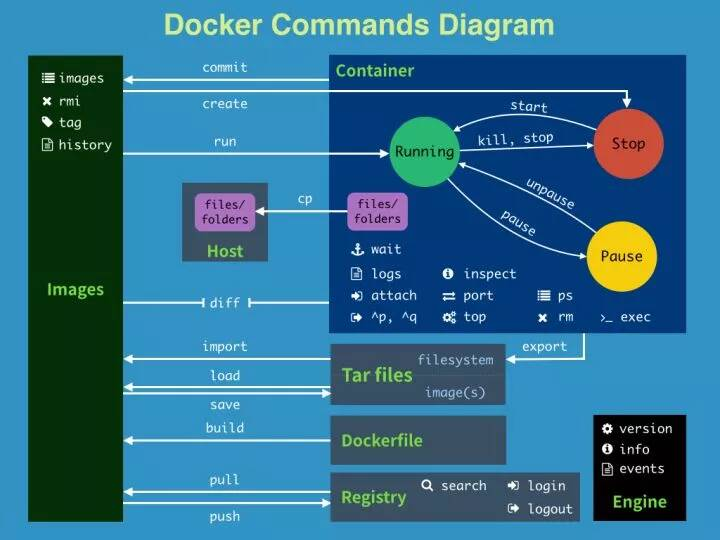
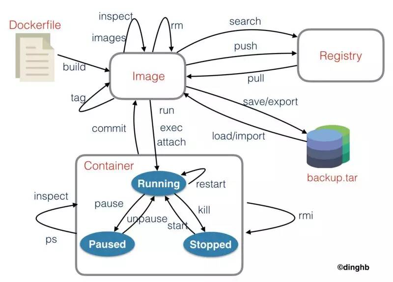

# docker常用操作
> Write By [CS逍遥剑仙](http://home.ustc.edu.cn/~cssjf/)   
> 我的主页: [csxiaoyao.com](https://csxiaoyao.com)   
> GitHub: [github.com/csxiaoyaojianxian](https://github.com/csxiaoyaojianxian)   
> Email: [sunjianfeng@csxiaoyao.com](mailto:sunjianfeng@csxiaoyao.com)  
> QQ: [1724338257](http://wpa.qq.com/msgrd?uin=1724338257&site=qq&menu=yes)

## 1. 安装

略

## 2. hello world

**创建镜像容器并启动**

```
# 以 ubuntu15.10 镜像创建一个新容器，并在容器里执行 bin/echo "Hello world"，输出结果
$ docker run ubuntu:15.10 /bin/echo "Hello world"
Hello world
```

**停止/启动/重启/移除容器**

```
$ docker stop [CONTAINER ID/NAMES]
$ docker start [CONTAINER ID/NAMES]
$ docker restart [CONTAINER ID/NAMES]
$ docker rm [CONTAINER ID/NAMES]
```

**启动容器（后台模式）**

通过参数 `-d`

```
$ docker run -d ubuntu:15.10 /bin/sh -c "while true; do echo hello world; sleep 1; done"
```

**查看容器进程**

```
$ docker ps
```

**运行交互式容器**

运行exit命令或者使用 CTRL+D 来退出容器

```
$ docker run -i -t ubuntu:15.10 /bin/bash
root@9dc85e45b749:/#
```

> 参数解析：
>
> - **-t: **在新容器内指定一个伪终端或终端
> - **-i: **允许对容器内的标准输入 (STDIN) 进行交互

**查看应用程序日志**

```
$ docker logs [CONTAINER ID/NAMES]
```

**查看容器内进程**

```
$ docker top [CONTAINER ID/NAMES]
```

**启动镜像**

启动镜像nginx并：1.指定容器名称(sunshine-nginx-test)；2.后台运行(-d)；3.指定端口绑定(-p)

```
$ docker run --name sunshine-nginx-test -p 8080:80 -d nginx
```

## 3. Docker 镜像使用

**查找镜像**

```
$ docker search httpd
```

**获取一个新的镜像**

```
$ docker pull ubuntu:14.10
```

**更新镜像**

docker commit 更新镜像

```
$ docker commit -m="update image" -a="csxiaoyao" [CONTAINER ID/NAMES] csxiaoyao/ubuntu:v2
```

**构建镜像**

docker build 从零创建一个新的镜像，需要创建一个 Dockerfile 文件

## 4. 容器连接

**端口映射**

```
# 随机分配主机端口
$ docker run -d -P [CONTAINER ID/NAMES] python app.py
# 指定主机端口
$ docker run -d -p 80:5000 [CONTAINER ID/NAMES] python app.py
# 指定host
$ docker run -d -p 127.0.0.1:80:5000 [CONTAINER ID/NAMES] python app.py
# 指定协议，默认TCP
$ docker run -d -p 127.0.0.1:80:5000/udp [CONTAINER ID/NAMES] python app.py
```

> 参数解析：
>
> - **-P :** 容器内部端口**随机**映射到主机高端口
> - **-p :** 容器内部端口绑定到**指定**的主机端口

## 5. 常用命令





