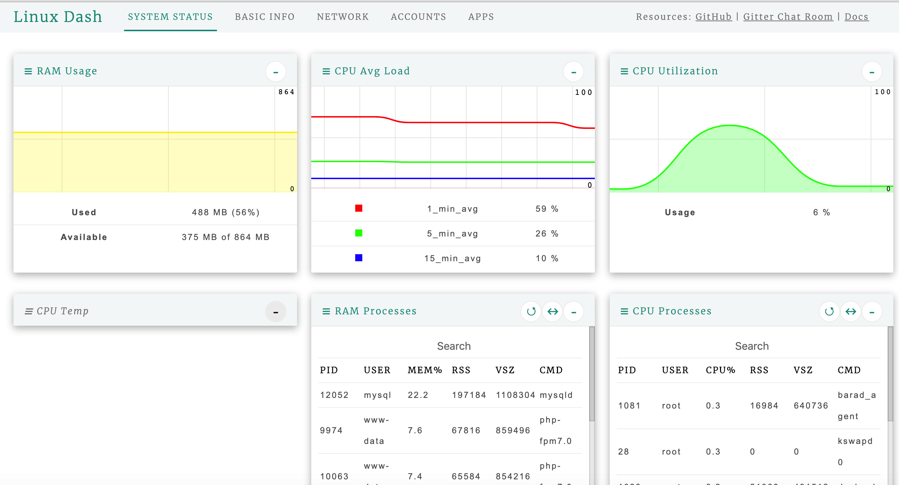
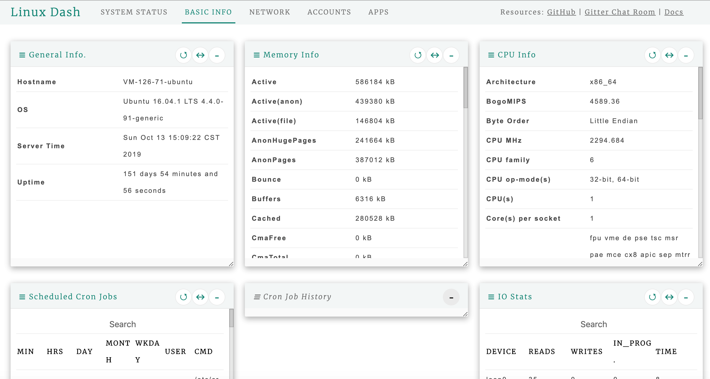

# 简单Linux系统监控小工具linux-dash安装与体验

linux上的监控工具有不少，偶然发现一款非常小巧精致的监控 linux-dash，可以直接在web环境中通过git来安装，虽然功能不是最强大的，但是它足够简单小巧。

## 1. 安装

github地址：[https://github.com/afaqurk/linux-dash](https://github.com/afaqurk/linux-dash)，直接在服务器的发布路径下执行git的克隆命令即可。

```
$ git clone https://github.com/afaqurk/linux-dash.git
```

## 2. 使用

直接浏览器打开网站路径下的 linux-dash/app 即可。



