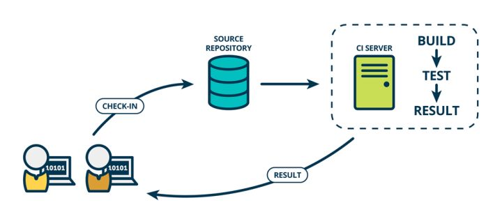
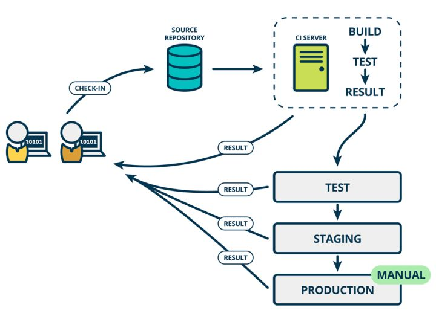

# 前端自动化测试实践01—持续集成之jest自动化测试环境搭建

> Write By [CS逍遥剑仙](http://home.ustc.edu.cn/~cssjf/)   
> 我的主页: [csxiaoyao.com](https://csxiaoyao.com)   
> GitHub: [github.com/csxiaoyaojianxian](https://github.com/csxiaoyaojianxian)   
> Email: [sunjianfeng@csxiaoyao.com](mailto:sunjianfeng@csxiaoyao.com)  
> QQ: [1724338257](http://wpa.qq.com/msgrd?uin=1724338257&site=qq&menu=yes)

本节代码地址 [https://github.com/csxiaoyaojianxian/JavaScriptStudy](https://github.com/csxiaoyaojianxian/JavaScriptStudy) 下的自动化测试目录

## 1. 概念 

### 1.1 持续集成&持续交付&持续部署

在互联网时代软件从开发到上线，后续迭代更新，已经形成了一套近乎标准的流程，其中最重要的流程就是持续集成(Continuous integration，简称CI)。"持续"的核心思想在于：在事先难以完全了解完整正确的需求时，干脆把大项目分割成小块完成，并加快交付的速度和频率，使其尽早在下个环节得到验证，若发现问题能够尽早返工。

对于持续集成、持续交付和持续部署三个从敏捷思想中提出的概念，此处举个在知乎上看到的很形象例子：装修厨房，铺地砖时边角地砖要切割大小，如果一次全切割完再铺上去，发现尺寸有误时的浪费和返工成本就大了，不如切一块铺一块，这就是持续集成；装修厨房有很多部分，每个部分都有检测手段，如地砖铺完了要测试漏水与否，线路铺完了要通电测试电路通顺，水管装好了也要测试冷水热水，如果等全部装完了再测，出现问题可能会互相影响，比如电路不行可能要把地砖给挖开，如果每完成一部分就测试，这是持续部署；全部装修完了等待验收，客户发现地砖颜色不合意，水池太小，灶台位置不对，返工吗？所以不如每完成一部分就试用验收，这就是持续交付。这三个概念强调在软件开发过程中，通过技术手段自动化这三个工作，加快交付速度。

具体来说，持续集成是一种软件开发实践，强调开发人员在提交新代码后立刻进行构建、自动化测试等，频繁自动将代码集成到主干和生产环境，降低一次性集成过多代码带来的风险。



持续交付在持续集成的基础上，将集成后的代码部署到更贴近真实运行环境的"类生产环境"中。比如把完成单元测试的代码部署包含完整功能的预发布环境中运行更多更完整的集成测试，甚至是人工测试，通过后继续手动部署到生产环境中。



持续部署则是在持续交付的基础上，把部署到生产环境的过程自动化。


### 1.2 持续集成 & 前端自动化测试

持续集成是互联网软件开发上线流程中的核心一环，在1.1节介绍中也不难看出，自动化测试是持续集成得以实现的核心步骤，缺乏了自动化测试，持续集成自然无从谈起。

在日常的开发中，前端错综复杂的变化引发的bug往往令开发者头疼，或多或少经历过 **修完东墙西墙倒** 的经历，此时前端自动化测试就显得非常重要。前端的自动化测试无非也是编写测试用例，在持续集成时执行跑通全部测试用例。如果是一个短平快的小项目，引入前端自动化测试，编写测试用例，无疑只会增加开发成本，然而当项目扩大、迭代频繁、逻辑复杂、需求反复变更的情况下，回归测试的成本是巨额的，自动化测试的优势就能体现出来。

```
自动化测试的收益 = 迭代次数 * 全手动执行成本 - 首次自动化成本 - 维护次数 * 维护成本
```

尽早引入前端自动化测试不仅能够减少项目 bug 出现概率(尤其是回归测试中的 bug)，还能更好地进行代码组织，增强项目的可维护性，尤其对于工程质量较差的项目，收益是巨大的；如果将其应用于持续集成中，commit 触发自动执行测试脚本，还能大幅提升团队的开发效率。

### 1.2 分类

前端自动化测试可以按照开发模式分两类：**TDD (Test-Driven Development) 测试驱动开发**、**BDD (Behavior Driven Development) 行为驱动开发**。TDD 顾名思义，开发者根据需求先编写测试用例，再逐步开发，最终满足全部测试用例的需求。刚开始的时候，只有测试用例，未进行功能开发，执行测试用例，满屏是红色的测试用例不通过提示，随着测试用例被满足变绿，最终全部变绿，功能开发完成，因此前端自动化测试也被叫做 `Red-Green Development`。测试还可以按照用例粒度分为 **单元测试 (Unit Test)**、**集成测试 (Integration Test)**、**端到端测试 (End to End Test)**。

#### 1.2.1 TDD (Test-Driven Development) 测试驱动开发

1. TDD 先写测试再写代码，单位是模块，多用于 **单元测试**
2. 重点在测试代码，属于 **白盒测试**
3. 测试内容是模块，速度快，但是忽略模块间依赖，安全感低

**TDD 有以下优势：**

1. 长期减少回归BUG
2. 代码质量会更好（组织、可维护性）
3. 测试覆盖率高

#### 1.2.2 BDD (Behavior Driven Development) 行为驱动开发

1. BDD 先写代码再写测试，测试单位是功能，多用于 **集成测试**
2. 重点在测试 UI（DOM）功能，属于 **黑盒测试**
3. 测试内容是整套操作流程，速度慢，往往需要多个模块配合，安全感高

### 1.3 工具选择

前端近几年涌现出很多优秀的测试工具：

- [karma](https://karma-runner.github.io/2.0/index.html) – Google Angular团队开发的测试运行平台，配置简单灵活，能够很方便在多个真实浏览器中运行测试


- [mocha](https://mochajs.org/) – 很优秀的测试框架，有完善的生态系统，简单的测试组织方式，不对断言库和工具做任何限制，非常灵活
- [jest](https://facebook.github.io/jest/) – facebook出品的大而全的测试框架，React官方推荐的单元测试框架，配置简单运行速度快

还有很多其他的前端测试框架，但大同小异，无非是对断言和测试桩等工具的集成度不同，论成熟度首推 mocha，论效率首推 jest。

jest是 Facebook 开源的 JavaScript 测试框架，它自动集成了断言、JsDom、覆盖率报告等开发者所需要的所有测试工具，是一款几乎零配置的测试框架，而且速度很快，此处选择 jest 作为测试工具。

## 2. jest 环境搭建

### 2.1 jest 安装

jest 需要自动运行测试脚本，**node** 环境是必不可少的，如果从头搭建，首先得初始化项目 `package.json` 并安装 jest：

```shell
$ npm init
$ npm install jest -D
```

jest 默认不支持 es6，需要使用 babel 来支持 es6，安装 babel：

```shell
$ npm install @babel/core @babel/preset-env -D
```

配置 babel，修改 `.babelrc` 文件

```json
{
    "presets": [
        ["@babel/preset-env", {
            "targets": {
                "node": "current"
            }
        }]
    ]
}
```

### 2.2 jest 初始化

安装完 jest 以后，初始化 jest 并根据需要修改根目录下生成的配置文件 `jest.config.js`

```shell
$ npx jest --init
```

修改 `package.json` 中的 `scripts`，添加执行指令

(1) 普通执行测试，即 `$ npx jest`

```json
{
	"test": "jest"
}
```

(2) 生成覆盖率报告，即 `$ npx jest —coverage`

```json
{
	"coverage": "jest --coverage"
}
```

(3) 持续监听变化，默认 o 模式

```json
{
	"test": "jest --watch"
}
```

(4) 持续监听所有文件变化

```json
{
	"test": "jest --watchAll"
}
```

### 2.3 编写测试用例

先写一个功能模块 `init.js`

```javascript
function add (a, b) { return a + b; }
function minus (a, b) { return a - b; }
function multi (a, b) { return a * b; }
module.exports = { add, minus, multi }
```

编写对应测试用例文件 `init.test.js`

```javascript
const math = require('./init.js');
const {add, minus, multi} = math;
// 断言
test('测试加法 3 + 7', () => { expect(add(3, 7)).toBe(10); })
test('测试减法 3 - 3', () => { expect(minus(3, 3)).toBe(0); })
test('测试乘法 3 * 3', () => { expect(multi(3, 3)).toBe(9); })
```

执行测试，并在控制台观察结果

```Shell
$ npm run test
$ npm run coverage
```

## 3. vue-cli 中使用 jest

现实项目中，往往不会从零搭建 jest 项目，更多的情况是，需要在一个脚手架已经搭建好的项目中引入自动化测试，此处在 `vue-cli` 基础上修改 jest 配置，安装好 jest 后需要修改项目根目录下的配置文件 `jest.config.js`，重点关注 `testMatch` 和 `testPathIgnorePatterns` 两个属性，`testMatch` 指定了匹配的测试用例文件的路径，而 `testPathIgnorePatterns` 则可以忽略指定文件，因此使用两个属性可以精确匹配到项目中所有的测试用例。

```javascript
module.exports = {
  ...
  testMatch: [
    '**/__tests__/**/*.(js|jsx|ts|tsx)'
  ],
  testPathIgnorePatterns: [
    '.eslintrc.js'
  ],
  testURL: 'http://localhost/'
}
```

最后还需要在 `package.json` 中添加测试指令

```json
{
	"test:unit": "vue-cli-service test:unit --watch"
}
```

执行对应指令即可在项目中执行测试

```shell
$ npm run test:unit
```

