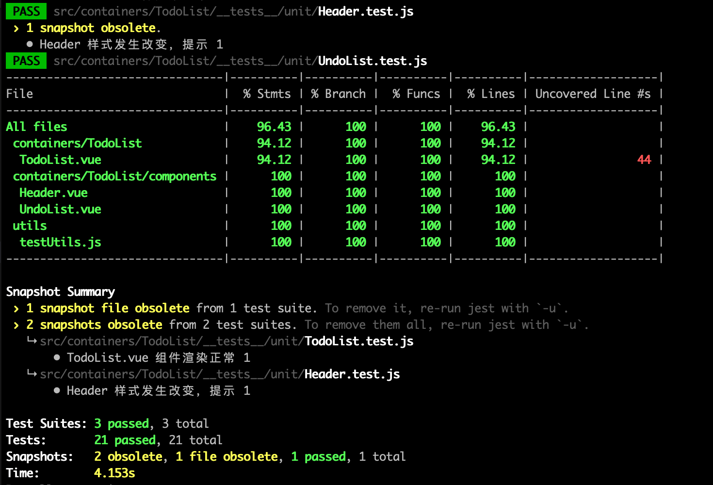
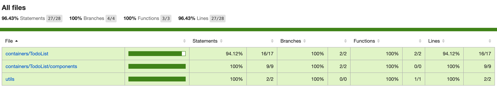

# 前端自动化测试实践04—jest-vue项目之TDD&BDD

> Write By [CS逍遥剑仙](http://home.ustc.edu.cn/~cssjf/)   
> 我的主页: [csxiaoyao.com](https://csxiaoyao.com)   
> GitHub: [github.com/csxiaoyaojianxian](https://github.com/csxiaoyaojianxian)   
> Email: [sunjianfeng@csxiaoyao.com](mailto:sunjianfeng@csxiaoyao.com)  
> QQ: [1724338257](http://wpa.qq.com/msgrd?uin=1724338257&site=qq&menu=yes)

本节代码地址 [https://github.com/csxiaoyaojianxian/JavaScriptStudy](https://github.com/csxiaoyaojianxian/JavaScriptStudy) 下的自动化测试目录

## 1. 项目构建

本节将以 TDD 的方式来搭建一个 TodoList 的 vue 项目。如何搭建包含 `jest` 的 `vue` 项目已经在第一节 `jest-vue前端自动化测试实践01` 中已经进行过介绍，其中，在 `jest` 的配置文件 `jest.config.js` 中，需要注意 `testMatch` 配置项，它指定了测试用例文件的路径，这里我们习惯性设置为 `__tests__` 文件夹下的以 `.test` 加多种后缀结尾的文件。

```javascript
testMatch: [
	'**/__tests__/**/*.test.(js|jsx|ts|tsx)'
]
```

在配置过启动命令 `"test:unit": "vue-cli-service test:unit --watch"` 后就可以愉快地以 `watch` 方式将 jest 在 shell 中实时运行起来，每次修改代码后，jest 都会自动执行测试用例。

```Shell
$ npm run test:unit
```

还可以配置测试覆盖率命令 `"test:cov": "vue-cli-service test:unit --coverage"`。

```
$ npm run test:cov
```



生成的报告也可以在浏览器中打开，更加直观清晰。



## 2. 项目目录结构 

项目的目录结构组织如下：

```Text
├── src
│   ├── sssets
│   ├── containers
│   │   └── TodoList    
│   │       ├── __mocks__                测试mocks文件
│   │       ├── __tests__                测试用例文件
│   │       │   ├── unit                 单元测试
│   │       │   │   └── TodoList.test.js
│   │       │   └── integration          集成测试
│   │       │       └── store.test.js
│   │       ├── components               子组件
│   │       │   ├── Header.vue
│   │       │   └── UndoList.vue
│   │       │   
│   │       └── TodoList.vue             TodoList父vue组件
│   │
│   ├── utils
│   │   └── testUtils.js                 存放测试工具公共工具
│   ├── App.vue                          vue-App
│   └── main.js                          入口文件
│
├── public
├── jest.config.js                       jest配置文件
├── ...
└── package.json
```

## 3. vue 组件测试方法

### 3.1 组件浅渲染和深渲染

在 vue 项目中测试 vue 组件，vue 官方提供了 `@vue/test-utils` 工具用于测试 vue 组件，其中包含 `mount` 和 `shallowMount` 方法，用于渲染 vue 组件。

```javascript
import { mount, shallowMount } from '@vue/test-utils'
```

不同的是，mount 方法会渲染完整的组件，包括子组件，适合 BDD 和集成测试，而 shallowMount 方法只会渲染当前组件，因此速度更快，效率更高，更加适合 TDD 和单元测试。为了方便获取测试需要的 DOM 元素，可以将获取 DOM 元素的方法进行封装，在 `testUtils.js` 中定义 `findTestWrapper` 方法如下：

```javascript
export const findTestWrapper = (wrapper, tag) => {
	return wrapper.find(`[data-test="${tag}"]`)
}
```

### 3.2 vuex 的使用

可以通过在 mount 中传入 vuex 对象实现对 vuex 的引用：

```javascript
import store from '@/store'
const wrapper = mount(TodoList, { store })
```

### 3.3 组件异步测试

对于异步请求，可以使用 vue 的 `vm.$nextTick` 方法实现异步数据的渲染。

## 4. TDD & BDD

在 TDD 中，由于是测试驱动开发，因此往往先进行需求分析再根据需求编写测试用例，最后才进行项目业务逻辑编码满足用例，因此用于单元测试，而 BDD 则相反，在编写完业务逻辑代码后编写测试用例，因此是从功能角度出发，更加适合集成测试，具体代码可以见 github：

> 本节代码地址 [https://github.com/csxiaoyaojianxian/JavaScriptStudy](https://github.com/csxiaoyaojianxian/JavaScriptStudy) 下的自动化测试目录

### 4.1 组件

对于 vue 测试工具渲染出的组件，自动化测试，我们一般可以考虑生成快照监测dom结构变化进行测试。还可以测试组件中方法是否触发，以及查找其子组件等。

```javascript
expect(wrapper).toMatchSnapshot() // 生成快照
wrapper.emitted().add             // 组件中 add 方法是否被触发
wrapper.find(Header)              // 查找子组件 Header
```

### 4.2 vm 实例

大部分的自动化测试，都是通过 vm 实例上的 data 变化来测试的，可以获取对应的 data 值，也可以通过 vm 调用相关方法。

```javascript
wrapper.vm.$data.inputValue         // 获取 inputValue
wrapper.vm.addUndoItem('csxiaoyao') // 执行 addUndoItem 方法
wrapper.vm.$emit('add', content)    // 触发外部 add 方法
```

### 4.3 jsDom 操作

jest 提供了一套 node 环境下的 dom，在获取到指定的 dom 元素后，可以对 dom 元素执行各种操作：

```javascript
const input = findTestWrapper(wrapper, 'input')
input.exists()                // 获取dom存在性
input.setValue('csxiaoyao')   // 给dom赋值
input.trigger('keyup.enter')  // 触发dom方法
input.trigger('change')       // 触发dom方法
```

### 4.4 vuex

vuex 数据操作

```javascript
store.state.inputValue                        // 数据获取
store.commit('changeInputValue', 'csxiaoyao') // 数据设置
```

### 4.5 异步操作

定时器测试，可以借助 `vm.$nextTick` 方法和 jest 定时器操作实现

```javascript
beforeEach(() => {
	jest.useFakeTimers()
})
it(`
  1. 用户进入页面时，等待 3s
  2. 列表应该展示远程返回的数据
`, (done) => {
	const wrapper = mount(TodoList, { store }) // 传入 store
	jest.runAllTimers()
	wrapper.vm.$nextTick(() => {
		const listItems = findTestWrapper(wrapper, 'list-item')
		// 不能直接判断，因为异步操作在 mounted 之后
		expect(listItems.length).toBe(2)
		done()
	})
})
```

