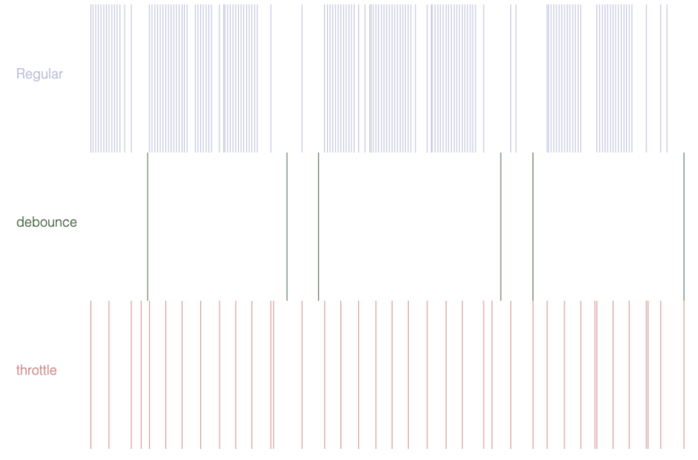

# 函数防抖(debounce)和节流(throttle)在H5编辑器项目中的应用

> Write By [CS逍遥剑仙](http://home.ustc.edu.cn/~cssjf/)   
> 我的主页: [csxiaoyao.com](https://csxiaoyao.com)   
> GitHub: [github.com/csxiaoyaojianxian](https://github.com/csxiaoyaojianxian)   
> Email: [sunjianfeng@csxiaoyao.com](mailto:sunjianfeng@csxiaoyao.com)  
> QQ: [1724338257](http://wpa.qq.com/msgrd?uin=1724338257&site=qq&menu=yes)

前端开发者对函数防抖和函数节流或多或少有些了解，最近在做一个H5编辑器的项目，由于画布功能复杂，计算量较大，在鼠标拖拽操作时尤其是在低配电脑上能够明显感受到卡顿，自然联想运用函数防抖(debounce)和函数节流(throttle)来优化 `mousemove` 等实时计算方法的计算频率再合适不过了。

## 1. 为什么要防抖节流

### 1.1 客户端性能瓶颈

众所周知，浏览器JavaScript单线程的性能有限，一般用户浏览网页时的交互较少，所以和后端及网络性能比起来，前端渲染时间占比较小，然而在H5编辑器这类功能复杂的纯前端交互系统中，每当 `mousemove` 、`scroll`、 `resize` 等事件触发时，会不断调用绑定的回调函数，非常耗费计算资源，如果能减少计算频率，对前端用户体验会有明显提升。

### 1.2 刷新率的必要性 

目前大部分的显示器的刷新率是 60hz，而且人的肉眼也只能分辨出一定频率的变化，可以说1000fps和100fps对于人体感官的差异是微乎其微的，目前主流浏览器的 `mousemove` 事件的频率在 130/s 左右，如果不是在画质精良的游戏大作中，其实是完全没有必要的。

### 1.3 需求所迫

还有很多时候，为了减少不必要的脏数据以保证数据的准确性，以及降低服务器负载等，前端必须减少函数触发次数，不得不使用函数节流防抖。

## 2. 防抖 & 节流的概念

对于频率限制，前端开发中有两种常见操作：`函数防抖(debounce)`  和 `函数节流(throttle)`，两种方法虽然都是降低频率，却又存在差异，下面用一个网络上看到的例子来方便理解。

### 2.1 函数防抖 (debounce)

**效果**：等待足够的空闲时间后，才执行代码一次

比如坐公交，在一定时间内，如果有人陆续刷卡上车，司机就不会开车。只有没人刷卡上车了，司机才会开车，这是防抖的思想。

### 2.2 函数节流 (throttle)

**效果**：一定时间内只执行代码一次

水龙头放水，如果想节水，可以手动减小水流，但是它仍会一直流，这是节流的思想。

### 2.3 图示对比

如果上述还不够明了，下图三种方式对 `mousemove` 的监听可以很好地解释 `debounce` 和 `throttle` 的区别，当鼠标停下一定时间，`debounce` 才会执行，而 `throttle` 也会一直执行，但是频率明显低于常规 `mousemove`。



## 3. 实际工程应用场景

函数防抖节流在本人开发的H5编辑器中有很多处应用，列举几处：

### 3.1 函数节流应用场景 

**1. 防止重复点击**

按钮防止重复点击是每个前端开发者的必修课，尤其是面向C端的系统，例如营销活动，玩家拼命点击领奖按钮，没有防重机制会对服务器造成较大压力。很多时候，开发者会优先用遮罩层来防止用户重复点击，其实，理论上单用遮罩是不能防重的，因为如果客户端性能不足，遮罩层的显示会在用户多次点击之后。最好的方法是函数节流配合遮罩，保证在遮罩启动前按钮事件只会触发一次，就可以很好地解决按钮重复点击的问题。

**2. `mousemove` 时位置计算**

鼠标移动时候需要计算元素位置、碰撞检测、边缘检测、参考线计算、网格吸附，十分消耗资源，函数节流，60fps 已然足够。

**3. `scroll` 时画布计算与标尺绘制**

在滚动画布时候，`canvas` 绘制的标尺需要固定在屏幕位置，但刻度需要跟随画布移动，计算新的起点、绘制辅助尺等工具，函数节流也非常合适

**4. `resize` 时重绘整个画布**

由于 `resize` 可能带来整个画布尺寸的变化，重绘画布是非常必要的，否则可能出现样式错位等问题，虽然一般用户调整窗口尺寸的次数不多，但是使用函数节流后的体验还是非常好的。

### 3.2 函数防抖应用场景

**1. `autosave` 状态保存**

H5编辑器支持 `撤销`、`前进` 功能，需要实时监听 `setter` 引起的状态数据的变化，自动保存状态用于回滚，然而就拿移动元素来说，如果实时记录元素移动中所有的坐标变化，不仅浪费大量的存储空间来记录状态，而且真正应用撤销功能的时候用户也会崩溃，显然这是不合理的，最好的方法就是通过函数防抖，监听用户一段时间内的操作，但只有当用户当前单步操作停止后才会记录，比如拖拽停止后记录下元素放置的状态。

**2. 素材搜索框自动拉取**

H5编辑器需要从素材库拉取图片素材，如果等用户输入完关键词点击搜索，效率太低，如果在搜索过程中实时拉取服务器数据，对服务器压力又会过大，折中的方法就是使用函数防抖，当用户输入停顿一定时间后触发 `ajax` 请求拉取数据。

**3. 配置信息保存**

越来越多的产品倾向于使用无保存按钮的交互方式，用户每操作完一步后自动提交请求保存，如果使用函数防抖，H5编辑器就可以减少例如计数器频繁操作触发的保存频率。

## 4. 函数防抖节流的实现

实现防抖节流非常简单，利用定时器就可以轻松实现。

### 4.1 函数防抖(debounce)实现

`debounce` 的实现非常简单，需要在一定时间后执行，一个定时器轻松搞定，需要主要在启动定时器时修改传入函数的上下文环境。

```javascript
// debounce 接受一个函数和延迟时间作为参数
const _.debounce = function (func, delay) {
  // 维护一个 timer
  let timer = null
  return function() {
    clearTimeout(timer)
    const context = this
    const args = arguments
    timer = setTimeout(function () {
      func.apply(context, args)
    }, delay)
  }
}
```

### 4.2 函数节流(throttle)实现

`throttle` 需要在一定时间内只执行一次，有**时间戳**和**定时器**两种简单的实现方式：

**1. 时间戳方式：**

```javascript
// 每次调用记录当前时间，执行回调函数前比对间隔时间
const _.throttle = function (func, delay) {
  let prev = Date.now()
  return function () {
    const context = this
    const args = arguments
    const now = Date.now()
    if(now - prev >= delay){
      func.apply(context, args)
      prev = Date.now()
    }
  }
}
```

时间戳实现的节流函数会在第一次触发时立即执行，并且最后一次触发事件不会被执行

**2. 定时器方式：**

```javascript
const _.throttle = function (func, delay) {
  let timer = null
  return function () {
    const context = this
    const args = arguments
    if (!timer) {
      timer = setTimeout(function () {
        func.apply(context, args)
        timer = null
      },delay)
    }
  }
}
```

定时器实现的节流函数在第一次触发时不会执行，delay 秒后才执行，并且当最后一次停止触发后，还会再执行一次函数

### 4.3 函数调用

调用方法如下：

```javascript
function foo () {
  console.log('trigger')
}
window.addEventListener('resize', debounce(foo, 2000))
window.addEventListener('resize', throttle(foo, 2000)) // 大部分场景下 resize 更适合使用节流
```

## 5. 总结

函数防抖节流的实现非常简单，却能解决前端开发过程中的很多问题，提升性能，优化用户体验，尤其是应对像H5编辑器这样的交互复杂的前端项目更是不可或缺，在实际的工程项目中，防抖函数还是节流函数的选择需要开发者针对不同的应用场景进行选择。

