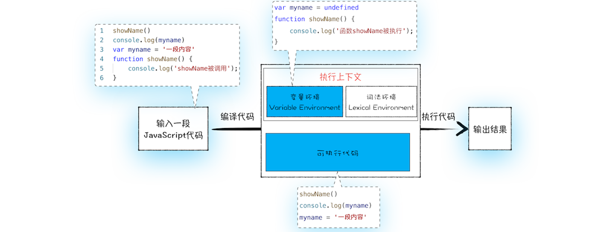
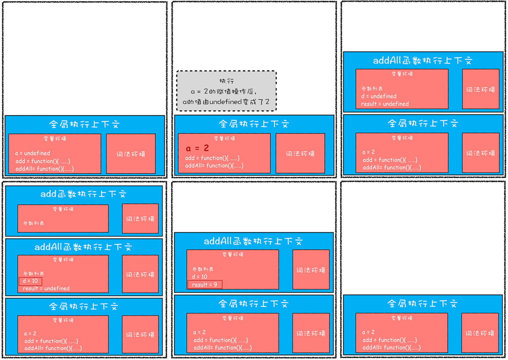
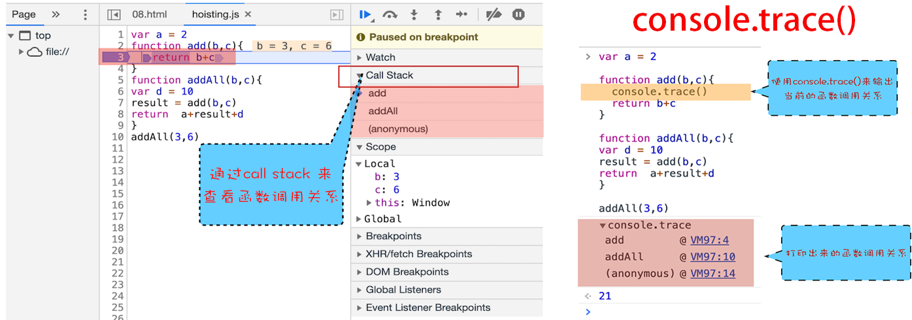
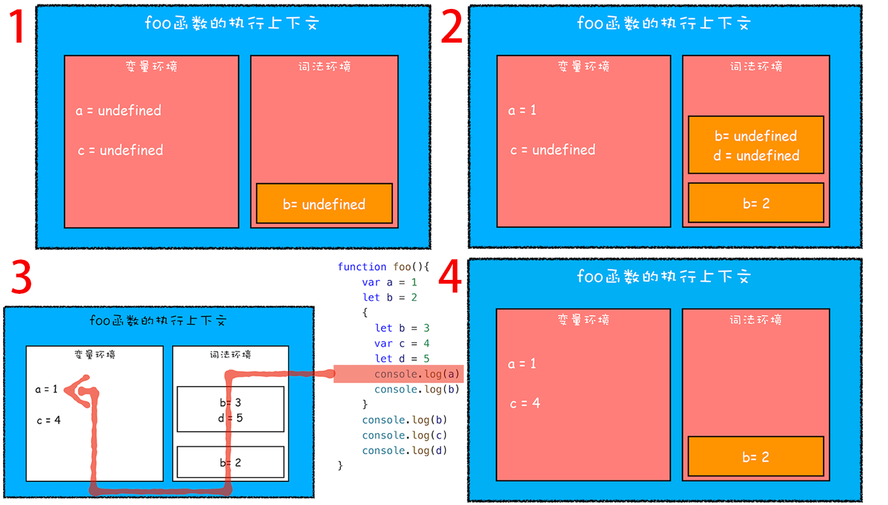
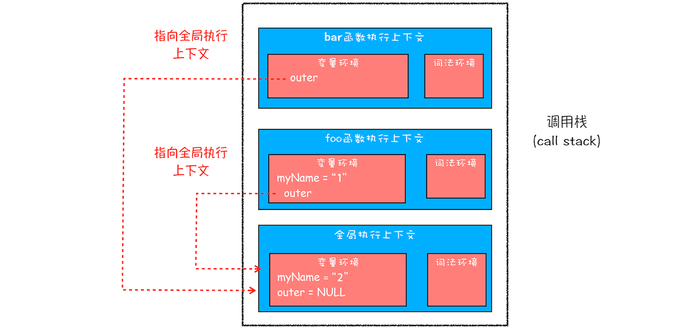
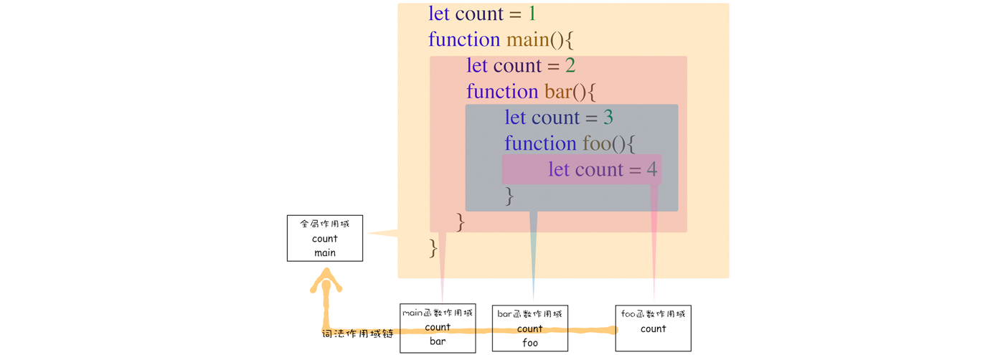
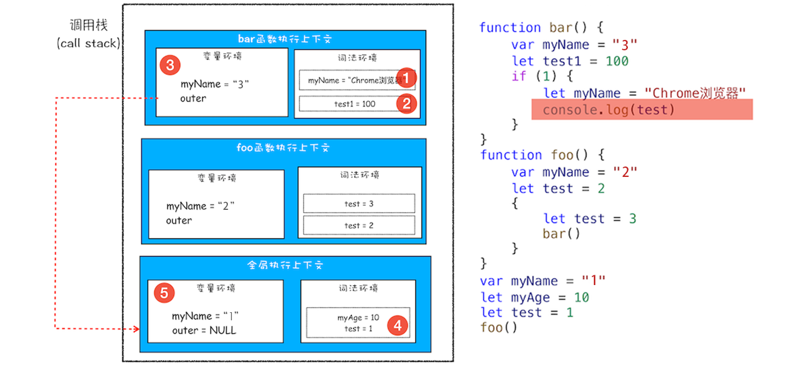
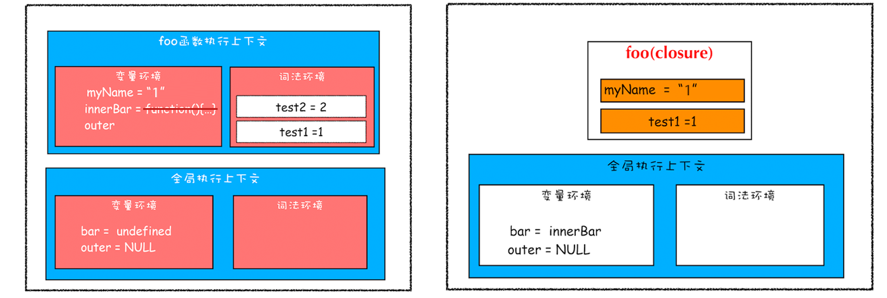
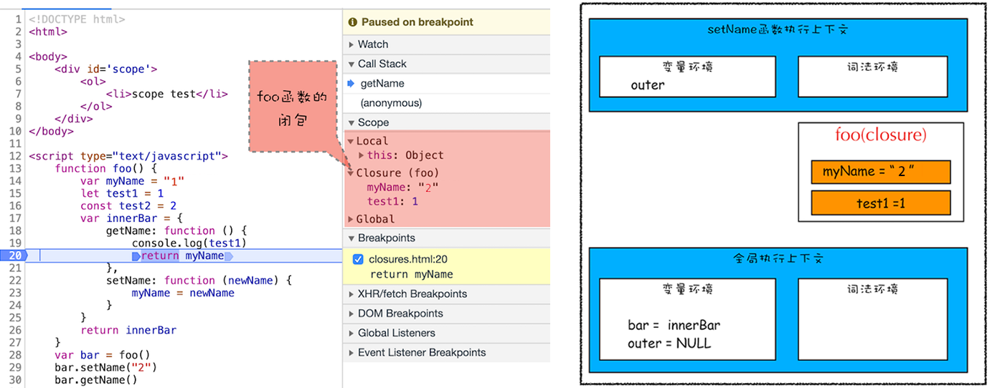

# 浏览器原理学习笔记02—浏览器中的JavaScript执行机制

> Write By [CS逍遥剑仙](http://home.ustc.edu.cn/~cssjf/)   
> 我的主页: [csxiaoyao.com](https://csxiaoyao.com)   
> GitHub: [github.com/csxiaoyaojianxian](https://github.com/csxiaoyaojianxian)   
> Email: [sunjianfeng@csxiaoyao.com](mailto:sunjianfeng@csxiaoyao.com)  
> QQ: [1724338257](http://wpa.qq.com/msgrd?uin=1724338257&site=qq&menu=yes)

## 1. JavaScript 代码的执行流程



### 1.1 编译阶段

输入代码经过编译后会生成两部分内容：**执行上下文** 和 **可执行代码**。

执行上下文(Execution context)是 JavaScript 执行一段代码时的运行环境，比如调用一个函数，就会进入这个函数的执行上下文，确定该函数在执行期间用到的 this、变量、对象以及函数等。

编译阶段代码中的变量和函数会被存放到执行上下文中的 **变量环境对象** 中，即变量提升(Hoisting)。

> **Tips:**
>
> 1. 之所以执行变量提升，是因为js代码需要被编译
> 2. 变量提升，变量默认值初始化为 undefined
> 3. 出现同名函数，后面的函数会覆盖前面的函数
> 4. 如果变量和函数同名，编译阶段变量的声明会被忽略(函数优先级高于变量)

如果出现变量和函数同名，下面的 demo 输出 1。

```Javascript
showName()
function showName () { console.log(1) }
var showName = function () { console.log(2) }
```

### 1.2 执行阶段

在代码执行阶段 JavaScript 引擎会从变量环境中去查找自定义的变量和函数。

## 2. JavaScript 调用栈

### 2.1 创建执行上下文的场景

+ **执行全局代码**，创建页面生存周期内 **唯一** 的 **全局执行上下文**
+ **函数调用**，创建函数执行上下文，函数执行结束后销毁
+ **使用 eval 函数时**，eval 代码被编译并创建执行上下文
### 2.2 调用栈执行过程

调用栈(call stack)是用于管理执行上下文的数据结构，符合后进先出的规则，是 JavaScript 引擎追踪函数执行的一个机制。

```javascript
var a = 2
function add (b, c) {
  return b + c
}
function addAll (b, c) {
  var d = 10
  result = add(b, c)
  return  a + result + d
}
addAll(3, 6)
```



### 2.3 利用浏览器查看调用栈信息

有两种方式：**debug** 和 **console**，此处 **(anonymous)** 即全局执行上下文。



### 2.4 栈溢出(Stack Overflow)

调用栈是有大小限制的，当入栈的执行上下文超过一定数目 JavaScript 引擎就会报错，尤其在递归时很容易出现栈溢出，可以通过将递归调用改成其他形式，或使用定时器将任务拆解等方式来避免栈溢出。

## 3. 作用域(scope)

ES6 之前作用域只有两种：**全局作用域** 和 **函数作用域**，不支持 **块级作用域** (即大括号包裹的代码，如函数、判断语句、循环语句，甚至单独的一个{})，ES6 引入了 `let` 和 `const` 支持了 **块级作用域**。

```javascript
function foo(){
    var a = 1
    let b = 2
    {
      let b = 3
      var c = 4
      let d = 5
      console.log(a) // 1
      console.log(b) // 3
    }
    console.log(b) // 2，若使用var声明，则输出3
    console.log(c) // 4
    console.log(d) // Uncaught ReferenceError: d is not defined
}   
foo()
```

块级作用域借助 **词法环境** 的栈结构来实现，而变量提升通过变量环境来实现。使用了 `let` 和 `const` 之后的调用栈执行过程也会发生变化。var 声明的变量编译阶段全都被存放到 **变量环境** 里，通过 let 声明的变量编译阶段会被存放到 **词法环境(Lexical Environment)** 中。

单个执行上下文中的变量查找见下图中步骤 3，而块级作用域(跨执行上下文)的变量查找见4.3。



## 4. 作用域链和闭包

### 4.1 作用域连

```javascript
function bar() {
    console.log(myName) // 此时的 myName 使用"全局上下文"还是使用"foo函数上下文"中的值?
}
function foo() {
    var myName = "1"
    bar()
}
var myName = "2"
foo() // 2
```

虽然调用栈中，从栈顶向下查找理论上应该是使用 foo 函数上下文的，但实际 Bar 中的 myName 应该使用全局上下文的， JavaScript 执行过程中的 **作用域链是由词法作用域决定的**，而词法作用域是代码阶段决定的，**和函数调用没有关系**，词法作用域后面详解。bar 函数的作用域链上级是全局作用域，**这是由 bar 函数在代码中的位置决定的**，和在 foo 函数或其他位置调用无关。

在每个执行上下文的变量环境中，都包含了一个外部引用 `outer` 指向外部的执行上下文，查找变量时首先会在当前执行上下文中查找，若未找到则继续在 outer 所指向的执行上下文中查找(如查找 myName 变量时在 bar 函数执行上下文中未找到，则在 outer 指向的全局执行上下文中查找)。



### 4.2 词法作用域确定 outer 指向

**词法作用域(静态作用域)** 由代码结构(代码中函数声明的位置)决定，和函数调用关系无关。



### 4.3 块级作用域中(跨执行上下文)的变量查找

单个执行上下文的变量查找上一节已经叙述，若当前执行上下文中未找到变量，则会沿 **作用域链** 查找，图中按照1，2，3，4，5的顺序最终在全局执行上下文中找到 `test = 1`。



### 4.4 闭包

#### 4.4.1 定义

在 JavaScript 中，根据词法作用域规则，**内部函数** 总是可以访问其 **外部函数** 中 **声明的变量**，当通过调用一个外部函数(foo)返回一个内部函数(getName/setName)后，即使该外部函数已经执行结束了，内部函数引用外部函数的变量依然保存在内存中，我们就把这些变量(test1/myName)的集合称为闭包(foo函数的闭包)。

```javascript
function foo() {
    var myName = "1"
    let test1 = 1
    const test2 = 2
    var innerBar = {
        getName:function(){
            console.log(test1)
            return myName
        },
        setName:function(newName){
            myName = newName
        }
    }
    return innerBar
}
var bar = foo()
bar.setName("2")
bar.getName()
console.log(bar.getName())
```



#### 4.4.2 使用

在开发者工具中可以看到，当调用 bar.getName 时，右边 Scope 项展示了从 "Local–>Closure(foo)–>Global" 的完整作用域链。Local 表示当前的 getName 函数的作用域，Closure(foo) 是指 foo 函数的闭包，Global 指全局作用域。JavaScript 引擎会沿着 **当前执行上下文**–>**foo 函数闭包**–>**全局执行上下文** 的顺序来查找 myName 变量。



#### 4.4.3 回收

闭包的回收取决于引用闭包的函数是全局变量还是局部变量，若使用频率不高而又占用内存较大，应尽量使其成为一个局部变量，以便使用完后 JavaScript 引擎自动垃圾回收。

## 5. 完整的执行上下文 & this

### 5.1 this 和 作用域链 的区别

作用域链查找变量的例子：

```javascript
var bar = {
    myName:"test bar",
    printName: function () {
        console.log(myName) // 作用域链查找 myName 变量
    }    
}
function foo() {
    let myName = "test foo"
    return bar.printName
}
let myName = "test outer"
let _printName = foo()
_printName() // test outer
bar.printName() // test outer
```

**在对象内部方法中使用对象内部的属性**是一个非常普遍的需求，但 JavaScript 的作用域机制并不支持，因此JavaScript 又设定了另外一套 **this 机制**。**作用域链** 和 **this** 是两套不同的系统，它们之间基本没联系。

```javascript
printName: function () {
    console.log(this.myName) // 通过 this 查找 bar 的属性 myName
}
```

### 5.2 this 和 执行上下文 的联系


完整的执行上下文中包含了 **变量环境**、**词法环境**、**外部环境outer** 和 **this**，this 是和执行上下文绑定的(每个执行上下文包含一个 this)。对应三种执行上下文：全局执行上下文、函数执行上下文和 eval 执行上下文，this 也只有三种——**全局执行上下文中的 this**、**函数中的 this** 和 **eval 中的 this**。

### 5.3 全局执行上下文中的 this

控制台中输入 `console.log(this)` 得到 `window` 对象，这也是 this 和作用域链的唯一交点，作用域链最底端包含了 window 对象，全局执行上下文中的 this 也是指向 window 对象。

### 5.4 函数执行上下文中的 this

函数执行上下文中 this 的指向与调用函数的调用方式相关，而与调用函数的代码位置无关。

#### 5.4.1 默认直接调用函数

```javascript
function foo () {
  console.log(this)
  function bar () {
    console.log(this)
  }
  bar() // window
}
foo() // window
```

默认直接调用函数，无论在哪调用，this 都指向 window 对象。

#### 5.4.2 通过函数的 call / apply / bind 方法设置 this

```javascript
let bar = {
  myName: "test1"
}
function foo(){
  this.myName = "test2"
}
foo.call(bar) // foo 函数内部的 this 指向 bar 对象
console.log(bar) // {myName: "test2"}
console.log(myName) // Uncaught ReferenceError: myName is not defined
```

#### 5.4.3 通过对象调用方法设置 this

```javascript
var myObj = {
  name: "test", 
  showThis: function(){
    console.log(this)
  }
}
myObj.showThis() // 输出：myObj，通过对象调用方法
var foo = myObj.showThis
foo() // 输出：window，默认直接调用函数
```

使用对象来调用其内部的一个方法，该方法的 this 指向对象本身。通过 myObj 对象来调用 showThis 方法，最终输出的 this 指向 myObj，也可以认为 JavaScript 引擎在执行 `myObj.showThis()` 时，将其转化为：

```javascript
myObj.showThis.call(myObj)
```

#### 5.4.4 通过构造函数设置 this

```javascript
function CreateObj(){
  this.name = "test"
}
var myObj = new CreateObj()
```

当执行 `new CreateObj()` 创建对象 myObj 时 JavaScript 引擎做了如下四件事：

1. 创建一个空对象 tempObj
2. 调用 CreateObj.call 方法，将 this 指向 tempObj 对象
3. 执行 CreateObj 函数内容，此时 CreateObj 函数执行上下文中的 this 已经指向 tempObj 对象
4. 最后返回 tempObj 对象

用代码可以表达为：

```javascript
var tempObj = {}
CreateObj.call(tempObj)
// ...
return tempObj
```

### 5.5 this使用技巧

#### 5.5.1 技巧1：缓存 this 解决嵌套函数中的 this 继承

function 函数嵌套及调用让 this 的指向难以理解，可通过缓存 this 来解决，本质是把 this 体系转换为作用域体系。

```javascript
var myObj = {
  name: "test1", 
  showThis: function(){
    var self = this // 缓存 this
    function bar(){
      // this.name = "test2" // this 指向全局 window 对象
      self.name = "test2" // self 指向 myObj
    }
    bar()
  }
}
myObj.showThis()
```

#### 5.5.2 技巧2：使用箭头函数避免创建执行上下文

ES6 中的箭头函数不会创建其自身的执行上下文，所以箭头函数中的 this 取决于它的外部函数，箭头函数 bar 里的 this 指向 myObj 对象。

```javascript
var myObj = {
  name: "test1", 
  showThis: function(){
    var bar = () => {
      this.name = "test2" // this 指向 myObj
    }
    bar()
  }
}
myObj.showThis()
```

#### 5.5.3 技巧3：使用严格模式修改 this 默认指向

默认情况直接调用一个函数，this 指向全局对象 window，可以通过启用 JavaScript 的 **严格模式** 设置函数的执行上下文中的 this 默认值是 undefined。如果要让 this 指向某个对象需要通过 call 来显式调用。

