# 浏览器原理学习笔记04—浏览器中的页面事件循环系统

> Write By [CS逍遥剑仙](http://home.ustc.edu.cn/~cssjf/)   
> 我的主页: [csxiaoyao.com](https://csxiaoyao.com)   
> GitHub: [github.com/csxiaoyaojianxian](https://github.com/csxiaoyaojianxian)   
> Email: [sunjianfeng@csxiaoyao.com](mailto:sunjianfeng@csxiaoyao.com)  
> QQ: [1724338257](http://wpa.qq.com/msgrd?uin=1724338257&site=qq&menu=yes)

## 1. 页面事件循环系统

### 1.1 任务调度模型

每个渲染进程都有一个非常繁忙的主线程，需要一个系统来统筹调度任务(具体任务后面详解)

+ **模型1 - 顺序处理**：使用一个单线程来顺序处理确定好的任务

+ **模型2 - 支持接收处理新任务**：引入事件循环机制，让该线程"活"起来

  循环机制：通过一个 for 循环语句来监听是否有新的任务，线程会一直循环执行

  事件系统：用户事件阻塞进程执行

  

+ **模型3 - 支持接收处理外部进程/线程消息**：引入消息队列

  **线程间消息处理**

  模型 2 所有任务来自线程内部，不能处理外部线程消息，因此增加消息队列，IO 线程中产生的新任务添加进消息队列尾部，渲染主线程循环地从消息队列头部读取任务，执行任务。由于多个线程操作同一消息队列，所以在添加任务和取出任务时还会加上一个同步锁。

  **进程间消息处理**

  渲染进程有一个 IO 线程专门接收其他进程传入的消息，并将消息组装成任务发送给渲染主线程。其他进程若发送任务给页面主线程，会先通过 IPC 把任务发送给渲染进程的 IO 线程。

  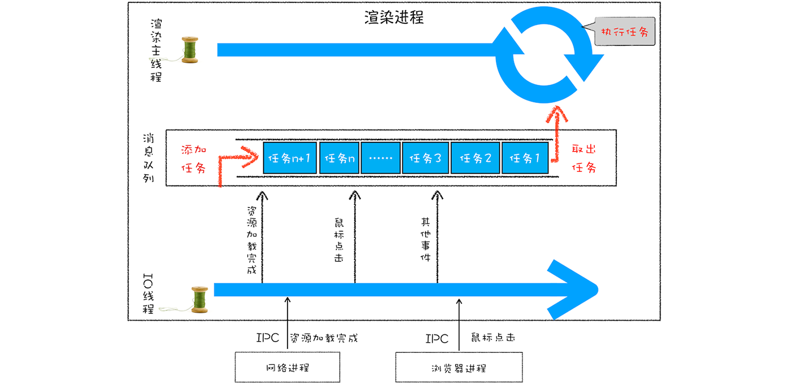

### 1.2 消息队列中的任务类型

[Chromium 的官方源码](https://cs.chromium.org/chromium/src/third_party/blink/public/platform/task_type.h) 中包含了很多内部消息类型，如输入事件(鼠标滚动、点击、移动)、微任务、文件读写、WebSocket、JavaScript 定时器等等。此外，消息队列还包含很多页面相关事件，如 JavaScript 执行、解析 DOM、样式计算、布局计算、CSS 动画等。更多事件在3、6两节中继续介绍。

典型的事件添加过程：

- 当接收到 HTML 文档数据，渲染引擎会将"解析 DOM"事件添加到消息队列中
- 当用户改变 Web 页面的窗口大小，渲染引擎会将"重新布局"事件添加到消息队列中
- 当触发  JavaScript 引擎垃圾回收机制，渲染引擎会将"垃圾回收"任务添加到消息队列中
- 当要执行一段异步  JavaScript 代码，需要将执行任务添加到消息队列中
- …...

事件被添加到消息队列后，事件循环系统会按照消息队列中的顺序来执行事件。

### 1.3 页面单线程缺点的优化

消息队列先进先出，并不太灵活。

+ **高优先级任务处理优化**：微任务，后续详解
+ **单任务执行时间过长**：JavaScript 回调功能

## 2. 事件循环应用：WebAPI

### 2.1 setTimeout

#### 2.1.1 实现方式

消息队列中的任务是按顺序执行的，为了保证 setTimeout 回调函数能在指定时间内执行，不能将定时器的回调函数直接添加到消息队列中。

**延迟队列**：在 Chrome 中还有另外一个消息队列维护了需要延迟执行的任务列表，当通过 JavaScript 创建定时器时，渲染进程会将该定时器的回调任务添加到延迟队列中。

**触发方式**：消息队列中的一个任务执行完成后，消息队列会根据任务发起时间和延迟时间计算出到期的任务，然后依次执行这些到期的任务。等到期的任务执行完成后，再继续下一个循环过程。

**任务取消**：当一个定时器任务还没有被执行时也可通过 `clearTimeout` 函数传入定时器 ID 来取消，浏览器通过 ID 在延迟队列中查找到对应的任务并删除。

#### 2.1.2 一些细节

1. **当前任务执行时间会影延迟到期定时器任务的执行**

   ```javascript
   function bar() {
       console.log('bar')
   }
   function foo() {
       setTimeout(bar, 0);
       for (let i = 0; i < 5000; i++) {
           let i = 5+8+8+8
           console.log(i)
       }
   }
   foo()
   ```

   **定时器的回调函数执行时间比实际设定值延后**，通过 setTimeout 设置的回调任务被放入消息队列中并不是立即执行的，要等当前任务执行完成后执行。例如上面这段代码要执行 5000 次 for 循环，实际约500ms后才输出 bar。

2. **嵌套调用最短时间间隔 4 毫秒**

   在定时器函数里面嵌套调用定时器，也会延长定时器的执行时间，系统会设置最短时间间隔为 4 毫秒。图中竖线是定时器的函数回调过程，前五次调用时间间隔较小，后面固定 4 毫秒。在 Chrome 中，定时器被嵌套调用 5 次以上，系统会判断该函数方法被阻塞，调用时间间隔小于 4 毫秒会设置为 4 毫秒，所以，实时性要求较高的需求，如动画，不太适合使用 setTimeout，更适合用 `requestAnimationFrame`。

   

3. **未激活的页面(隐藏tab)最小间隔 1000 毫秒**

   目的是为了优化后台页面的加载损耗以及降低耗电量。

4. **延时执行时间有最大值**

   Chrome、Safari、Firefox 以 32 bit 存储延时值，最大能存放的数字是 2147483647 毫秒，当延迟值大于 2147483647 毫秒(约 24.8 天)时会溢出导致定时器立即执行。

5. **回调函数中的 this 不符合直觉**

   ```javascript
   var name= 1;
   var MyObj = {
     name: 2,
     showName: function(){
       console.log(this.name)
     }
   }
   setTimeout(MyObj.showName,1000) // 1
   ```

   如上，执行上下文中的 this 会被设置为全局 window，如果是严格模式，会被设置为 undefined，解决方法：

   **使用匿名函数**

   ```javascript
   setTimeout(() => { MyObj.showName() }, 1000)
   // 或
   setTimeout( function() { MyObj.showName() }, 1000)
   ```

   **使用 bind 方法**

   ```javascript
   setTimeout(MyObj.showName.bind(MyObj), 1000) // 将 showName 绑在 MyObj 上
   ```


### 2.2 XMLHttpRequest

和 setTimeout 直接将延迟任务添加到延迟队列中不同，XMLHttpRequest 发起请求，由浏览器的其他进程或线程执行，再将执行结果使用 IPC 的方式通知渲染进程，并将对应的消息添加到消息队列中。

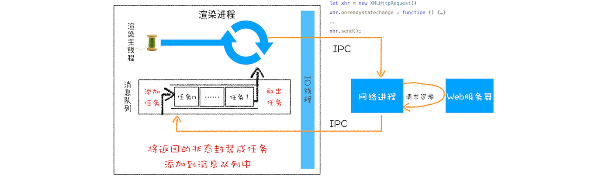

## 3. 宏任务和微任务

### 3.1 宏任务(粗时间粒度) 

页面中的大部分任务都是在主线程上执行的，如：

- 渲染事件(如解析 DOM、计算布局、绘制等)
- 用户交互事件(如鼠标点击、滚动页面、放大缩小等)
- JavaScript 脚本执行事件
- 网络请求完成、文件读写完成等事件

页面进程引入消息队列和事件循环机制来协调这些任务有条不紊地执行，渲染进程内部会维护多个消息队列，如 **延迟执行队列** 和 **普通消息队列**，然后主线程采用一个 for 循环，不断地从多个消息队列中选出一个最老的任务 oldestTask 设置为当前任务，执行完成后从消息队列中删除并统计时长等信息，这些消息队列中的任务称为宏任务。但宏任务难以胜任对时间精度要求高的事件，例如两个连续 setTimeout 延迟时间为 0 的任务，中间却插入了其他系统级任务：


### 3.2 微任务

微任务是一个异步执行的函数，执行时机是在主函数执行结束之后、当前宏任务结束之前。**微任务是实时性和效率之间的一个有效的权衡**。

#### 3.2.1 微任务队列

当 JavaScript 执行一段脚本时，V8 创建全局执行上下文的同时会创建一个 **微任务队列**，存放当前宏任务执行过程中产生的微任务。但这个微任务队只给 V8 引擎内部使用，无法通过 JavaScript 直接访问。

#### 3.2.2 微任务的产生

在现代浏览器中产生微任务有两种方式：

+ 使用 `MutationObserver` 监控某个 DOM 节点，再通过 JavaScript 修改这个节点及其子节点，当 DOM 节点发生变化时产生 DOM 变化记录的微任务
+ 使用 `Promise`，调用 Promise.resolve() 或 Promise.reject() 产生微任务

> **关于 MutationObserver:**
>
> 最早浏览器不支持 DOM 监听，轮询方式难以平衡性能和实时性问题，2000年引入的 Mutation Event 采用同步回调监听 DOM 变化，但存在严重性能问题。MutationObserver 将其改成异步调用，使用一个能记录多次 DOM 变化记录的数据结构，**一次性触发异步调用**，为保证实时性不能使用 setTimeout 创建宏任务触发回调，渲染引擎将变化记录封装成微任务添加进当前任务的微任务队列中。**异步 + 微任务** 策略解决了性能和实时性问题。

#### 3.2.3 微任务的执行

在当前宏任务中的 JavaScript 快执行完成时(JavaScript 引擎准备退出全局执行上下文并清空调用栈时)，JavaScript 引擎会检查全局执行上下文中的微任务队列并按序执行。若执行微任务过程中产生了新的微任务，会添加到微任务队列中，直到队列为空才执行结束，因此不会推迟到下个宏任务。

> **关于检查点:**
>
> 除了退出，还有其他检查点，但不重要

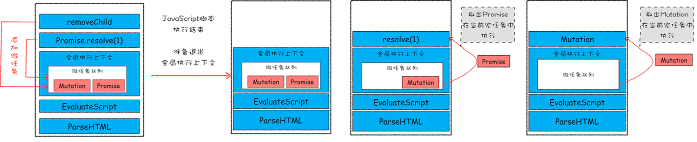

上图执行一个 `ParseHTML` 宏任务过程中遇到 JavaScript 脚本，暂停解析流程并进入到 JavaScript 执行环境，添加微任务并在 JavaScript 执行结束时取出执行，可以得到结论：

- 每个宏任务关联一个微任务队列
- 微任务的执行时长会影响当前宏任务的时长
- 在一个宏任务中分别创建一个用于回调的宏任务和微任务，微任务会早于宏任务执行

## 4. Promise

### 4.1 Promise 的产生背景

Web 页面的单线程架构决定了异步回调，使得代码逻辑不连续，以原始 `XMLHttpRequest` 编程为例：

```javascript
let xhr = new XMLHttpRequest()
xhr.ontimeout = function(e) { onReject(e)}
xhr.onerror = function(e) { onReject(e) }
xhr.onreadystatechange = function () { onResolve(xhr.response) }
...
xhr.open('Get', URL, true);
...
xhr.timeout = 3000 // 设置 xhr 请求的超时时间
xhr.responseType = "text" // 设置响应返回的数据格式
...
xhr.send();
```

优化——封装异步代码，让处理流程变得线性。将所有请求细节封装进 XFetch 函数 `function XFetch(request, resolve, reject)`，传入 `request` 对象作为参数输入，`resolve` 和 `request` 作为回调。

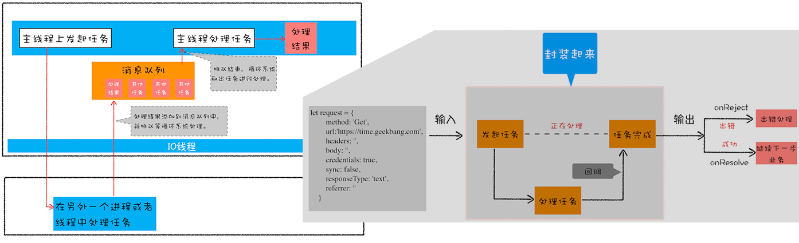

但是太多的回调嵌套很容易造成 **回调地狱**，代码凌乱的形成原因：

+ 嵌套回调，层层依赖
+ 任务的不确定性，每个任务都必须处理成功和失败回调

### 4.2 Promise 优化回调地狱问题

#### 4.2.1 Promise 解决嵌套回调

Promise 主要通过以下两步解决嵌套回调问题：

+ **Promise 实现了回调函数的延时绑定**

产生嵌套回调的主要原因是在发起任务请求时会带上回调函数，所以当前任务结束后下个任务只能在回调函数中处理。而 Promise 是在创建好 Promise 对象后再在 Promise 对象上调用 `.then` 方法来设置回调函数：

```javascript
function executor(resolve, reject){ resolve(100) }
let x1 = new Promise(executor)
// 延迟绑定回调函数 onResolve
function onResolve(value){ ... }
x1.then(onResolve)
```

+ **Promise 将回调函数的返回值穿透到最外层**

通过将回调函数中创建的 Promise 对象返回到最外层可以摆脱嵌套循环。

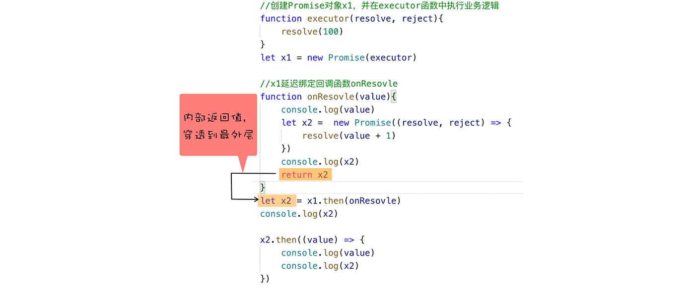

#### 4.2.2 Promise 错误"冒泡"解决异常的重复处理

```javascript
function executor(resolve, reject) {
    let rand = Math.random();
    if (rand > 0.5) { resolve() }
    else { reject() }
}
var p0 = new Promise(executor)
var p1 = p0.then((value) => {
    return new Promise(executor)
})
var p2 = p1.then((value) => {
    return new Promise(executor)
})
p2.catch((error) => {
    console.log("error")
})
```

Promise 对象的错误具有"冒泡"性质，会一直向后传递直到被 onReject 函数处理或 catch 语句捕获为止。三个 Promise 对象 p0～p2 无论哪个对象中抛出异常，都可以在最后一个对象 p2.catch 中捕获异常，合并了错误处理。

### 4.3 Promise 与微任务

```Javascript
function executor(resolve, reject) { resolve(100) }
let demo = new Promise(executor)
function onResolve(value){ ... }
demo.then(onResolve)
```

针对上面的 Promise 编写 Bromise 函数模拟实现 resolve 和 then(暂不支持 rejcet)，来模拟 Promise 回调的延迟绑定。

```Javascript
function Bromise (executor) {
    var onResolve_ = null
    this.then = function (onResolve, onReject) {
        onResolve_ = onResolve
    };
    function resolve (value) {
        setTimeout(()=>{
            onResolve_(value) // 采用定时器推迟 onResolve 的执行
        }, 0)
    }
    executor(resolve, null)
}
```

使用定时器的效率并不是太高，所以 Promise 将这个定时器的实现改造成微任务，这样既可以让 onResolve 延迟调用，又提升了代码的执行效率，这就是 Promise 中使用微任务的原由。

## 5. async / wait

Promise 的编程模型虽然解决了回调地狱问题，但在语义方面依然存在缺陷，代码中充斥着大量的 then 函数。使用 es7 的 async/await 可以实现用同步代码风格来编写异步代码，async/await 的基础技术使用生成器(协程)和 Promise(微任务) 来实现。

### 5.1 生成器 & 协程

生成器函数是一个支持暂停和恢复执行的带星号函数。在生成器函数内部执行一段代码，遇到 yield 关键字 JavaScript 引擎会暂停该函数的执行并将关键字后的内容返回给外部，外部函数可通过 next 方法恢复函数的执行。

生成器就是 JavaScript 中协程的一种实现方式。协程是一种比线程更轻量级的存在，一个线程可以拥有多个协程，但线程上同时只能执行一个协程，可以把协程看成是跑在线程上的任务，比如当前执行 A 协程同时要启动 B 协程，那么 A 协程需要将主线程的控制权交给 B 协程，体现为 A 协程暂停执行，B 协程恢复执行。协程不被操作系统内核管理，完全由程序控制(用户态执行)，因此性能得到很大提升，不会像线程切换那样消耗资源。

```javascript
function* genDemo() {
    console.log("开始执行第一段")
    yield 'generator 1'
    console.log("开始执行第二段")
    yield 'generator 2'
    console.log("执行结束")
    return 'generator 3'
}
console.log('main 0')
let gen = genDemo()
console.log(gen.next().value)
console.log('main 1')
console.log(gen.next().value)
console.log('main 2')
console.log(gen.next().value)
console.log('main 3')
```

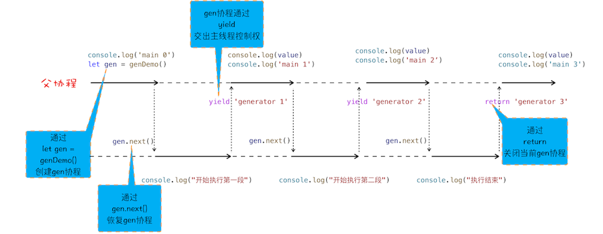

`genDemo()` 创建协程 `gen` 之后并没有立即执行，需要通过调用 `gen.next` 来执行，执行时候可以通过 `yield` 关键字来暂停并返回关键字后面的内容给父协程，可以通过 `return` 结束当前协程并将 `return` 后的内容返回给父协程。`gen` 协程和父协程在主线程上交互执行(非并发执行)，通过 `yield` 和 `gen.next` 来配合完成调用栈的切换。

生成器(协程)和 Promise 可以相互配合更优雅地执行异步方法：

```javascript
function* foo() {
    // ...
    let response1 = yield fetch('https://xxx/test1')
    // ...
    let response2 = yield fetch('https://xxx/test2')
    // ...
}
// 创建生成器函数
let gen = foo()
// 返回 Promise
function getGenPromise (gen) { return gen.next().value }
// 处理回调
getGenPromise(gen).then((response) => {
    // response1 ...
    return getGenPromise(gen)
}).then((response) => {
    // response2 ...
})
```

### 5.2 async & await

根据 MDN 定义，`async` 是一个通过 **异步执行** 并 **隐式返回 Promise** 的函数。

```javascript
async function foo() {
    return 2
}
console.log(foo()) // Promise {<resolved>: 2}
```

`await` 则会默认创建 Promise 对象。

```javascript
async function foo() {
    console.log(1) // step2
    let a = await 100
    console.log(a) // step4
    console.log(2) // step5
}
console.log(0) // step1
foo()
console.log(3) // step3
```

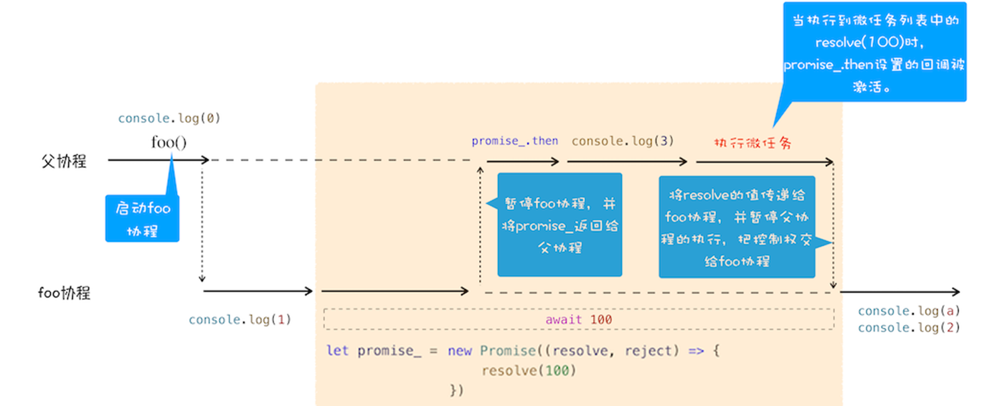

从协程的视角观察代码的整体执行流程，执行 `await 100` 语句时会默认创建一个 Promise 对象，然后 JavaScript 引擎会暂停当前 foo 协程，将主线程的控制权转交给父协程，同时将创建的 promise_ 对象返回给父协程。父协程需要调用 `promise_.then` 来监控 promise 状态的改变。接下来继续执行父协程打印 3。随后父协程执行结束前会进入微任务检查点，然后执行微任务队列，微任务队列中的 `resolve(100)` 任务被执行，最后执行 foo 中剩下流程。

`async / await` 其实是 Promise 和生成器的应用，也可以说是微任务和协程应用，使用 `async / await` 能够彻底告别执行器和生成器，实现更直观简洁的代码。

## 6. 扩展：单消息队列队头阻塞问题优化

### 6.1 问题描述

随着浏览器不断进化，渲染主线程越来越拥挤，下面的仅为部分渲染主线程任务：

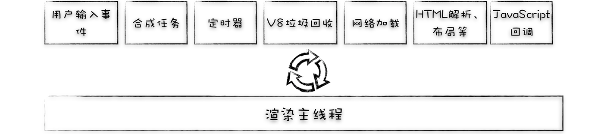

在单消息队列架构下，存在低优先级任务阻塞高优先级任务的情况，造成卡顿。Chromium 团队从 2013 年开始花费了大量精力在持续重构底层消息机制。


### 6.2 第一次迭代：引入高优先级队列

引入不同优先级的队列，渲染进程根据任务紧急程度添加到不同队列，例如在交互阶段，下面的任务应视为高优先级任务：

+ 鼠标触发的点击任务、滚动页面任务
+ 手势触发的页面缩放任务
+ CSS、JavaScript 等操作触发的动画特效等任务

再在渲染进程中引入一个 **任务调度器**，负责从多个消息队列中选出合适的任务，如先取高优先级队列任务，当其为空再选普通优先级队列任务。问题是 **可能会打乱任务相对执行顺序**。


### 6.3 第二次迭代：根据消息类型实现消息队列

为不同类型的任务创建不同优先级的消息队列，如创建用户交互队列存放输入事件、创建合成队列存放合成任务、创建默认队列存放资源加载和定时器回调等事件、创建空闲消息队列存放垃圾回收等实时性不高的事件……但采用的 **静态优先级** 策略，在一些场景下，如页面加载阶段，**速度会拖慢**。


### 6.4 第三次迭代：动态调度策略

第二次的静态优先级策略虽然优化了高优先级任务，却拖慢低优先级任务，对于各种不同场景显得过于死板，因此采用 **动态优先级** 策略，在不同场景下动态调整消息队列的优先级。

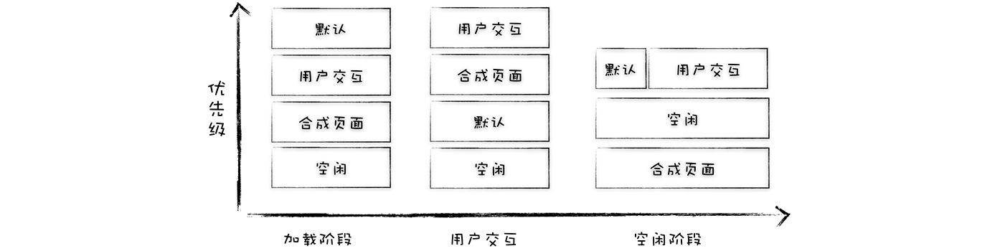

**页面加载阶段**，用户核心诉求是尽快看到页面，交互、合成并不是核心诉求，因此将包含页面解析、JavaScript 脚本执行等任务的默认队列优先级设为最高。

**交互阶段**，首先分析下渲染过程。如下一章《浏览器中的页面渲染》章节中讲述，浏览器生成图片提交到显卡后缓冲区，GPU互换前后缓冲区，显示器下次读取GPU前缓冲区数据并显示。若显示器从前缓冲区读取图片，和浏览器生成新的图像到后缓冲区的过程不同步，会造成卡顿、丢帧、不连贯的现象。

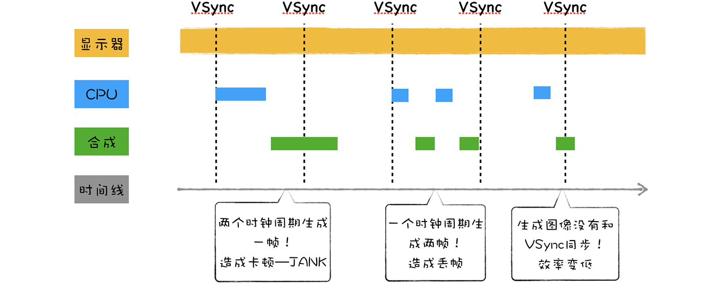

显示器在绘制一帧完成后会发出 **VSync 垂直同步信号** (vertical synchronization) 给 GPU，Chromium 收到 GPU 的 VSync 信号后同步给浏览器进程，浏览器进程再将其同步到对应的渲染进程，渲染进程准备绘制新的一帧。

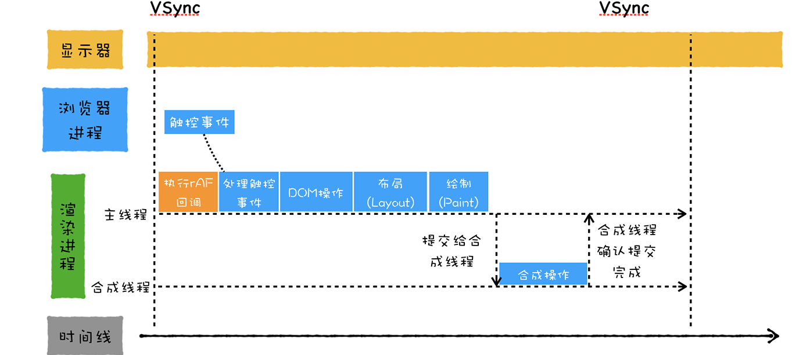

回到动态优先级调节，交互阶段渲染进程收到用户交互任务后，合成任务的优先级最高，合成任务完成后提交数据给合成线程。场景切换为合成线程工作，此时下个合成任务的优先级调整为最低，并将页面解析、定时器等任务优先级提升。一个 VSync 时钟周期大多是 16.66 (1/60) 毫秒，不需要再次生成新页面，剩下的时间切换为空闲阶段场景，空闲(不紧急)任务优先级提升，如 V8 的垃圾回收。

> **window.requestAnimationFrame & setTimeout:**
>
> CSS 动画的高效执行是由于渲染进程自动处理，每帧动画与 VSync 时钟保持一致实现的；而 JavaScript 由用户控制，setTimeout 触发的动画每帧的绘制时机很难和 VSync 时钟保持一致，所以引入了和 VSync 时钟周期同步的原生函数调用 API `window.requestAnimationFrame` 实现 JavaScript 高性能动画。rAF 函数的回调任务会在 **每一帧的开始执行**，与浏览器刷新频率同步；而 setTimeout 即使设置16.7ms延迟，也可能会因为当前任务的执行时间过长而延迟。
>

### 6.5 第四次迭代：队列设置执行权重

基于不同场景动态调整消息队列优先级依然存在 **任务饿死** (新的高优先级任务不断加入队列导致低优先级任务一直不执行) 的问题，Chromium 给每个队列设置执行权重，若连续执行了一定数量的高优先级任务后中间会执行一次低优先级任务，缓解任务饿死问题。

