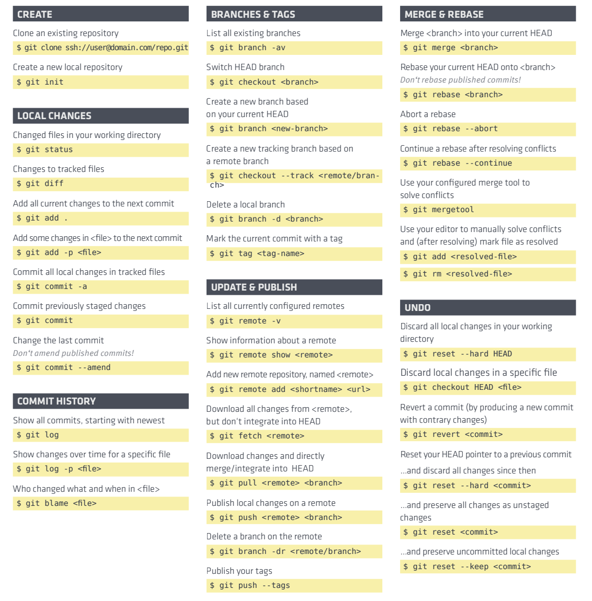

# git学习总结01 — 初始化

> Write By [CS逍遥剑仙](http://home.ustc.edu.cn/~cssjf/)   
> 我的主页: [csxiaoyao.com](https://csxiaoyao.com)   
> GitHub: [github.com/csxiaoyaojianxian](https://github.com/csxiaoyaojianxian)   
> Email: [sunjianfeng@csxiaoyao.com](mailto:sunjianfeng@csxiaoyao.com)  
> QQ: [1724338257](http://wpa.qq.com/msgrd?uin=1724338257&site=qq&menu=yes)

## 1. 起步 

最初学习 git 已是多年前在校期间，用于课程设计，场景也相对简单。实习后由于所在公司一直使用 svn，缺少协作实践场景，时间久了 git 知识已逐渐淡忘。公司从去年开始已经在内部全面推广 git，随着项目规模不断扩大，git 操作方面已明显力不从心，因此再次系统化学习 git，写此笔记以总结备忘。

本文分3篇：《初始化》、《版本控制》、《分支管理》进行总结，因为版本控制和分支管理是 git 的核心，已经单独成篇，在版本控制一篇中最后总结了8种常见的场景，在分支管理一篇中总结了团队协作模式和 git 工作流，剩下的细碎的内容放在了第一篇初始化中。

## 2. 初始化配置

### 2.1 设置签名 config

安装完 git 后需要设置签名，签名分为项目级别和系统用户级别。

**项目/仓库级别：**

```Shell
$ git config user.name csxiaoyaojianxian
$ git config user.email sunjianfeng@csxiaoyao.com
```

仅在当前本地库有效，信息保存在 `./.git/config` 文件。

**系统用户级别：**

```Shell
$ git config --global user.name csxiaoyaojianxian
$ git config --global sunjianfeng@csxiaoyao.com
```

信息保存在 `~/.gitconfig` 文件。

> **注意：**
>
> 这里的用户名和邮箱仅用于区分不同开发人员身份，和登录远程库的账号没有任何关系

### 2.2 初始化本地库 init

```Shell
$ git init
```

### 2.3 配置忽略文件 .gitignore

代码提交需要忽略垃圾文件和敏感信息文件，可以配置 `.gitignore`，参考 [https://github.com/github/gitignore](https://github.com/github/gitignore)

```shell
# 检查验证规则
$ git check-ignore -v config.js
# 使用 -f 参数强制添加
$ git add -f config.js
```

## 3. 搭建 gitlab

git 分**工作区 (Working Directory)**、**暂存区 (Stage / Index)**、**本地库 (Repository)**、**远程库**。远程库除了使用 `github` 等外，还可以自己搭建。gitlab 社区版安装指引 [<https://about.gitlab.com/install/>](https://about.gitlab.com/install/)，安装完成后初始化配置 gitlab：

```shell
# 启动gitlab服务
$ gitlab-ctl reconfigure
$ gitlab-ctl start
# 停止gitlab服务
$ gitlab-ctl stop
```

## 4. 文件操作 add & commit

**快照流文件管理**：每次 commit 提交更新时 git 都会对当前的全部文件制作一个快照并保存这个快照的索引。为了高效，如果文件没有修改则只保留一个链接指向之前存储的文件。

```Shell
# 查看工作区、暂存区状态
$ git status
# 工作区的"新建/修改"添加到暂存区
$ git add [file name]
# 暂存区删除对指定文件的追踪
$ git rm --cached [file name]
# 将暂存区的内容提交到本地库
$ git commit -m "commit message" [file name]
# 简化命令: 跳过 add 所有工作区文件，直接 commit
$ git commit -a
$ git commit -am "commit message"
# 编辑上次提交信息
$ git commit --amend -m "更好的提交日志"
# 在上次提交中附加一些内容，保持提交日志不变
$ git add . && git commit --amend --no-edit
# 空提交，可用来重新触发 CI 构建
$ git commit --allow-empty -m "chore: re-trigger build"
```

## 5. 文件差异比较 diff

```Shell
# 工作区 / 暂存区 比较
$ git diff [file name]
# 工作区 / 暂存区 比较多个
$ git diff

# 工作区 / 本地库 比较
$ git diff [本地库中历史版本] [file name]
$ git diff HEAD^ test.txt

# 两个分支文件差异比较
$ git diff master..dev
```

## 6. 命令一览

```Shell
# 帮助命令
$ git help <command>
```




参考：

<https://dev.to/lydiahallie/cs-visualized-useful-git-commands-37p1>

<https://dev.to/maxpou/git-cheat-sheet-advanced-3a17>

<https://gitee.com/liaoxuefeng/learn-java/raw/master/teach/git-cheatsheet.pdf>

<https://juejin.im/post/5e9e49356fb9a03c917fe7fd>

<https://www.liaoxuefeng.com/wiki/896043488029600>


