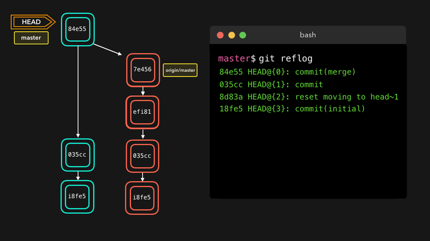

# git学习总结02 — 版本控制

> Write By [CS逍遥剑仙](http://home.ustc.edu.cn/~cssjf/)   
> 我的主页: [csxiaoyao.com](https://csxiaoyao.com)   
> GitHub: [github.com/csxiaoyaojianxian](https://github.com/csxiaoyaojianxian)   
> Email: [sunjianfeng@csxiaoyao.com](mailto:sunjianfeng@csxiaoyao.com)  
> QQ: [1724338257](http://wpa.qq.com/msgrd?uin=1724338257&site=qq&menu=yes)

## 1. 历史记录查询 log & reflog 

版本控制是基于 commit 的操作，因此历史记录的查询是版本控制的基础。

```shell
# 查看详细 log
$ git log  # space / b 翻页, q 退出
# 简化展示
$ git log --pretty=oneline
# 【推荐方式1】简洁
$ git log --oneline
# 【推荐方式2】reflog 可以记录每一条操作命令
$ git reflog  # HEAD@{x} x表示移动到当前版本需要的步长
# 日志搜索
$ git log --all --grep='homepage'
# 获取某人的提交日志
$ git log --author="csxiaoyao"
# 查看分支合并图
$ git log --graph --pretty=oneline --abbrev-commit
```



## 2. 本地库版本管理 reset

### 2.1 reset 操作 HEAD 指针的三种方式

版本的前进后退本质是 HEAD 指针的移动，有三种移动指针进行版本控制的方式：索引、`^`、`~`。

```shell
# 1. 【推荐】基于索引值操作
$ git reset --hard [局部索引值]
# 2. 使用^符号后退指定步数
$ git reset --hard HEAD^
$ git reset --hard HEAD^^^ # 后退3步
# 3. 使用~符号后退指定步数
$ git reset --hard HEAD~n # 后退n步
```

`HEAD` 表示当前版本 (提交ID)，上个版本是 `HEAD^`，上上个版本是 `HEAD^^`，上100个版本是 `HEAD~100`。

同时 reset 命令有三个参数，对应三个恢复等级：`--soft`、`--mixed`、`--hard`。

### 2.2 --soft

本地库移动 HEAD 指针，**暂存区**和**工作区**内容不变。

如下图，使用软重置可以撤销提交记录，但保留新建的 index.js 和 style.css 文件。


### 2.3 --mixed (默认)

本地库移动HEAD指针，重置暂存区，**工作区**内容不变。

### 2.4 --hard (常用)

本地库移动HEAD指针，重置暂存区，重置工作区。

如下图，硬重置不保留已提交的修改，直接将当前分支的状态恢复到某个特定提交下，同时将当前工作区和暂存区中的文件全部移除。


## 3. 远程版本还原 revert

reset 适用于本地库中的版本控制，然而远程分支只能使用 revert 在不修改分支历史的前提下，还原某次提交引入的更改，并创建一个包含已还原更改的新提交记录。

如下图，ec5be 上添加了 index.js 文件，后来发现多余了，可以执行 revert 指令还原之前的更改。

```shell
$ git revert ec5be
```


## 4. 工作区修改丢弃 checkout (特殊)

checkout 除了用于分支切换，使用 `--` 还可以用于版本控制，丢弃指定文件在工作区的全部修改，恢复文件到最后一次 commit 的状态(丢失最后一次 commit 后工作区修改的内容)。

```shell
$ git checkout -- [file name]
```

## 5. 标签管理 tag

标签也是版本库的一个快照，拥有让人容易记住的名字，同时也是指向某个 commit 的指针，但是分支指针可以移动，标签指针不能移动。

- 创建标签

```shell
# 切换到目标分支，默认标签打在最新提交的commit上(HEAD)
$ git tag v1.0
# 也可以给指定提交ID创建标签
$ git tag v0.9 xxxxxx
# 还可以指定标签信息，-a 指定标签名，-m 指定说明文字
$ git tag -a v0.9 -m "some message" xxxxxx
```

- 查看所有标签

```shell
$ git tag
# 标签不是按时间顺序列出，而是按字母排序的
# 可以用 git show <tagname> 查看指定标签信息
$ git show v0.9
```

- 标签推送

```shell
# 推送指定标签名的标签
$ git push origin v1.0
# 推送全部尚未推送到远程的本地标签
$ git push origin --tags
```

- 标签删除

```shell
# 删除本地标签
$ git tag -d v0.9
# 删除远程标签，先删除本地再 push 删除远程
$ git tag -d v0.9
$ git push origin :refs/tags/v0.9
```

## 6. 常见场景操作

- **场景1**：工作区某文件内容改错，想直接丢弃工作区的修改时：

```shell
$ git checkout -- [file name]
```

- **场景2.1**：改错的文件添加到了暂存区，未提交版本库，想清除暂存区的修改，重新放回工作区时：

```shell
# 清空暂存区的全部修改，重新放回工作区
$ git reset HEAD
# 仅操作指定文件
$ git reset HEAD [file name]
```

此时回到了**场景1**，可以选择直接丢弃或修改重新添加。

- **场景2.2**：改错的文件添加到了暂存区，未提交版本库，想直接清除本地所有修改时：

```shell
# 清空暂存区，清空工作区
$ git reset --hard HEAD
```

等同于 **场景2.1** + **场景1**。

- **场景3.1**：改错的文件已提交版本库，但未提交远程库，想撤销上次提交，重新放回工作区时：

```shell
$ git reset HEAD^
```

- **场景3.2**：改错的文件已提交版本库，但未提交远程库，想撤销上次提交，上次提交内容直接丢弃时：

```shell
$ git reset --hard HEAD^
```

- **场景4**：工作区删除文件，想找回时：

> 注意：工作区 rm 文件后需要执行 `git rm [file name]` 删除对应的追踪并 commit

```shell
# 前提：文件删除前提交过本地库

# 方式1：通过 checkout 丢弃指定文件在工作区的修改以恢复(可以恢复为暂存区中的文件)
$ git checkout -- [file name]

# 方式2：通过 reset 的 hard 参数重置 HEAD 指针到最新记录，刷新暂存区和工作区状态，找回版本库中的删除文件
# 删除操作已提交到本地库
$ git reset --hard [历史记录指针位置]
# 删除操作尚未提交到本地库
$ git reset --hard HEAD
```

- **场景5：**还原远程分支

```shell
# 不改变历史提交记录还原，并生成新的提交记录
$ git revert [历史记录指针位置]
```

- **场景6：**清理一团糟的本地仓库

```shell
# 还原 master 和远程最新的一致
$ git fetch origin
$ git checkout master
$ git reset --hard origin/master
# You're now up-to-date with master!
```


参考：

<https://dev.to/lydiahallie/cs-visualized-useful-git-commands-37p1>

<https://dev.to/maxpou/git-cheat-sheet-advanced-3a17>

<https://gitee.com/liaoxuefeng/learn-java/raw/master/teach/git-cheatsheet.pdf>

<https://juejin.im/post/5e9e49356fb9a03c917fe7fd>

<https://www.liaoxuefeng.com/wiki/896043488029600>


