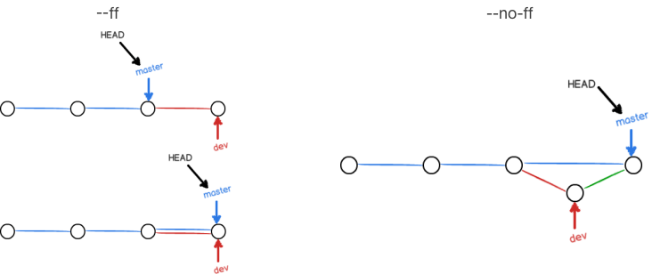
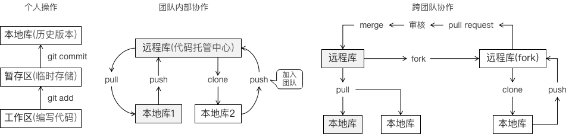
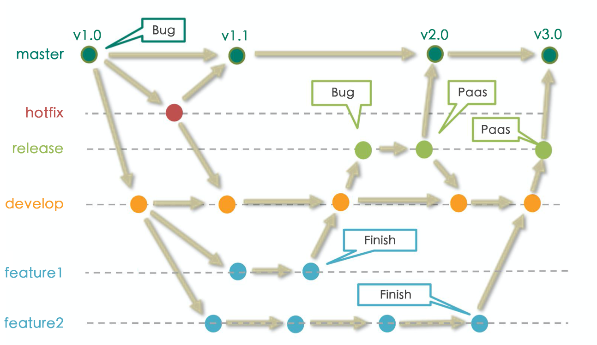

# git学习总结03 — 分支管理

> Write By [CS逍遥剑仙](http://home.ustc.edu.cn/~cssjf/)   
> 我的主页: [csxiaoyao.com](https://csxiaoyao.com)   
> GitHub: [github.com/csxiaoyaojianxian](https://github.com/csxiaoyaojianxian)   
> Email: [sunjianfeng@csxiaoyao.com](mailto:sunjianfeng@csxiaoyao.com)  
> QQ: [1724338257](http://wpa.qq.com/msgrd?uin=1724338257&site=qq&menu=yes)

## 1. 分支基本操作 branch & checkout

- 查看分支

```shell
$ git branch # git branch -v
```

- 创建分支

```shell
$ git branch [branch name] # 从当前分支新建分支
```

- 切换分支 

```shell
$ git checkout [branch name] # git switch [branch name]
# 创建 + 切换分支
$ git checkout -b [branch name] # git switch -c [branch name]
# 切换到之前的分支
$ git checkout -
```

- 删除分支

```shell
$ git branch -d [branch name]
# 强行删除未合并分支 (会丢失未合并分支修改)
$ git branch -D [branch name]
```

## 2. 分支合并 merge & rebase

### 2.1 merge 合并 (--ff & --no-ff)

merge 分支合并有 `fast-forward` 和 `no-fast-forward` 两种模式。下图 dev 合入 master，默认触发快进模式(fast-forward)，因为只需要修改指针即可实现合并；而普通模式(no-fast-forward)需要生成一个新的commit，因此即使 dev 分支删除，也能从 master 分支历史上看出分支合并信息。



```shell
# 查看分支合并图
$ git log --graph --pretty=oneline --abbrev-commit
```

### 2.2 fast-forward 模式

合并分支时 git 默认会优先用 `fast forward` 快进模式。

- 操作：直接修改 HEAD 指针指向，不会创造一个新的 commit 节点，所以合并速度非常快
- 缺点：删除分支或指针向前走会丢失分支信息 (log中体现不出原来的分支操作)
- 触发时机：例如下图合并 dev 分支到 master 分支时，如果 master 分支的状态没有被更改过则触发快进合并

```shell
# 合并某分支到当前分支，默认 git merge --ff [待合入分支]
$ git merge dev
```


### 2.3 no-fast-forward 模式

- 触发时机：例如下图合并 dev 分支到 master 分支时，master 分支的历史记录有更新，合并两个分支修改会生成一个新的提交，同时 master 分支的 HEAD 指针会移动到该提交上。
- 强制禁用 fast-forward 模式

```shell
# 添加 --no-ff 参数禁用 fast forward 改为普通模式合并保留合并历史
$ git merge --no-ff -m "merge with no-ff" dev # 可以通过 -m 填写新 commit 信息
```

- 设置默认 no-fast-forward 模式

```shell
# 方案1：全局设置禁用 fast-forward
$ git config --global --add merge.ff false
# 方案2：某个分支单独禁用 fast-forward
$ git config branch.[branch name].mergeoptions "--no-ff"
```


- 冲突解决

```shell
# 若出现冲突，需要在文件中解决冲突，然后添加提交
# ...
$ git add [file name]
$ git commit -m "some message" # 注意：此时 commit 不能加具体文件名
```


### 2.4 rebase 变基

rebase 操作可以通过复制提交记录，改变本地未 push 的分叉提交历史所基于的 commit，并整理成直线，使得查看历史提交的变化时更直观，缺点是本地的分叉提交会被修改。

```Shell
# 将当前 dev 分支修改合并到 master 分支
$ git rebase master
```


> 关于交互式变基修改 commit (commit合并、顺序调整、提交日志修改) 等可以参考 [<https://dev.to/lydiahallie/cs-visualized-useful-git-commands-37p1>](https://dev.to/lydiahallie/cs-visualized-useful-git-commands-37p1)

## 3. 工作区储藏与恢复 stash

对于工作区中未开发完无法 add / commit 的内容，可以先 stash 起来，切换到其他分支，后面再切回来恢复。

```shell
$ git stash # 此时 git status，工作区是干净的，可以切换到其他分支
```

工作区的恢复有两种方式：

```shell
# 首先查看stash列表
$ git stash list
# stash@{0}: WIP on dev: xxxxxx
```

**方式1**：使用 `git stash pop` 恢复，同时删除 stash 内容：

```shell
$ git stash pop
```

**方式2**：使用 `git stash apply` 恢复，删除需要额外使用 `git stash drop` 来删除：

```shell
$ git stash apply stash@{0}
$ git stash drop stash@{0}
```

## 4. 复制提交 cherry-pick

有一种场景，如 BUG 修复，在 dev 分支上修复并提交，需要同样在 master 上修改，但是却不能直接合并 dev 分支，因为只需要复制其中某一个 commit，使用 `cherry-pick` 命令，即可复制一个特定的提交到当前分支并生成一次新的提交，避免了在 master 分支再修复一次。

```shell
# 在 master 分支执行 cherry-pick，将指定提交作为新提交添加到 master
$ git cherry-pick [提交索引]
```

如下图，dev 分支上的 76d12 提交添加了 index.js 文件，使用 cherry-pick 将本次提交更改加入到 master 分支。


## 5. 远程仓库&多人协作

### 5.1 git 多人协作方式

多人协作分为团队内部协作和跨团队协作。



### 5.2 配置ssh

```shell
# 在用户主目录~找到.ssh目录，有id_rsa和id_rsa.pub两个文件
$ cd ~
# 创建 SSH Key
$ ssh-keygen -t rsa -C "youremail@example.com"
# 登录远程库，如GitHub，Add SSH Key，粘贴id_rsa.pub文件内容
$ cd .ssh
$ cat id_rsa.pub
```

### 5.3 remote & clone

+ 已有本地库，关联本地库与远程库 remote

```shell
# 查看远程库信息
$ git remote
# or
$ git remote -v
# 创建远程库地址别名，远程库的名字默认是 origin，可以修改
# git remote add [别名] [远程地址]
$ git remote add origin git@github.com:csxiaoyaojianxian/test.git
```

- 没有本地库，克隆远程库 clone

```shell
# clone 过程完成了远程库下载到本地、创建 origin 远程地址别名、初始化本地库
$ git clone git@github.com:csxiaoyaojianxian/test.git
# git支持多种协议，包括https，但ssh协议速度最快
```

- 本地创建和远程分支对应的分支 checkout

```shell
# 本地和远程分支名最好一致
$ git checkout -b [branch name] origin/branch-name
```

### 5.4 push

本地库分支修改后需要使用 push 命令推送到远程库。

```shell
# git push [远程库地址别名] [本地分支名]:[远程分支名]
# 把当前分支 master 推送到远程
# 首次推送加上 -u 参数，会把本地 master 分支和远程 master 分支关联
$ git push -u origin master
# 后续推送
$ git push origin master
```

### 5.5 fetch & pull


若分支 push 失败，提示远程分支比本地分支更新，则需要先更新本地，合并后再尝试 push，更新有两种方式：`fetch` 和 `pull`。

使用 `git fetch` 指令可以下载远程分支上最新的修改而不影响本地分支(即HEAD指针位置未改变)，需要 `git merge ` 手动合并；使用 `git pull` 指令可以下载远程分支上最新的修改并与本地合并。

```shell
# git fetch [远程库地址别名] [远程分支名]:[本地分支名(不存在自动创建，可省略表示与远程一致)]
# 仅拉取远程库更新，不更改本地工作区文件
$ git fetch origin master
# 可以查看远程文件
$ git checkout origin/master
# 查看完后决定合并远程 master 到本地 master 分支，git merge [远程库地址别名/远程分支名]
$ git merge origin/master
```

还可以 fetch 到一个临时新分支进行安全合并：

```Shell
# 将远程 origin 仓库的 master 分支代码下载到本地新建的 temp 分支
$ git fetch origin master:temp
# 比较本地代码与刚下载的远程代码的区别
$ git diff temp
# 合并 temp 分支到本地 master分支
$ git merge temp
# 删除临时的 temp 分支
$ git branch -d temp
```


```shell
# pull = fetch + merge
# git pull [远程库地址别名] [远程分支名]:[本地分支名(不存在自动创建，可省略表示与远程一致)]
$ git pull
# 若提示 no tracking information，可建立本地分支和远程分支的关联
$ git branch --set-upstream-to <branch-name> origin/<branch-name>
```


### 5.6 Fork / Pull request

跨团队协作需要使用 Fork / Pull request 的方式，需要在远程库管理端界面操作。

## 6. git workflow

**master**：主干分支

**hotfix**：bug 修理分支

**release**：预发布分支

**develop**：开发分支

**feature**：功能分支




参考：

<https://dev.to/lydiahallie/cs-visualized-useful-git-commands-37p1>

<https://dev.to/maxpou/git-cheat-sheet-advanced-3a17>

<https://gitee.com/liaoxuefeng/learn-java/raw/master/teach/git-cheatsheet.pdf>

<https://juejin.im/post/5e9e49356fb9a03c917fe7fd>

<https://www.liaoxuefeng.com/wiki/896043488029600>


