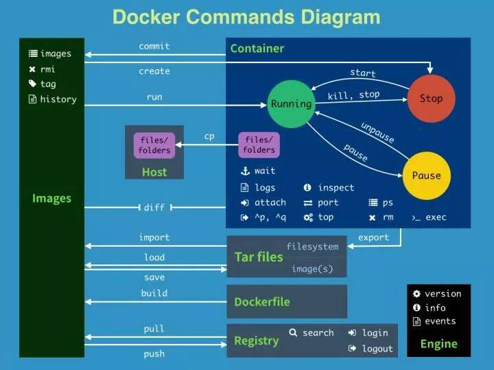
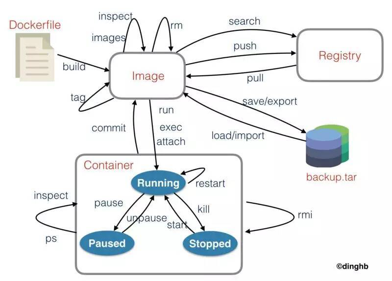

# Docker 学习总结

> Write By [CS逍遥剑仙](http://home.ustc.edu.cn/~cssjf/)   
> 我的主页: [csxiaoyao.com](https://csxiaoyao.com)   
> GitHub: [github.com/csxiaoyaojianxian](https://github.com/csxiaoyaojianxian)   
> Email: [sunjianfeng@csxiaoyao.com](mailto:sunjianfeng@csxiaoyao.com)  
> QQ: [1724338257](http://wpa.qq.com/msgrd?uin=1724338257&site=qq&menu=yes)

## 1. docker 架构


## 2. 环境安装

docker分为企业版(EE)和社区版(CE)，社区版链接 [docker-ce](https://docs.docker.com/install/linux/docker-ce/centos/)

有3种常用的安装方式：

+ vagrant + VirtualBox
+ docker-machine + VirtualBox
+ docker playground

推荐安装 vagrant + VirtualBox 快速搭建 docker host，不推荐直接使用 Docker for Mac

```Shell
# 初始化 Vagrantfile 文件
$ vagrant init centos/7
# 安装 centos7 虚拟机
$ vagrant up
# ssh进入虚拟机
$ vagrant ssh

> sudo yum update
> exit # 退出
```

vagrant 虚拟机镜像管理

```shell
$ vagrant status
# 停止
$ vagrant halt
# 删除
$ vagrant destroy
```

**(1) 【推荐】虚拟机中 docker 安装方式1**

按照官方教程安装 docker <https://docs.docker.com/engine/install/centos/> 并验证

```Shell
# 查看docker版本
$ sudo docker version
$ sudo docker info
# 启动 docker
$ sudo systemctl start docker
# $ sudo docker run hello-world
```

**(2) 虚拟机中 docker 安装方式2**

还可以直接通过配置 Vagrantfile 文件

```shell
config.vm.provision "shell", inline: <<-SHELL
    sudo yum remove docker docker-client docker-client-latest docker-common docker-latest docker-latest-logrotate docker-logrotate docker-engine
    sudo yum install -y yum-utils
    sudo yum-config-manager --add-repo https://download.docker.com/linux/centos/docker-ce.repo
    sudo yum install docker-ce docker-ce-cli containerd.io
    sudo systemctl start docker
SHELL
```

然后启动

```Shell
$ vagrant up
```

**(3) docker-machine工具**

可以不通过 vagrant 创建虚拟机，但是同样依赖 virtualbox

```Shell
# 创建 docker - demo
$ docker-machine create demo
$ docker-machine ls
$ docker-machine ssh demo
$ exit
$ docker-machine stop demo
$ docker-machine env demo
```

## 3. image 镜像

image 的获取途径

+ Dockerfile 构建
+ pull from registry —— [dockerhub](https://hub.docker.com/)

镜像由多层组成，容器其实就是在镜像的最上面加了一层读写层，在运行容器里做的任何文件改动，都会写到这个读写层里。如果容器删除了，最上面的读写层也就删除了，改动也就丢失了。可以通过 `docker history <ID/NAME>` 查看镜像中各层内容及大小，每层对应着 `Dockerfile` 中的一条指令。

### 3.1 查看镜像

```Shell
$ docker image ls
```

### 3.2 查找镜像

```Shell
$ docker search hello-world
```

| 字段        | 含义       |
| ----------- | ---------- |
| NAME        | 名称       |
| DESCRIPTION | 描述       |
| STARTS      | 星星的数量 |
| OFFICIAL    | 是否官方源 |

### 3.3 拉取镜像

```Shell
$ docker pull docker.io/hello-world
# docker 官方提供的 image 文件都放在 docker.io 默认组里，可以省略
$ docker pull hello-world
```

### 3.4 删除镜像

```Shell
$ docker rmi hello-world
```

### 3.5 其他

| 命令    | 含义                                         | 案例                                                      |
| ------- | -------------------------------------------- | --------------------------------------------------------- |
| history | 查看镜像历史                                 | docker history [imageName]                                |
| inspect | 显示一个或多个镜像详细信息                   | docker inspect [imageName]                                |
| push    | 推送一个镜像到镜像仓库                       | docker push [imageName]                                   |
| prune   | 移除未使用的镜像，没有被标记或补任何容器引用 | docker image prune                                        |
| tag     | 标记本地镜像，将其归入某一仓库               | docker image tag [imageName][username]/[repository]:[tag] |
| build   | 根据Dockerfile构建镜像                       |                                                           |
| export  |                                              |                                                           |
| import  |                                              |                                                           |
| save    |                                              |                                                           |
| load    |                                              |                                                           |

## 4. container 容器

### 4.1 container 命令总览

| 命令                 | 含义                                                         | 案例                                                    |
| -------------------- | ------------------------------------------------------------ | ------------------------------------------------------- |
| run                  | 从镜像运行一个容器                                           | docker run ubuntu /bin/echo 'hello-world'               |
| ls                   | 列出容器                                                     | docker container ls                                     |
| inspect              | 显示一个或多个容器详细信息                                   | docker inspect                                          |
| attach               | 要attach上去的容器必须正在运行，可以同时连接上同一个container来共享屏幕 | docker attach                                           |
| stats                | 显示容器资源使用统计                                         | docker container stats                                  |
| top                  | 显示一个容器运行的进程                                       | docker container top                                    |
| update               | 显示一个容器运行的进程                                       | docker container update                                 |
| port                 | 更新一个或多个容器配置                                       | docker container port                                   |
| ps                   | 查看当前运行的容器                                           | docker ps -a -l                                         |
| kill [containerId]   | 终止容器(发送SIGKILL )                                       | docker kill [containerId]                               |
| rm [containerId]     | 删除容器                                                     | docker rm [containerId]                                 |
| start [containerId]  | 启动已经生成、已经停止运行的容器文件                         | docker start [containerId]                              |
| stop [containerId]   | 终止容器运行 (发送 SIGTERM )                                 | docker stop [containerId]                               |
| logs [containerId]   | 查看 docker 容器的输出                                       | docker logs [containerId]                               |
| exec [containerId]   | 进入一个正在运行的 docker 容器执行命令                       | docker container exec -it [containerId] /bin/bash       |
| cp [containerId]     | 从正在运行的 Docker 容器里面，将文件拷贝到本机               | docker container cp [containerId]:app/package.json .    |
| commit [containerId] | 创建一个新镜像来自一个容器                                   | docker commit -a "victors" -m "test" abcd123efg test:v1 |

### 4.2 从 image 运行容器

`docker run` 命令会从 `image` 文件生成一个正在运行的容器实例，若发现本地没有指定的 image 文件，就会从 Docker Hub 仓库自动抓取。

```Shell
# 启动镜像 ubuntu 并在启动的容器里执行命令 /bin/echo "Hello world"
$ docker run ubuntu /bin/echo "Hello world"
# 运行交互式的容器，允许对容器内的标准输入(STDIN)进行交互
$ docker run -it ubuntu /bin/bash
# 可以通过运行exit命令或者使用 CTRL+D 来退出容器
```

输出提示以后，hello world 会停止运行，容器自动终止(有些容器不会自动终止)，关闭容器并不会删除容器文件，只是容器停止运行。

> Docker以ubuntu镜像创建一个新容器，然后在容器里执行 bin/echo "Hello world"，然后输出结果

| 参数              | 含义                 |
| ----------------- | -------------------- |
| -i  --interactive | 交互式               |
| -t  --tty         | 分配一个伪终端       |
| -d  --detach      | 运行容器到后台       |
| -a  --attach list | 附加到运行的容器     |
| -e --env list     | 设置环境变量         |
| -p --publish list | 发布容器端口到主机   |
| -P                | --publish-all        |
| --mount mount     | 挂载宿主机分区到容器 |
| -v  --volumn list | 挂载宿主机分区到容器 |

### 4.3 启动容器

```Shell
$ docker start [containerId]
```

### 4.4 停止容器

```Shell
$ docker stop [containerId]
```

### 4.5 进入一个容器 attach

```Shell
$ docker attach [containerID]
```

### 4.6 进入运行中的容器 exec

```Shell
$ docker container -exec -it [containerID] /bin/bash
$ docker exec -it [containerID] ip a # 打印容器ip
```

### 4.7 查看容器

```Shell
$ docker ps
# 显示所有的容器，包括已停止的
$ docker container ls -a
# 显示最新的那个容器
$ docker container ls -l
```

| 字段         | 含义           |
| ------------ | -------------- |
| CONTAINER ID | 容器ID         |
| IMAGE        | 使用的镜像     |
| COMMAND      | 使用的命令     |
| CREATED      | 创建时间       |
| STATUS       | 状态           |
| PORTS        | 端口号         |
| NAMES        | 自动分配的名称 |

### 4.8 后台运行容器

```Shell
$ docker run --detach centos ping www.csxiaoyao.com
# 查看 docker 容器的输出
$ docker logs --follow abcd123efg
```

### 4.9 kill

```Shell
$ docker kill abcd123efg
```

### 4.10 删除容器

```Shell
# 删除容器
$ docker rm [containerId]
# 删除镜像
$ docker rmi [imageId]
# 删除所有停止运行的容器
$ docker rm $(docker ps -a -q)
```

### 4.11 拷贝文件

```Shell
$ docker container cp [containerId] /README.md .
```

### 4.12 自动删除

```Shell
$ docker run --rm ubuntu /bin/bash
```

### 4.13 容器资源限制

`--memory` 、`--cpu-shares` 设置内存和权重

```Shell
$ docker run --cpu-shares=10 --memory=200M xxx/ubuntu-stress --vm 1 --verbose
```

### 4.14 查看容器内进程

```Shell
$ docker top [CONTAINER ID/NAMES]
```

## 5. 制作个性化镜像 commit

```Shell
# $ docker commit -m "test commit" -a "csxiaoyao" [containerId] csxiaoyao/testimage:1.0.0
$ docker commit -m "test commit" -a "csxiaoyao" [containerId] csxiaoyao/testimage:latest
$ docker image ls
$ docker run csxiaoyao/testimage /bin/bash
$ docker rm [containerId]
$ docker rmi [imageId]
```

## 6. Dockerfile

Docker 的镜像是用一层一层的文件组成的，`docker inspect` 命令可以查看镜像或容器

```Shell
$ docker inspect centos
```

### 6.1 Dockerfile 语法总览

| 命令        | 含义                                                         | 案例                                                         |
| ----------- | ------------------------------------------------------------ | ------------------------------------------------------------ |
| FROM        | 继承的镜像                                                   | FROM node                                                    |
| LABEL       | 定义 image 的 metadata，类似注释                             | LABEL version="1.0"                                          |
| COPY        | 从宿主机拷贝文件                                             | COPY ./app /app                                              |
| ADD         | 拷贝文件或目录到镜像中，如果是URL或者压缩包会自动下载和解压  | ADD https://xxx.com/file.tar.gz /var/www/html                |
| WORKDIR     | 设置 RUN CMD ENTRYPOINT COPY ADD 的工作目录                  | WORKDIR /app                                                 |
| RUN         | 编译打包阶段运行命令，创建新的 layer，尽量合并一行，避免无用分层 | RUN npm install                                              |
| CMD         | 容器运行阶段运行命令，可被 docker run 参数覆盖               | CMD npm run start                                            |
| ENTRYPOINT  | 配置容器启动时运行的命令                                     | ENTRYPOINT /bin/bash -c '/start.sh'                          |
| MAINTAINER  | 作者                                                         | MAINTAINER csxiaoyao                                         |
| EXPOSE      | 暴露端口                                                     | EXPOSE 3000                                                  |
| ENV         | 设置容器内环境变量                                           | ENV MYSQL_ROOT_PASSWORD 19931128                             |
| VOLUME      | 指定容器挂载点到宿主自动生成的目录或其它容器                 | VOLUME ["/var/lib/mysql"]                                    |
| USER        | 为 RUN CMD 和 ENTRYPOINT 执行命令指定运行用户                | USER csxiaoyao                                               |
| HEALTHCHECK | 健康检查                                                     | HEALTHCHECK --interval=5m --timeout=3s --retries=3 CMS curl -f htp://localhost |
| ARG         | 在构建镜像时指定一些参数                                     | ARG user                                                     |

**FROM**，尽量使用官方 image 作为 base image

```
FROM centos  # 制作 base image
FROM ubuntu:14.04
```

**LABEL**，定义 image 的 Metadata，类似注释，不可少

```
LABEL version="1.0"
LABEL description="test"
```

**RUN**，执行命令并创建新的 Image Layer，尽量合并一行，避免无用分层，为了美观，复杂的 RUN 可使用反斜线换行

```
RUN yum update && yum install -y vim \
    python-dev
```

**WORKDIR**，不要用 RUN cd，尽量用绝对路径

```
WORKDIR /test
WORKDIR demo
RUN pwd      # 输出 /test/demos
```

**ADD / COPY**，把本地文件添加到指定位置，ADD 相比 COPY 还可以自动解压缩，添加远程文件/目录使用 curl / wget

```
ADD test.tar.gz /  # 添加到根目录并解压
WORKDIR /root
ADD hello test/    # /root/test/hellos
```

**ENV**，常量，增强可维护性

```
ENV MYSQL_VERSION 5.6  # 设置常量
RUN apt-get install -y mysql-server="${MYSQL_VERSION}" \
    && rm -rf /var/lib/apt/lists/*
```

**CMD**，设置容器启动后默认执行的命令和参数，若 docker run 指定了其他命令，CMD 会被忽略，若定义了多个 CMD，只有最后一个会执行

两种写法：shell (完整的一行)、exec (参数数组的形式)

```
...
CMD ["python", "app.py"]
```

**ENTRYPOINT**，设置容器启动时运行的命令，让容器以应用程序或服务的形式运行，不会被忽略，推荐写一个 shell 脚本作为 entrypoint

```
COPY docker-entrypoint.sh /usr/local/bin/
ENTRYPOINT ["./docker-entrypoint.sh"]
CMD ["mongod"]
```

### 6.2 忽略文件 .dockerignore

用于记录需要排除(不打包到 image 中)的文件的路径

```File
.git
node_modules
```

### 6.3 demo

#### 6.3.1 demo1

```shell
# 安装 npm
# 安装 node
$ npm install n -g
$ n latest
$ npm init -y
$ vi server.js
# ...
```

编写名为 `Dockerfile` 的文件

```
FROM node
COPY ./app /app
WORKDIR /app
RUN npm install
EXPOSE 3000
CMD node server.js
```

#### 6.3.2 demo2

准备工作，本地app目录下新建 express 项目

```Shell
$ npm install express-generator -g
$ express app
```

编写名为 `Dockerfile` 的文件

```dockerfile
FROM node
COPY ./app /app
WORKDIR /app
RUN npm install
EXPOSE 3000
CMD npm start
```

#### 6.3.3 指令说明

- FROM  该镜像继承的镜像
- COPY  将当前目录下app目录下面的文件拷贝到image里的/app目录中
- WORKDIR  指定工作路径，类似于执行 `cd` 命令
- RUN npm install  在image文件构建阶段在/app目录下安装依赖，执行结果会打包进入image文件
- EXPOSE  暴露3000端口，允许外部连接这个端口
- CMD npm start  在容器启动后执行，一个 Dockerfile 可以包含多个RUN命令，但是只能有一个CMD命令，指定了CMD命令后，docker container run 命令就不能附加命令(如 /bin/bash)，否则会覆盖CMD命令

### 6.4 创建 image

```shell
# -t 指定image镜像的名称，后面还可以加冒号指定标签，如果不指定默认是latest
# . 表示 Dockerfile 文件所在路径，. 表示当前路径
$ docker build -t csxiaoyao/express-demo:latest .
$ docker image ls
```

### 6.5 使用新镜像运行容器

```Shell
# -p 将容器的3000端口映射为本机的3333端口
# /bin/bash 容器启动后执行的第一个命令，会覆盖文件中配置的CMD
# --rm 在容器终止运行后自动删除容器文件
$ docker container run -p 3333:3000 -it express-demo /bin/bash
$ curl localhost:3333
```

### 6.6 发布 image

```shell
# 登录 dockerhub 账户
$ docker login
$ docker login --username=csxiaoyao --password=19931128
# build
# docker image build -t [username]/[repository]:[tag] .
# 镜像打标签
# docker image tag [imageName] [username]/[repository]:[tag]
$ docker tag express-demo:v1 csxiaoyao/express-demo:v1
# 上传
$ docker push csxiaoyao/express-demo:v1
```

## 7. 数据盘

有两种持久化存储方式：

+ Data Volume 关联容器文件路径到主机，删除容器不会删除 Vloume，可以设置别名，如 nginx-vol
+ Bind Mouting 可以实现绑定本地文件夹，实现开发调试

### 7.1 Data Volume

若想在删除容器时保留文件数据，如Web服务器日志，数据库数据等，可以为容器创建一个数据盘 volume，管理宿主机文件系统的一部分 (/var/lib/docker/volumes)，如果没有指定卷，则会自动创建。

#### 7.1.1 创建数据卷

```Shell
$ docker volume --help
$ docker volume create nginx-vol
$ docker volume ls
$ docker volume inspect nginx-vol
```

#### 7.1.2 挂载数据卷

```Shell
# 把新建的 nginx-vol 数据卷挂载到 /usr/share/nginx/html
# 建议使用 --mount，更通用
$ docker run -d -it --name=nginx1 --mount src=nginx-vol,dst=/usr/share/nginx/html nginx
$ docker run -d -it --name=nginx2 -v nginx-vol:/usr/share/nginx/html nginx
# mysql
$ docker run -d --name mysql -v mysql-data:/var/lib/mysql -e MYSQL_ROOT_PASSWORD=root -e MYSQL_DATABASE=wordpress mysql
```

#### 7.1.3 删除数据卷

```Shell
# 停止容器
$ docker container stop nginx1
# 删除容器
$ docker container rm nginx1
# 删除数据卷
$ docker volume rm nginx-vol
```

#### 7.1.4 管理数据卷

```Shell
# 列出所有的数据盘
$ docker volume ls
# 列出已经孤立的数据盘
$ docker volume ls -f dangling=true
# 删除数据盘
$ docker volume rm xxxx
```

### 7.2 Bind Mouting

此方式与Linux系统的mount方式相似，即是会覆盖容器内已存在的目录或文件，但并不会改变容器内原有的文件，当umount后容器内原有的文件就会还原。通过在创建容器时通过 `-v` 或 `--volumn` 指定数据盘路径，`bind mounts` 可以存储在宿主机系统的任意位置。如果源文件/目录不存在，不会自动创建，会抛出一个错误；如果挂载目标在容器中为非空目录，则该目录现有内容将被隐藏。

#### 7.2.1 使用默认数据盘

```Shell
$ docker run -v /mnt -it --name logs centos bash
> cd /mnt
> echo 1 > 1.txt
> exit
$ docker inspect logs
```

查看容器信息，`Source` 是给容器指定的数据盘在主机上的位置，`Destination` 是数据盘在容器上的位置

```Json
...
"Mounts": [
    {
        "Source":"/var/lib/docker/volumes/xxxxxxxx/_data",
        "Destination": "/mnt",
    }
]
...
```

#### 7.2.2 指定数据盘

```Shell
# demo1: $(pwd):/app
$ docker run -d -p 80:5000 -v $(pwd):/app --name app xxx/test-image
# demo2: ~/data:/mnt
$ docker run -v ~/data:/mnt -ti --name logs2 centos bash # 把当前用户目录中的data目录映射到/mnt上
> cd /mnt
> echo 2 > 2.txt
> exit
$ cat ~/data/2.txt
```

#### 7.2.3 指定使用某容器的数据盘

```Shell
# 创建 logger 容器
$ docker create -v /mnt --name logger centos
# 创建 logger1 容器使用 logger 的数据盘
$ docker run --volumes-from logger --name logger1 -i -t centos bash
> cd /mnt 
> touch logger1
# 创建 logger2 容器使用 logger 的数据盘
$ docker run --volumes-from logger --name logger2 -i -t centos bash
> cd /mnt
> touch logger2
```

## 8. 网络 network

docker里有一个DNS服务，可以通过容器名称访问主机，分三种网络类型：

- none  无网络，对外界完全隔离
- host  主机网络
- bridge  桥接网络(默认)，适用于日常需要连接网络的容器，如http容器、web容器...

```Shell
# ping 验证IP可达性，telnet 验证服务(端口)可用性
$ ping 192.168.205.10
$ telnet 192.168.205.10 80
```

### 8.1 bridge

```Shell
$ docker network ls
$ docker inspect bridge
$ docker run -d --name server1 nginx
$ docker run -d --name server2 nginx
$ docker exec -it server1 bash
> ping server2
```

### 8.2 none

```Shell
$ docker run -d --name server_none --net none nginx
$ docker inspect none
$ docker exec -it server_none bash
> ip addr
```

### 8.3 host

```Shell
$ docker run -d --name server_host --net host nginx
$ docker inspect none
$ docker exec -it server_host bash
> ip addr
```

### 8.4 访问桥接网络里的服务(端口绑定)

```Shell
# 随机分配主机端口，容器内部端口随机映射到主机高端口
$ docker run -d -P [CONTAINER ID/NAMES] python app.py
# 指定主机端口
$ docker run -d -p 80:5000 [CONTAINER ID/NAMES] python app.py
# 指定host
$ docker run -d -p 127.0.0.1:80:5000 [CONTAINER ID/NAMES] python app.py
# 指定协议，默认TCP
$ docker run -d -p 127.0.0.1:80:5000/udp [CONTAINER ID/NAMES] python app.py
```

例如

```Shell
# 访问主机的 8080 端口会被定向到容器的 80 端口
$ docker run -d --name server_nginx -p "8080:80" nginx
# 查看主机绑定的端口
$ docker port server_nginx
```

### 8.5 创建自定义网络

```Shell
$ docker network create --driver bridge web
$ docker network inspect web
$ docker run -d --name webserver --net web nginx
$ docker network connect web webserver1
$ docker network disconnect web webserver2
```

## 9. docker-compose.yml

### 9.1 安装

compose 通过一个配置文件来管理多个 docker 容器，但是 **只适用于单机**，linux 需要独立安装 compose

```Shell
$ pip install docker-compose
```

### 9.1 基础语法

services 代表一个 container，启动 service 类似 docker run

```yml
version: '2'
services:
  test1:
    image: nginx
    port:
      - "8080:80"
  test2:
    image: nginx
    port:
      - "8081:80"
```

### 9.2 操作指令

```Shell
# 启动所有的服务，docker会创建默认的网络
$ docker-compose up
# 后台启动所有的服务
$ docker-compose up -d
# 打印所有的容器
$ docker-compose ps
# 停止所有服务
$ docker-compose stop
# 开始所有服务
$ docker-compose start
# 持续跟踪日志
$ docker-compose logs -f
# 进入容器
$ docker-compose exec test1 bash
# 通过服务名连接
> ping test2
# 删除服务容器
$ docker-compose rm
# 网络不会删除
$ docker network ls
# stop 并删除资源
$ docker-compose down
```

### 9.3 配置数据卷

```yml
version: '2'
services:
  test1:
    image: nginx
    ports:
      - "8080:80"
    networks:
      - "demo_network"
    volumes:
      - "access:/mnt"
  test2:
    image: nginx
    ports:
      - "8081:80"
    networks:
      - "demo_network"
    volumes:
      - "access:/mnt"
  test3:
    image: nginx
    ports:
      - "8082:80"
    networks:
      - "default"
      - "demo_network"
networks:
  demo_network:
    driver: bridge
volumes:
  access:
    driver: local
```

### 9.4 配置根目录

```yml
version: '2'
services:
  test1:
    image: nginx
    ports:
      - "8080:80"
    networks:
      - "demo_network"
    volumes:
      - "access:/mnt"
      - "./test1:/usr/share/nginx/html"
  test2:
    image: nginx
    ports:
      - "8081:80"
    networks:
      - "demo_network"
    volumes:
      - "access:/mnt"
      - "./test2:/usr/share/nginx/html"
  test3:
    image: nginx
    ports:
      - "8082:80"
    networks:
      - "default"
      - "demo_network"
networks:
  demo_network:
    driver: bridge
volumes:
  access:
    driver: local
```

### 9.5 配置环境变量

```
version: '3'
services:
  wordpress:
    image: wordpress
    ports:
      - 8080:80
    depends_on:
      - mysql
    environment:
      WORDPRESS_DB_HOST: mysql
      WORDPRESS_DB_PASSWORD: root
    networks:
      - my-bridge
  mysql:
    image: mysql:5.7
    environment:
      MYSQL_ROOT_PASSWORD: root
      MYSQL_DATABASE: wordpress
    volumes:
      - mysql-data:/var/lib/mysql
    networks:
      - my-bridge
volumes:
  mysql-data:
networks:
  my-bridge:
    driver: bridge
```

### 9.6 通过 Dockerfile build

参考 10.1.3 docker-compose.yml

### 9.7 水平扩展和负载均衡

```
version: "3"
services:
  redis:
    image: redis
  web:
    build:
      context: .
      dockerfile: Dockerfile
    ports: ["8080"]
    environment:
      REDIS_HOST: redis
  lb:
    image: dockercloud/haproxy
    links:
      - web
    ports:
      - 80:80
    volumes:
      - /var/run/docker.sock:/var/run/docker.sock
```

`--scale`，如 lb service 使用了 image: dockercloud/haproxy

```Shell
$ docker-compose up --scale web=3 -d
```

## 10. Demo

### 10.1 nodeapp

#### 10.1.1 相关服务

db(mariadb)、node、web server(nginx)

#### 10.1.2 目录结构

```
-- app/
   |-- web/                         # 应用代码
-- services/                        # 相关服务
-- images/                          # 编译的脚本和镜像
   |-- nginx/config/default.conf    # nginx 配置文件
   |-- node/Dockerfile
-- docker-compose.yml
```

#### 10.1.3 docker-compose.yml

```yml
version: '2'
services:
  node:
    build:
      context: ./images/node
      dockerfile: Dockerfile
    volumes:
      - ./app/web:/web
    depends_on:
      - db
  web:
    image: nginx
    ports:
      - "8080:80"
    volumes:
      - ./images/nginx/config:/etc/nginx/conf.d
      - ./app/web/views:/mnt/views
    depends_on:
      - node
  db:
    image: mariadb
    environment:
      MYSQL_ROOT_PASSWORD: "root"
      MYSQL_DATABASE: "node"
      MYSQL_USER: "csxiaoyao"
      MYSQL_PASSWORD: "19931128"
    volumes:
      - db:/var/lib/mysql
volumes:
  db:
    driver: local
```

#### 10.1.4 app/web/server.js

```javascript
let http=require('http');
var mysql  = require('mysql');
var connection = mysql.createConnection({
  host     : 'db',
  user     : 'csxiaoyao',
  password : '19931128',
  database : 'node'
});
connection.connect();
let server=http.createServer(function (req,res) {
  // ...
});
server.listen(3000);
```

#### 10.1.5 package.json

```Json
"scripts": {
  "start": "node server.js"
},
"dependencies": {
  "mysql": "^2.16.0"
}
```

#### 10.1.6 images/node/Dockerfile

```Dockerfile
FROM node
MAINTAINER csxiaoyao <x@csxiaoyao.com>
WORKDIR /web
RUN npm install
CMD npm start
```

#### 10.1.7 images/nginx/config/default.conf

```Conf
upstream backend {
  server node:3000;
}
server {
  listen 80;
  server_name localhost;
  root /mnt/views;
  index index.html index.htm;
  location /api {
    proxy_pass http://backend;
  }
}
```

### 10.2 搭建 LNMP-wordpress

#### 10.2.1 关闭防火墙

| 功能           | 命令                                |
| -------------- | ----------------------------------- |
| 停止防火墙     | systemctl stop firewalld.service    |
| 永久关闭防火墙 | systemctl disable firewalld.service |

## 11. swarm & kubernetes

参考 [github-csxiaoyaojianxian-DockerStudy](https://github.com/csxiaoyaojianxian/DockerStudy/tree/master/01-Docker%E5%AD%A6%E4%B9%A0)

## 12. docker cloud


## 13. 参考






- [yaml](https://www.ruanyifeng.com/blog/2016/07/yaml.html)
- [commandline](https://docs.docker.com/engine/reference/commandline/docker/)


