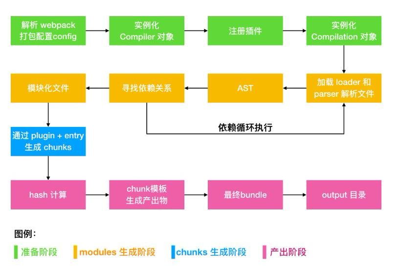

# webpack 学习笔记系列07-工作原理

> Write By CS逍遥剑仙  
> 我的主页: [csxiaoyao.com](https://csxiaoyao.com)   
> GitHub: [github.com/csxiaoyaojianxian](https://github.com/csxiaoyaojianxian)   
> Email: [sunjianfeng@csxiaoyao.com](mailto:sunjianfeng@csxiaoyao.com)  
> QQ: [1724338257](http://wpa.qq.com/msgrd?uin=1724338257&site=qq&menu=yes)

## 1. 基本工作流程



+ **准备阶段**：创建 `Compiler` 和 `Compilation` 对象。使用配置文件合并 shell 传参得到初始化参数，再用此参数实例化 `Compiler` 类，并注册所有插件且绑定 webpack 生命周期 hook。`Compiler` 是工作流中的最高层对象，提供全局钩子，继承自 Tapable(即完整的事件流程核心类) ，记录了完整的 Webpack 环境配置信息，每个 Webpack 配置对应一个 Compiler 对象，通过 Tapable 的 Hook 机制管理整个打包流程的生命周期；`Compilation` 是由 `Compiler` 创建的实例对象，也继承自 Tapable ，是每次打包流程最核心的流程，进行模块依赖解析、优化资源、渲染 runtime 代码等，代表一次资源版本构建，dev-server 下 watch 会不断生成新的 `Compilation`。 
+ **编译阶段**：完成 modules 解析，并生成 chunks。调用 `Compiler` 类的 `run` 方法创建 `Compilation` 实例，`Compilation` 从 entry 开始使用各种 `loader` 处理模块，解析 AST 找出每个 `chunk` 的 `modules` 依赖关系，递归编译依赖的模块。
+ **产出阶段**：根据 `chunks` 在 `output` 下生成 `bundle` 文件，并结果 `plugin` 处理成最终的 `bundle` 文件。三个步骤：模板 Hash 更新、模板渲染 chunk、生成文件。

## 2. 打包产出代码 IIFE 函数结构

webpack 的产出代码是根据不同配置，执行不同操作，拼接模板代码而成的，对于普通打包，webpack 的打包产物是一个 **立即执行函数表达式** (IIFE)，函数结构如下：

```javascript
(function(modules) {
  	// [1] The module cache 缓存已注册模块
    var installedModules = {};

    // [2] The require function 模块注册方法
  	function __webpack_require__(moduleId) {
        // ...
      	return module.exports;
    }

  	// [3] 定义 __webpack_require__ 函数的一些属性
  	__webpack_require__.m = modules; // expose the modules object (__webpack_modules__)
  	__webpack_require__.c = installedModules; // expose the module cache
    __webpack_require__.d = function(exports, name, getter) { /* ... */ }; // define getter function for harmony exports
    __webpack_require__.r = function(exports) { /* ... */ }; // define __esModule on exports
    __webpack_require__.t = function(value, mode) { /* ... */ }; // create a fake namespace object
    __webpack_require__.n = function(module) { /* ... */ }; // getDefaultExport function for compatibility with non-harmony modules
    __webpack_require__.o = function(object, property) { /* ... */ }; // Object.prototype.hasOwnProperty.call
    __webpack_require__.p = ''; // __webpack_public_path__

		// [4] 传入 entry 模块，执行 __webpack_require__ ，并且返回执行结果，即 entry 的 exports
  	// 从入口模块 id 开始执行
    return __webpack_require__((__webpack_require__.s = './src/app.js'));
})({
  	// 采用回调参数的形式传递所有的模块，所有的模块以路径作为 key，value 是类似 AMD factory 格式的函数
    './src/app.js': function(module, exports, __webpack_require__) {
        const name = __webpack_require__(/*! ./name.js */ './src/name.js');
        console.log(name);
    },
    './src/name.js': function(module, exports) {
        // name.js
        module.exports = 'Csxiaoyao';
    }
});
```

整个 IIFE 函数的核心流程分四步：

1. 定义保存已注册模块的对象 `installedModules`；

2. 定义模块加载函数 `__webpack_require__`；

3. 定义 `__webpack_require__` 函数的一些属性；

4. 执行 `__webpack_require__` 函数，传入 entry 模块，并返回执行结果，即 entry 的 exports 对象

该 IIFE 函数传入的参数为 `modules` 对象，key 为文件路径，value 是类似 AMD factory 格式的函数。

## 3. `__webpack_require__` 函数

### 3.1 函数总览

该函数是 webpack 的核心，负责调用并注册模块：

```javascript
// 缓存已注册模块
var installedModules = {};
// 接受模块id作为参数
function __webpack_require__(moduleId) {
    // 1. 判断是否已注册
    if (installedModules[moduleId]) {
        return installedModules[moduleId].exports;
    }
    // 2. 注册模块并缓存
    var module = (installedModules[moduleId] = {
        i: moduleId, // 模块 id
        l: false, // loaded，是否已经加载的 flag
        exports: {} // 模块的输出对象
    });
    // 3. 执行 IIFE 传入模块的 factory 函数，上下文为 module.exports
  	// 		同时传入3个参数：模块本身、模块 exports 对象、__webpack_require__ 函数
    modules[moduleId].call(module.exports, module, module.exports, __webpack_require__);
    // 4. 更新 flag 表示该模块已注册加载
    module.l = true;
    // 5. 返回模块 exports 对象作为输出
    return module.exports;
}
```

### 3.2 使用 call 方法执行模块的 factory 函数

IIFE 传入的 modules 对象，key 是模块路径，value 是类似 AMD factory 格式的函数：

```js
function(module, exports, __webpack_require__) {
    const name = __webpack_require__('./src/name.js');
    console.log(name);
}
```

factory 的 3 个参数分别对应 `__webpack_require__` 函数内执行 call 传入的 3 个参数，而上下文 this 即 this 是传入的 module.exports 即 exports 对象。

### 3.3 `__webpack_require__` 添加属性

```text
__webpack_require__.s： 记录入口文件的 moduleId
__webpack_require__.m： 所有模块对象，即 IIFE 函数传入的 modules 参数
__webpack_require__.c： 即 installedModules 缓存对象
__webpack_require__.d： 用于获取 ES modules，输出值引用
__webpack_require__.r： 给 exports 定义 __esModule 属性
__webpack_require__.t： 做 ES module default 和 CommonJS module 兼容
__webpack_require__.n： 统一 ES module / CommonJS module 导出格式，即ES模块返回module['default']
__webpack_require__.o： 判断一个Object是否有property属性，Object.prototype.hasOwnProperty.call
__webpack_require__.p： 对应配置中的 output.publicPath，即 __webpack_public_path__
...
```


