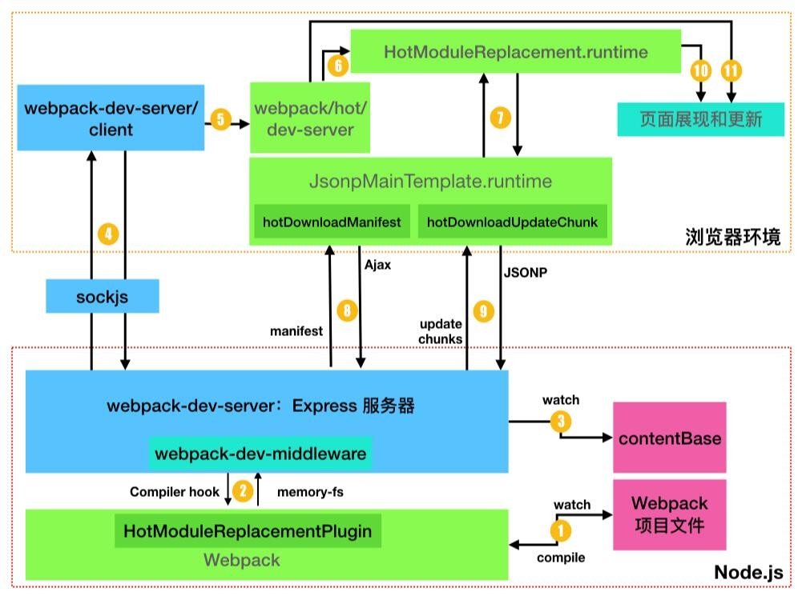
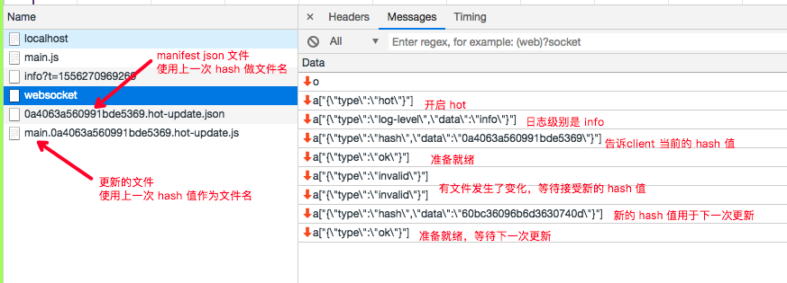
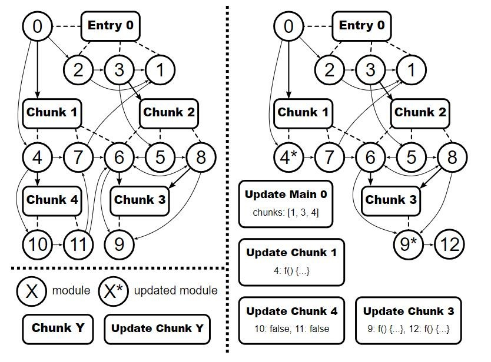

# webpack 学习笔记系列08-HMR热更新

> Write By CS逍遥剑仙  
> 我的主页: [csxiaoyao.com](https://csxiaoyao.com)   
> GitHub: [github.com/csxiaoyaojianxian](https://github.com/csxiaoyaojianxian)   
> Email: [sunjianfeng@csxiaoyao.com](mailto:sunjianfeng@csxiaoyao.com)  
> QQ: [1724338257](http://wpa.qq.com/msgrd?uin=1724338257&site=qq&menu=yes)

## 1. HMR 概念

HMR - Hot Module Replacement，当 webpack 开启 HMR 功能后，代码修改时 webpack 会重新打包，并将修改后的代码发送到浏览器，浏览器替换老的代码，保证了页面状态不会丢失，在不刷新整个页面的前提下进行局部更新。

当一个模块代码发生更改，就需要执行对应的 update 事件，若当前模块无法处理 HMR，则会顺着 webpack 的 module 树向父依赖节点冒泡，若直至根节点(即 entry 入口文件)都无法处理 update 事件，就会刷新页面，对于大多数的前端框架，如 Vue 等，都会有配套的 HMR 工具，一般通过 loader / babel 插件 / style-loader 来实现。

## 2. 热更新流程



### 2.1 webpack-dev-server & contentBase

启动一个 Express Server，整合 webpack-dev-middleware 中间件、WebSocket 长连接、 proxy、静态资源服务器等功能。

webpack-dev-server 的 contentBase 为临时的静态资源服务器的目录文件夹，启动 server 后，可通过 url 访问，但不会落盘(存储硬盘)，且这个文件和 webpack 打包出的路径并不一样。

在 webpack-dev-middleware 中，使用了 memory-fs 内存文件系统模块，替换 Webpack 的 Compiler 对象的输出打包结果文件模块 outputFileSystem

```javascript
// webpack-dev-middleware/lib/fs.js
const MemoryFileSystem = require('memory-fs');
module.exports = {
    setFs(context, compiler) {
        // ...
        fileSystem = new MemoryFileSystem();
        compiler.outputFileSystem = fileSystem;
    }
};
```

### 2.2 watch

上图共有三个 watch：

step1 中的 watch 监控依赖模块的文件变化，即代码修改触发重新编译(HMR)；

step2 是 webpack-dev-middleware 通过 webpack 的 `Compiler` 钩子监听编译进程并通过 ws 推送编译后的 hash 值以及告诉浏览器当前的页面代码是 `invalid` 状态的，需要更新；

step3 中的 watch 是设置 `devServer.watchContentBase=true` 时监听 contentBase 文件变化，触发通知浏览器刷新(非HMR，因为 contentBase 非打包的依赖文件)。

### 2.3 HotModuleReplacementPlugin 插件

在 `webpack.config.js` 中添加的插件 `HotModuleReplacementPlugin` 会生成两次编译之间差异文件列表，即 manifest JSON 文件。

+ manifest JSON 文件：文件名格式为 `[hash].hot-update.json`，由插件生成，包含 update 文件列表
+ update 文件：文件名格式为 `[id].[hash].hot-update.js`，罗列在 manifest JSON 文件中，内容为 HMR 的差异化执行代码

插件会通过 Compilation.mainTemplate 的 bootstrap 钩子根据不同环境注入 runtime.js，在浏览器环境下，注入的是 lib/web/JsonpMainTemplate.runtime.js ，该 runtime.js 中有两个用于更新的关键函数：

+ hotDownloadManifest： 发起 Ajax 请求 mainifest JSON 文件

+ hotDownloadUpdateChunk： 创建 JSONP 请求 update 文件

### 2.4 WebSocket & hash

webpack-dev-server 利用 sockjs 在浏览器和 Server 间创建一个 WebSocket 长连接，通信内容主要是传递编译模块的文件 hash 值信息。

浏览器获取到新 hash 后，会首先发起一个 ajax 请求获取 manifest 文件 `[hash].hot-update.json` 内容，再通知 HMR 的 Runtime 按清单列表发起 JSONP 请求，获取两次编译的差异文件 `[id].[hash].hot-update.js`，插到页面 `head` 标签的 `script` 中执行，完成最终的更新。



> **注意：** 这里的 hash 值为执行本次 Compilation 前确定的 hash 值，因此获取 manifest 和更新文件时用的是上一次更新后返回的 hash 值。

## 3. HMR 原理——编译差异计算方式



以上图为例，右侧模块 module(4) / module(9) 发生变化，manifest JSON 会更新为其依赖的4个相关 chunk：

+ **chunk(3)**： module(9) 修改后引入新的依赖 module(12)，因此 chunk(3) 生成包含 module(9) 和 module(12) 的 update 文件；
+ **chunk(4)**： module(4) 修改后去除 chunk(4) 的依赖，且 chunk(4) 中的 module(10) 和 module(11) 模块未被其他模块使用，因此删除 chunk(4) 中的模块 module(10) / module(11)；
+ **chunk(1)**： chunk(1) 依赖 module(4)，因此生成 module(4) 的 update 文件；
+ **entry(0)**：最后入口文件更新依赖的新 chunk 文件列表，chunks=[1,3,4]


