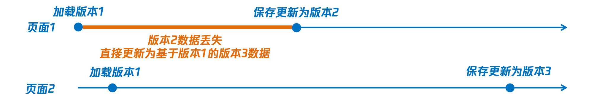
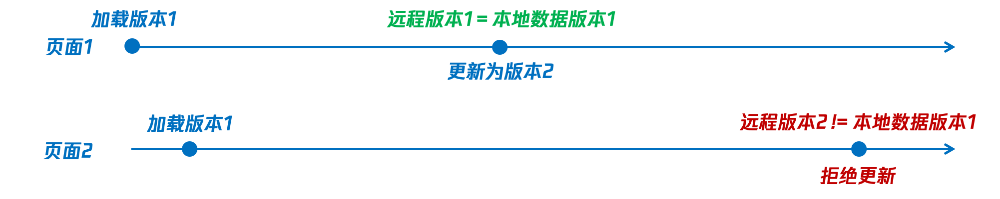
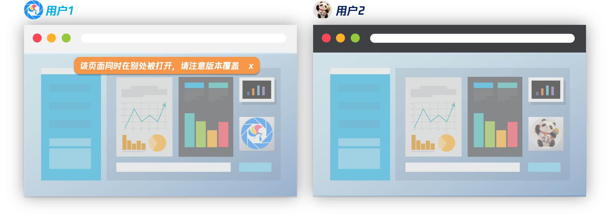
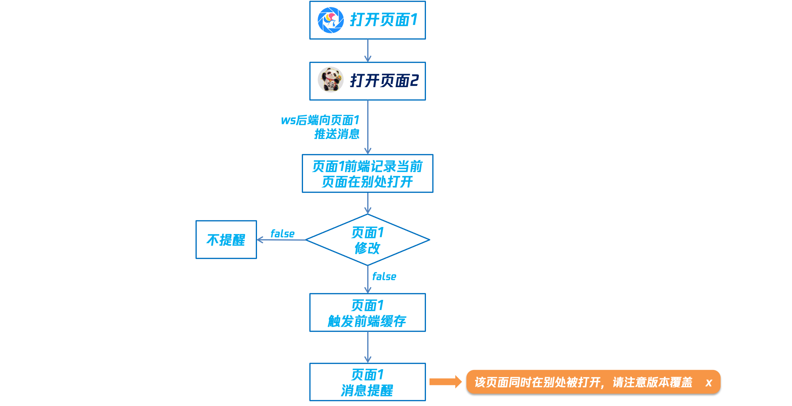
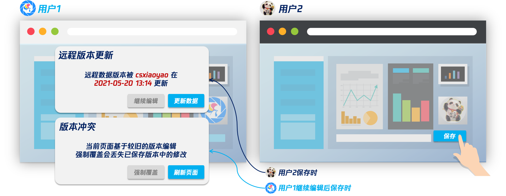
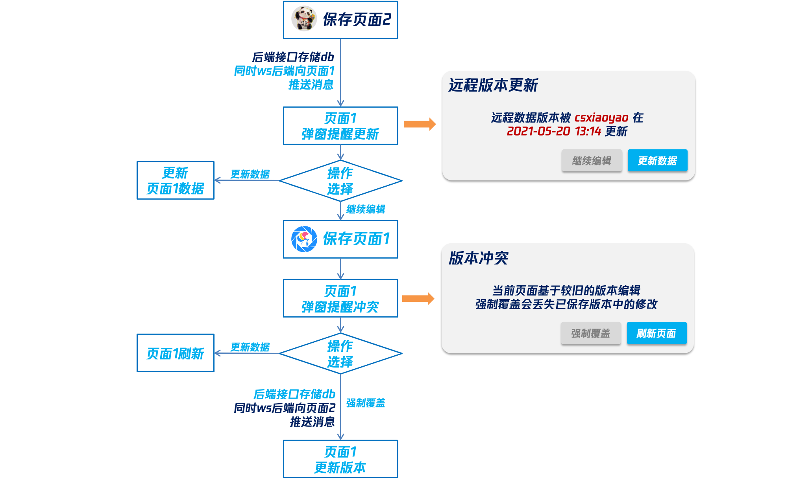

# 前端数据缓存 & 版本管理方案总结

> Write By CS逍遥剑仙  
> 我的主页: [csxiaoyao.com](https://csxiaoyao.com)   
> GitHub: [github.com/csxiaoyaojianxian](https://github.com/csxiaoyaojianxian)   
> Email: [sunjianfeng@csxiaoyao.com](mailto:sunjianfeng@csxiaoyao.com)  
> QQ: [1724338257](http://wpa.qq.com/msgrd?uin=1724338257&site=qq&menu=yes)

## 1. 背景总览

越来越多的大型项目趋于 web 化，在浏览器中运行交互复杂的大型项目时，若每步交互都向后端提交 ajax 请求，除了增加服务器的负担外，等待相应的延迟也会降低用户体验。在前端项目中，使用 localstorage 进行数据缓存已是司空见惯的做法，但由于数据分布式地存储在多个前端浏览器中，因此数据的版本管理终究是绕不开的话题。

本文将从一个实际的 UI 编辑器项目出发，分析页面 json 数据的缓存及版本管理方案，大致思路如下：


## 2. 本地缓存存储选型

### 2.1 前端存储选型

目前，前端存储有以下几类：

+ **cookie**

  在 H5 之前最主要的前端存储方式，大小限制 4K，且每次请求都会在请求头带上

+ **localStorage**

  以键值对 (Key-Value) 形式永久存储，直至手动删除，一般限制 5M 大小

+ **sessionStorage**
  
  与 localStorage 用法一致，区别在于 sessionStorage 在关闭页面后即被清空
  
+ **application cache**

  通过配置 manifest 文件实现整个应用的离线缓存，即使没有网络也能打开

+ **Web SQL**

  引入了一组使用 SQL 操作客户端数据库的 APIs，标准已废弃
  
+ **IndexedDB**

  索引数据库是在浏览器中保存结构化数据的一种数据库，用于替换 WebSQL，使用 NoSQL 的形式来操作数据库，但并不常用

对于大型应用的待缓存数据而言，cookie 容量过小，sessionStorage 不支持持久保存，离线缓存针对的是文件而非数据，Web SQL 和 IndexedDB 针对的是结构化数据且不常用。因此，对于项目缓存的应用场景，localStorage 是不二之选。但 localStorage 本身并不支持设置有效期，直接使用可能无法满足业务场景需要，因此需要进行封装，以支持设置有效期。

### 2.2 localStorage 封装支持设置有效期

将 `window.localStorage` 封装到 Storage 类中，该类包含三个静态方法：`set`、`get`、`del`，而过期时间的实现是通过每次 `set` 时额外设置 `expireKey` 实现的。具体实现如下：

```javascript
class Storage {
  /*
  * set 存储方法
  * @ param {String}     key 键
  * @ param {String}     value 值
  * @ param {String}     expired (可选)过期时间(min)
  */
  static set (key, value, expired = 0) {
    if (!window.localStorage) {
      return false
    }
    const data = JSON.stringify(value)
    const expireKey = `${key}__expires__`
    const expireTime = Date.now() + 1000 * 60 * expired
    try {
      window.localStorage.setItem(key, data)
      if (expired) {
        window.localStorage.setItem(expireKey, expireTime)
      }
      return true
    } catch (e) {
      if (e.name === 'QuotaExceededError') {
        window.localStorage.clear()
        window.localStorage.setItem(key, data)
        return true
      }
      return false
    }
  }
  /*
  * get 获取方法
  * @ param {String}     key 键
  */
  static get (key) {
    if (!window.localStorage) {
      return false
    }
    const now = Date.now()
    const expired = window.localStorage.getItem(`${key}__expires__`) || Date.now + 1
    if (now >= expired) {
      this.del(key)
      return false
    }
    const value = window.localStorage[key] ? JSON.parse(window.localStorage.getItem(key)) : window.localStorage.getItem(key)
    return value
  }
  /*
  * del 删除方法
  * @ param {String}     key 键
  */
  static del (key) {
    if (!window.localStorage) {
      return false
    }
    window.localStorage.removeItem(key)
    window.localStorage.removeItem(`${key}__expires__`)
    return true
  }
}
```

import `Storage` 后，就可以用过 `Storage` 的三个方法实现缓存的 CRUD 了。

## 3. 版本存取管理方案

### 3.1 定义缓存操作类

首先需要定义一个缓存操作类 `UndoRedoHistory` 用于对缓存数据进行存取操作，包含 3 个必备属性：`_store`、`_history`、`_currentIndex`。

+ **_history**: 缓存队列，存储了 `addState(state)` 方法中传入的 state 数据实例
+ **_currentIndex**: 当前的缓存队列索引，通过修改索引，可以实现页面数据版本的 **前进**、**后退**、**清空**
+ **_store**: 由 `UndoRedoHistory` 传入的当前页面的数据操作实例，可将缓存队列中的 state 设置渲染到页面中

`UndoRedoHistory` 还包含 4 个基本操作的方法：`addState`、`undo`、`redo`、`clear`。

+ **addState**: 将传入的 state 状态数据添加到缓存队列并操作索引，以实现数据的缓存添加操作
+ **undo**: 撤销操作，操作索引即可
+ **redo**: 重做操作，操作索引即可
+ **clear**: 清空缓存数据操作，清空队列并操作索引即可

```typescript
class UndoRedoHistory {
  private _store: store // 当前页面数据操作实例，用于修改并渲染页面
  private _history: Array<object> // 缓存队列存储历史state
  private _currentIndex: number // 缓存队列索引
  constructor (store: store) {
    this._store = store
    this._history = []
    this._currentIndex = -1
  }
  /**
   * @name: addState
   * @desc: 记录操作
   */
  public addState (state: object): boolean {
    ...
  }
  // 撤销操作
  public undo (): boolean {
    ...
  }
  // 前进操作
  public redo (): boolean {
    ...
  }
  // 清空历史记录
  public clear (): boolean {
    ...
  }
}
```

### 3.2 数据监听

前面定义了缓存队列的操作类，但 `addState` 的执行还需要主动触发调用，以 UI 编辑器项目使用的 vue 框架来说，可以通过基于 `vuex` 的插件对页面数据的监听来实现 `addState` 的自动触发调用，其他支持监听的框架也是类似，即便是 jQuery 或是原生 JavaScript 也可以通过 **发布订阅模式** 实现自动调用。

```javascript
// vuex 订阅操作，监听 mutation 的调用
store.subscribe((mutation, state) => {
  ...
  // 获取当前的 mutation
  const { type } = mutation
  // 筛选过滤等操作，只有支持的部分类型的 mutation 才会执行添加缓存记录操作
  ...
  // 通过前面定义的 UndoRedoHistory 类执行 addState 操作
  undoRedoInstance.addState(_.cloneDeep(state))
})
```

需要注意的是，vuex 支持命名空间，可以通过命名空间来区分参数是否需要监听，具体操作可以查询相关资料，下面是 vuex 命名空间的添加，如此处添加了名为 `editor` 的子空间。

```javascript
// modules/editor.js
export default {
  namespaced: true, // 启用命名空间
  state,
  getters,
  actions,
  mutations
}

// index.js
import editor from './modules/editor'
export default new Vuex.Store({
  state,
  getters,
  actions,
  mutations,
  modules: {
    editor
  }
}
```

## 4. 前端版本选择策略

前面叙述了缓存数据的本地存储和存取方式，同一个页面的数据会存储为两份：

+ **[db] 远程数据库**

+ **[local] 本地 localStorage 缓存** 

那么这两份数据应该如何取舍？在 UI 编辑器项目中，页面的 json 数据会有一个 **time** 字段标记数据的生成时间。页面加载时，会选择最新的数据用于加载。

> 关于 **time** 时间戳的获取:
>
> + 数据的时间戳需要使用服务器时间，避免本地时间误差导致版本错乱
> + 服务器时间戳的获取，可以使用页面初始化接口传入的时间戳与本地时间戳计算出时间差 diffTime，这样就可以每次获取服务器时间可以通过计算：**服务器时间戳 = 本地时间戳 + diffTime**

```javascript
// 从接口获取 db 数据 jsonDataFromServer
// 从本地获取 local 数据 jsonDataFromCache
// ...
// 默认使用远程 db 中存储的数据(不存在时本地新建空数据)
let jsonData = jsonDataFromServer
// server / local 都存在时，选用最新的数据
if (jsonDataFromServer.time && jsonDataFromCache.time) {
  if (jsonDataFromServer.time > jsonDataFromCache.time) {
    jsonData = jsonDataFromServer
  } else {
    jsonData = jsonDataFromCache
  }
} else if (jsonDataFromCache.time) {
  // 若 db 为空，缓存存在，则使用 local 缓存数据
  jsonData = jsonDataFromCache
}
```

需要注意的是，在涉及到数据版本对比时，需要将与数据实际内容无关的字段删除，如这里的 **time**，UI 编辑器中的版本比对方法如下，返回 0 表示传入的两个数据相等，1 表示数据 1 更新，-1 表示数据 1 旧于数据 2。

```Typescript
public static compareData (data1: PageJson, data2: PageJson): number {
  const time1 = data1.time
  const time2 = data2.time
  let dataToCompare1 = cloneDeep(data1)
  let dataToCompare2 = cloneDeep(data2)
  // 去除版本数据无关属性，如数据更新的时间等
  const eleDelHandler = (pageData: PageJson) => {
    delete (pageData as any).time
    ...
  }
  eleDelHandler(dataToCompare1)
  eleDelHandler(dataToCompare2)
  if (JSON.stringify(dataToCompare1) === JSON.stringify(dataToCompare2)) {
    return 0
  } else if (time1 > 0 && time2 > 0 && time1 > time2) {
    return 1
  } else if (time1 > 0 && time2 > 0 && time1 < time2) {
    return -1
  }
  return -1000
}
```

## 5. 版本一致性校验保障

若后端 db 存储数据时不进行版本校验，当页面 1 和页面 2 都加载了版本1数据，若页面 1 执行保存更新后端数据为版本 2 后，页面 2 再执行保存时，由于版本 3 是基于版本 1 的修改，后端数据会丢失页面 1 中的修改。尤其是对于一些会涉及到后端操作的关联数据，会直接导致数据异常，这显然是不符合预期的。



在 UI 编辑器项目中，采取了一种简单高效的处理方式，通过给每个数据版本设置版本号，在后端 db 存储时进行判断，若 db 中已有的数据版本号与传入的数据版本号不一致，则拒绝更新，前端弹窗提醒，保障了版本的一致性。



用户若选择强制覆盖，则后端会跳过版本校验，强制更新数据，若选择刷新页面，则页面重载，当前页面更新为最新的远程数据。


##  6. 版本冲突提示优化

### 6.1 websocket 消息推送

虽然后端通过版本号校验拦截了冲突版本的保存，但体验并不好，因为版本冲突只有在提交保存后才会反馈给用户，若此时用户已在本地进行了大量修改，也只能被迫放弃。究其根源，是因为目前主流的 HTTP 协议是单工通信，不能在页面间建立联系。在 UI 编辑器项目中，通过建立 websocket 长连接，实现了页面与服务器的双工通信，关联了不同页面间的状态。

### 6.2 多用户同时操作

用户 1 打开了页面后用户 2 也打开此页面，此时，websocket 服务会向用户 1 的页面 **推送锁定指令**，锁定页面 1 为 **只读状态**，当用户 1 操作页面 1 时会消息提醒。



整体执行流程如下：



### 6.3 远程版本更新

上述多用户同时操作的场景，页面仅仅是浮窗消息提醒，但在远程版本更新的场景下，用户必须对本地数据版本进行处理，可以选择继续编辑，最后强制覆盖，也可以立即更新页面数据为远程最新版本。



整体执行流程如下：



## 7. 总结

本文总结了在 UI 编辑器项目的前端数据缓存和版本管理方案，能够实际地解决大型前端项目中的数据管理问题，若有更好的方案，欢迎留言交流。


