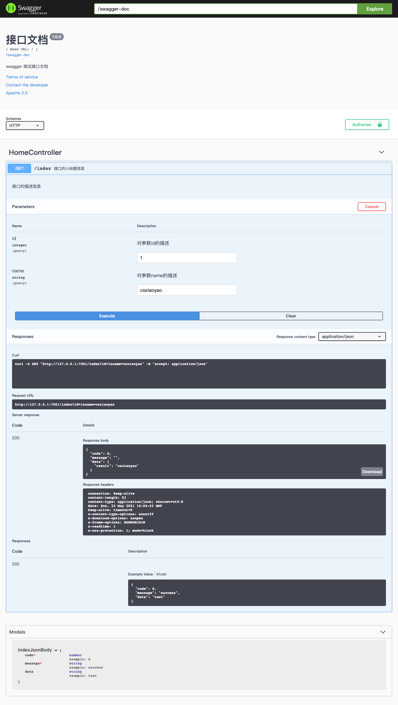
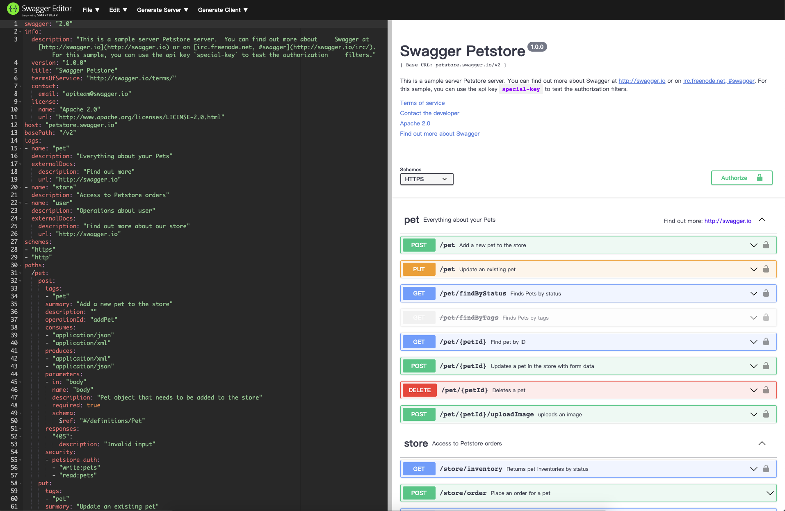

# swagger 在 egg 项目中的最佳实践

> Write By CS逍遥剑仙  
> 我的主页: [csxiaoyao.com](https://csxiaoyao.com)   
> GitHub: [github.com/csxiaoyaojianxian](https://github.com/csxiaoyaojianxian)   
> Email: [sunjianfeng@csxiaoyao.com](mailto:sunjianfeng@csxiaoyao.com)  
> QQ: [1724338257](http://wpa.qq.com/msgrd?uin=1724338257&site=qq&menu=yes)

## 1. 背景

swagger 是一个 RESTful 接口的基于 YAML、JSON 语言的文档和代码在线自动生成工具，它让部署管理 API 变得前所未有的简单。swagger 在 java 界广为使用，其他语言同样可以方便地集成使用。本文以基于 node.js 的企业级应用框架 egg.js 为例，集成 swagger 以根据函数注释自动生成接口文档。

## 2. 最佳实践

### 2.1 项目搭建

> 参考链接：https://github.com/csxiaoyaojianxian/JavaScriptStudy/tree/master/17-nodejs/20-egg-swagger-doc

egg 有两种搭建方式：快速搭建和普通搭建。由于本案例比较简单，为了避免项目多余的配置，此处使用普通的搭建方式，可以参考上面的链接，搭建的项目目录结构如下：

```
egg-example
    ├── app
    │   ├── contract
    │   │   └── format.js
    │   ├── controller
    │   │   └── home.js
    │   └── router.js
    ├── config
    │   └── config.default.js
    │   └── plugin.js
    └── package.json
```

其中，包含了一个路由 `/index` 调用了 `HomeController` 控制器的 `index` 方法，下面将对该路由进行 swagger 处理。

### 2.2 egg-swagger-doc 安装

参考 npm 项目: [https://www.npmjs.com/package/egg-swagger-doc](https://www.npmjs.com/package/egg-swagger-doc) 在 egg 项目中安装 swagger：

```shell
$ npm i egg-swagger-doc --save
```

### 2.3 swagger 插件配置

首先在 egg 中启用 swaggerdoc 插件：

```javascript
// {app_root}/config/plugin.js
exports.swaggerdoc = {
  enable: true, // 是否启用
  package: 'egg-swagger-doc' // 指定包名称
}
```

再在 config 配置文件中添加 swaggerdoc 插件的配置信息：

```javascript
// {app_root}/config/config.default.js
exports.swaggerdoc = {
  dirScanner: './app/controller', // 配置自动扫描的控制器路径
  apiInfo: {
    title: '接口文档', // 接口文档的标题
    description: 'swagger 测试接口文档', // 接口文档描述
    version: '1.0.0', // 接口文档版本
    termsOfService: 'http://swagger.io/terms/', // 服务条件
    contact: {
      email: 'sunjianfeng@csxiaoyao.com' // 联系方式
    },
    license: {
      name: 'Apache 2.0',
      url: 'http://www.apache.org/licenses/LICENSE-2.0.html'
    },
  },
  basePath: '/', // 配置基础路径
  schemes: ['http', 'https'], // 配置支持的协议
  consumes: ['application/json'], // 指定处理请求的提交内容类型 (Content-Type)，如 application/json、text/html
  produces: ['application/json'], // 指定返回的内容类型，仅当 request 请求头中的(Accept)类型中包含该指定类型才返回
  securityDefinitions: {}, // 配置接口安全授权方式
  enableSecurity: false, // 是否启用授权，默认 false
  // enableValidate: true, // 是否启用参数校验，默认 true
  routerMap: false, // 是否启用自动生成路由(实验功能)，默认 true
  enable: true   // 默认 true
}
```

### 2.4 注释参数编写

参数的编写一共分为两大部分：controller 和 contract，在完成插件引入后，如果不修改默认配置，应用启动后，会自动扫描 app/controller 和 app/contract 下的文件。controller 为 api 的控制器，而 contract 下的文件为定义好的请求体和响应体。

控制器的注释分两块，每个控制器的第一个注释块必须包含 @controller 才能被解析为控制器，然后会逐个解析出控制器下包含的 api 注释。

```javascript
/**
 * @controller HomeController
 */
class HomeController extends Controller {
  /**
   * @router get /index  路径
   * @summary 接口的小标题信息
   * @description 接口的描述信息
   * @request query integer id 对参数id的描述
   * @request query string name 对参数name的描述
   * @response 200 indexJsonBody
   */
  async index () {
  	...
  }
}
```

而 contract 下则定义了常用的请求体和响应体，可以对格式进行约束。

```javascript
const JsonBody = {
  code: { type: 'number', required: true, example: 0 },
  message: { type: 'string', required: true, example: 'success' },
  data: { type: 'Enum', required: true, example: [] },
}
module.exports = {
  indexJsonBody: {
    ...JsonBody,
    data: { type: 'string', example: 'test' },
  },
};
```

### 2.5 生成

配置完后，执行 dev 脚本，即可打开 `/swagger-ui.html` 看到生成的文档。

```shell
$ npm run dev
```



## 3. 参数说明

swagger 有以下常用的注释：

```
@Controller {ControllerName}
@Router {Mothod} {Path}
@Request {Position} {Type} {Name} {Description}
@Response {HttpStatus} {Type} {Description}
@Deprecated
@Description {Description}
@Summary {Summary}
```

对于 swagger 注释参数详细信息，可以参考 [https://www.npmjs.com/package/egg-swagger-doc](https://www.npmjs.com/package/egg-swagger-doc)，还可以在 swagger 编辑器中对照生成 [https://editor.swagger.io](https://editor.swagger.io)。



## 4. 参考文档

+ 我的github：https://github.com/csxiaoyaojianxian/JavaScriptStudy/tree/master/17-nodejs/20-egg-swagger-doc

+ npm：https://www.npmjs.com/package/egg-swagger-doc
+ editor：https://editor.swagger.io


