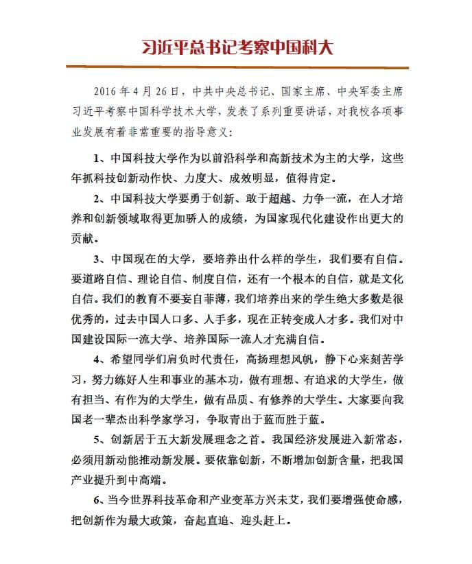

# 两学一做心得感悟

> Write By [CS逍遥剑仙](http://home.ustc.edu.cn/~cssjf/)   
> 我的主页: [csxiaoyao.com](https://csxiaoyao.com)   
> GitHub: [github.com/csxiaoyaojianxian](https://github.com/csxiaoyaojianxian)   
> Email: [sunjianfeng@csxiaoyao.com](mailto:sunjianfeng@csxiaoyao.com)  
> QQ: [1724338257](http://wpa.qq.com/msgrd?uin=1724338257&site=qq&menu=yes)

**by – CS逍遥剑仙**

&emsp;&emsp;今年4月，习总书记对中科大进行了考察，每位科大学子难掩内心的喜悦，认真学习总书记对大家提出的要求，每个人都感受到了肩上沉甸甸的责任。总书记时刻不忘让同学们铭记创新和人才对国家发展的重大意义，学习完总书记在科大和近期的重要讲话，对总书记的殷殷期盼我感悟颇丰。科技是国家强盛之基，创新是民族进步之魂，我认为作为一名大学生，创新我们可以分为以下三步来实践。

## 仰望星空，脚踏实地

&emsp;&emsp;建设创新型国家，科技是关键，人才是核心，教育是基础。作为当代大学生，我们是最富有创造力的一代，是思维活跃、敢想敢做的一代，我们在人生中的黄金年华努力学习先进的科学文化知识，用知识武装自己的头脑，为的是实现中华民族伟大复兴“中国梦”的重任。

&emsp;&emsp;在我看来，创新就是拒绝平庸，需要“仰望星空”与“脚踏实地”。

&emsp;&emsp;首先，仰望星空就是敢于做梦。但“做梦”异于胡思乱想。我们每个人以前曾无数次幻想自己未来的人生，我曾经和乔布斯一样认为自己“活着就是为了改变世界”。随着时间的流逝，梦也在逐个消逝。但有一点是肯定的，我们变得成熟和理智，岁月过滤了那些年少轻狂的梦，我们开始学会思考、承担责任，将自己的梦与“中国梦”相系，而这些梦正是亟待我们去实现的梦。

&emsp;&emsp;为什么一部《老男孩》能引起那么多人的共鸣，让那么多人深受感动？因为“梦想这东西和经典一样，永远不会因为时间而褪色，反而更显珍贵”。因此，如果你还是一个敢于做梦的人，或许在那一刻，你就已经不再平庸了。

&emsp;&emsp;俗话说“千里之行，始于足下”，创新也不是凭空臆想，“踩在巨人的肩膀上”才能事半功倍，这也需要大量的知识储备。然学海无涯苦作舟，创新不仅要“仰望星空”，更要“脚踏实地”。

&emsp;&emsp;总书记说：“历史的车轮滚滚向前，跟不上的人必将成为落伍者，必将被历史所淘汰。历史只会眷顾坚定者、奋进者、搏击者，而不会等待犹豫者、懈怠者、畏难者”。我认为，作为一名研究生，首先要做到“收心”，才能学会“用心”。在这个急功近利的社会，诱惑无处不在，短期的付出往往也能有可观的收益。纵观大千世界，功利心过强的人往往目光短浅，一生碌碌无为，这是因为他们不明白自己的追求，没有人生的“大计”。不少搞研究人有“坐冷板凳”的感觉，很多人甚至选择转行，机遇很可能就错失在一念之间。创新需要更多能够“坐热冷板凳”的甘于寂寞的有梦的年轻人。屠呦呦将一生献给了青蒿素，她说：“一个科技工作者，是不该满足于现状的，要对党、对人民不断奉献”，这是她的梦想，正是这种追梦精神让她擦出智慧的火花。要知道，科研工作非一朝一夕可就，一生心血换来的伟大成就更显珍贵。

&emsp;&emsp;仰望星空，脚踏实地，我们大学生只有具备了这两种精神才能为创新打下基础，才能用自己的知识和智慧为中国梦舔砖加瓦。

## 开阔眼界，善于思考

&emsp;&emsp;习总书记指出：“要开创中华民族伟大复兴新局面，就必须树立宏大历史视野，把握世界发展大势，聆听时代声音，勇于坚持真理、修正错误，不断推进理论创新、实践创新、制度创新、文化创新以及其他各方面创新，在时代前进的洪流中书写中华民族发展新篇章”。

&emsp;&emsp;眼界广者其成就必大，眼界小者其作为必小。眼界高的人自然而然地会“欲穷千里目，更上一层楼”。我们大学生正处于世界观和人生观的形成期，大学的高等教育的目的在于让我们开阔眼界，不做井底之蛙。这也有助于今后进入社会后形成更广大的格局，待人处事的方法都会与众不同，更能激发自己的创新潜能。

&emsp;&emsp;如何开阔眼界？读书，无疑是最直接的手段。读书本身就是在向外接受新的知识，聆听外界的声音，洞察外面的世界，体悟作者的思想。然而作为大学生的我们攻读圣贤书，却常常不能举一反三，不能创新解决问题的思路。众所周知，现在都爱拿中国学生和美国学生作比较，譬如同时让中国大学生和美国大学生用自己的方法来完成某个实验，中国大学生第一想到的是用书本上的所学知识来解决，而美国大学生则是主动用理论知识和实践相结合去解决，结果美国大学生往往能够取得更加优异的结果。可以说，中国不缺乏努力的人，缺的是有眼光的年轻人。有句话讲得好“尽信书，不如无书”，在书海中遨游固然是美妙的，但是能够做书的主人，善于总结思考前人的优点，发现前人的不足，敢于去挑战书中的观点、书中的方法，这样才会有“真知”，真正的知识，才会有“灼见”，就是与众不同的见解，才能“青出于蓝而胜于蓝”。

&emsp;&emsp;当今世界发展日新月异，学校努力培养安心做科研的年轻人，但我们年轻人也要努力走出去，以开阔的眼界，宽广的胸怀，探索未知的领域，走向社会，赢得世界，厚积而薄发！

## 理实交融，服务人民

&emsp;&emsp;习近平指出：“创新是一个民族进步的灵魂，是一个国家兴旺发达的不竭源泉，也是中华民族最鲜明的民族禀赋。” 历史表明，科学技术与人民生活息息相关。科技的落后必然导致综合国力和人民生活水平的不高。因此，党和国家领导人非常重视科技的发展，因为只有如此，才能更好地践行党的宗旨，才能更好地为人民服务。

&emsp;&emsp;初遇科大，科大校训“红专并进，理实交融”就深深打动了我。从前半句中可以深切感受到建校初期科大人的那种报国情怀；而后半句“理实交融”恰恰道出了科大对科研的最基本的要求。实践是马克思主义认识论的基本观点。人类文明的进步，社会的发展，都离不开在实践中不断地创新。就研究而研究，为认识而认识，为理论而理论，好比闭门造车，必然死路一条。

&emsp;&emsp;如何更好地创新、更好地实践？我想，我们要明确创新的目的。对于大学创新的认识，李开复曾在《做最好的自己》一书中提到过：“创新固然重要，但有用的创新更重要”。这便说明了一个问题，创新不是纸上谈兵，创新需要以服务党、服务社会、服务人民为落脚点。国家一直提倡的“大众创业、万众创新”也不是随意的凭空想象，创新需要建立在知识和生活、工作实践的基础上。有用的创新，关键在“有用”二字。何为“有用”？有用就是说得有需求，有需求才市场。举例来说，袁隆平费劲千辛万苦用农业科学技术战胜粮食饥荒，他培育成功的高产杂交水稻，解决了世界五分之一人口的温饱问题，因此被誉为“杂交水稻之父”。

&emsp;&emsp;这个如今看起来并不时髦的校训，却引领着科大学子们时刻心系国家，勇攀科学高峰，努力为人民服务。

&emsp;&emsp;“得人则安，失人则危”，习近平总书记向来爱才、惜才、敬才。十八大以来，习近平多次就人才问题发表重要讲话，对人才培养提出一系列高瞻远瞩的论述。总书记在中国科大谈创新不仅表达了科大学子的殷殷期盼，对创新人才的求贤若渴，更是对科大科研和创新实践的鞭策，有如春风化雨，将创新理念深入进每位科大学子心中。我将“日三省吾身”，时刻注意理论联系实践，不断探索创新。

&emsp;&emsp;“日新之谓盛德”，中华民族是一个爱学习、善学习、敬知识、崇创新的民族，在灿烂不熄的人类文明长河中创新人才辈出，持续书写着东方大国的创新史。

