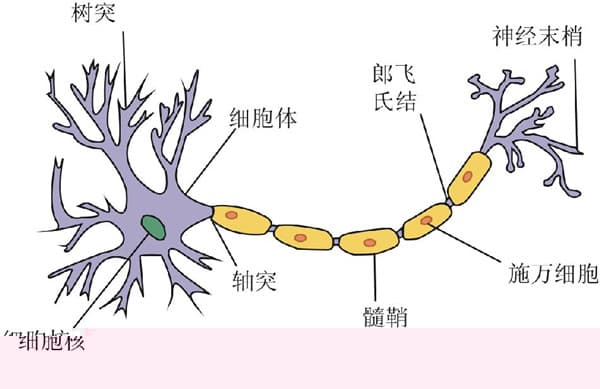
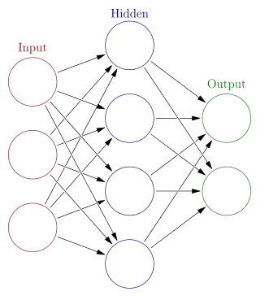

# 神经网络在tensorflow的简单应用

> Write By [CS逍遥剑仙](http://home.ustc.edu.cn/~cssjf/)   
> 我的主页: [csxiaoyao.com](https://csxiaoyao.com)   
> GitHub: [github.com/csxiaoyaojianxian](https://github.com/csxiaoyaojianxian)   
> Email: [sunjianfeng@csxiaoyao.com](mailto:sunjianfeng@csxiaoyao.com)  
> QQ: [1724338257](http://wpa.qq.com/msgrd?uin=1724338257&site=qq&menu=yes)

## 生物学联系
&emsp;&emsp;在生物学中，神经细胞利用电-化学过程交换信号。输入信号来自另一些神经细胞，这些神经细胞的轴突末梢（也就是终端）和本神经细胞的树突相遇形成突触，信号就从树突上的突触进入本细胞。就是说，大脑的神经细胞也只有两种状态：兴奋和不兴奋（抑制）。发射信号的强度不变，变化的仅仅是频率。神经细胞利用一种我们还不知道的方法,把所有从树突突触上进来的信号进行相加，如果全部信号的总和超过某个阀值，就会激发神经细胞进入兴奋状态，这时就会有一个电信号通过轴突发送出去给其他神经细胞。如果信号总和没有达到阀值，神经细胞就不会兴奋起来。  


&emsp;&emsp;尽管每一个神经细胞仅仅工作于大约100Hz的频率，但因各个神经细胞都以独立处理单元的形式并行工作着，使人类的大脑具有下面这些非常明显的特点：能实现无监督的学习，即它们能够自己进行学习，而不需要导师的监督教导。如果一个神经细胞在一段时间内受到高频率的刺激，则它和输入信号的神经细胞之间的连接强度就会按某种过程改变，使得该神经细胞下一次受到激励时更容易兴奋。  

## 执行过程  

&emsp;&emsp;一个人工神经细胞可以有任意n个输入，n代表总数。可以用下面的数学表达式来代表所有n个输入：
```
  x1, x2, x3, x4, x5, ..., xn
```
&emsp;&emsp;同样 n 个权重可表达为:
```
  w1, w2, w3, w4, w5 ..., wn
```
&emsp;&emsp;激励值就是所有输入与它们对应权重的之乘积之总和，可以写为:
```
  a = w1x1 + w2x2 + w3x3 + w4x4 + w5x5 +...+ wnxn
```
&emsp;&emsp;如果激励值超过了阀值，神经细胞就输出1; 如果激活小于阀值，则神经细胞的输出为0。这和一个生物神经细胞的兴奋和抑制是等价的。我们假设一个神经细胞有5个输入，他们的权重w都初始化成正负1之间的随机值(-1 < w < 1) 。如果我们假定激活所需阀值=1，则因激励值1.1 > 激活阀值１，所以这个神经细胞将输出1。  
&emsp;&emsp;bias、sigmod………

## 简单应用——手写识别
&emsp;&emsp;神经网络常常用来作模式识别，这是因为它们善于把一种输入状态（它所企图识别的模式）映射到一种输出状态（它曾被训练用来识别的模式）。  
&emsp;&emsp;以字符识别作为例子。设想有一个由8x8个格子组成的一块面板。每一个格子里放了一个小灯，每个小灯都可独立地被打开（格子变亮）或关闭（格子变黑），这样面板就可以用来显示十个数字符号。  

&emsp;&emsp;要解决这一问题，我们必需设计一个神经网络，它接收面板的状态作为输入，然后输出一个1或0；输出1代表ANN确认已显示了数字“4”，而输出0表示没有显示“4”。因此，神经网络需要有64个输入(每一个输入代表面板的一个具体格点) 和由许多神经细胞组成的一个隐藏层，还有仅有一个神经细胞的输出层，隐藏层的所有输出都馈送到它。一旦神经网络体系创建成功后，它必须接受训练来认出数字“4”。为此可用这样一种方法来完成：先把神经网的所有权重初始化为任意值。然后给它一系列的输入，在本例中，就是代表面板不同配置的输入。对每一种输入配置，我们检查它的输出是什么，并调整相应的权重。如果我们送给网络的输入模式不是“4”， 则我们知道网络应该输出一个0。因此每个非“4”字符时的网络权重应进行调节，使得它的输出趋向于0。当代表“4”的模式输送给网络时，则应把权重调整到使输出趋向于1。  
&emsp;&emsp;如果你考虑一下这个网络，你就会知道要把输出增加到10是很容易的。然后通过训练，就可以使网络能识别0到9 的所有数字。但为什么我们到此停止呢？我们还可以进一步增加输出，使网络能识别字母表中的全部字符。这本质上就是手写体识别的工作原理。对每个字符，网络都需要接受许多训练，使它认识此文字的各种不同的版本。到最后，网络不单能认识已经训练的笔迹，还显示了它有显著的归纳和推广能力。也就是说，如果所写文字换了一种笔迹，它和训练集中所有字迹都略有不同，网络仍然有很大几率来认出它。正是这种归纳推广能力，使得神经网络已经成为能够用于无数应用的一种无价的工具，从人脸识别、医学诊断，直到跑马赛的预测，另外还有电脑游戏中的bot（作为游戏角色的机器人）的导航，或者硬件的robot（真正的机器人）的导航。

## 平台应用
**tensorflow**
```
# -*- coding:utf-8 -*-
import tensorflow as tf
import numpy as np

# 添加层
def add_layer(inputs, in_size, out_size, activation_function=None):
    # add one more layer and return the output of this layer
    Weights = tf.Variable(tf.random_normal([in_size, out_size]))
    biases = tf.Variable(tf.zeros([1, out_size]) + 0.1)
    Wx_plus_b = tf.matmul(inputs, Weights) + biases
    if activation_function is None:
        outputs = Wx_plus_b
    else:
        outputs = activation_function(Wx_plus_b)
    return outputs

# 1.训练的数据
# Make up some real data
# 模拟数据、噪声、样本结果值
x_data = np.linspace(-1, 1, 300)[:, np.newaxis]
noise = np.random.normal(0, 0.05, x_data.shape)
y_data = np.square(x_data) - 0.5 + noise

# 2.定义节点准备接收数据
# define placeholder for inputs to network
xs = tf.placeholder(tf.float32, [None, 1])
ys = tf.placeholder(tf.float32, [None, 1])

# 3.定义神经层：隐藏层和预测层
# add hidden layer 输入值是 xs，在隐藏层有 10 个神经元
l1 = add_layer(xs, 1, 10, activation_function=tf.nn.relu)
# add output layer 输入值是隐藏层 l1，在预测层输出 1 个结果
prediction = add_layer(l1, 10, 1, activation_function=None)

# 4.定义 loss 表达式
# the error between prediciton and real data  方差
loss = tf.reduce_mean(tf.reduce_sum(tf.square(ys - prediction), reduction_indices=[1]))

# 5.选择 optimizer 使 loss 达到最小
# 这一行定义了用什么方式去减少 loss，学习率是 0.1
train_step = tf.train.GradientDescentOptimizer(0.1).minimize(loss)

# important step 对所有变量进行初始化
init = tf.initialize_all_variables()
sess = tf.Session()
# 上面定义的都没有运算，直到 sess.run 才会开始运算
sess.run(init)

# 迭代 1000 次学习，sess.run optimizer
for i in range(1000):
    # training train_step 和 loss 都是由 placeholder 定义的运算，所以这里要用 feed 传入参数
    sess.run(train_step, feed_dict={xs: x_data, ys: y_data})
    if i % 50 == 0:
        # to see the step improvement 误差情况
        print(sess.run(loss, feed_dict={xs: x_data, ys: y_data}))
```

