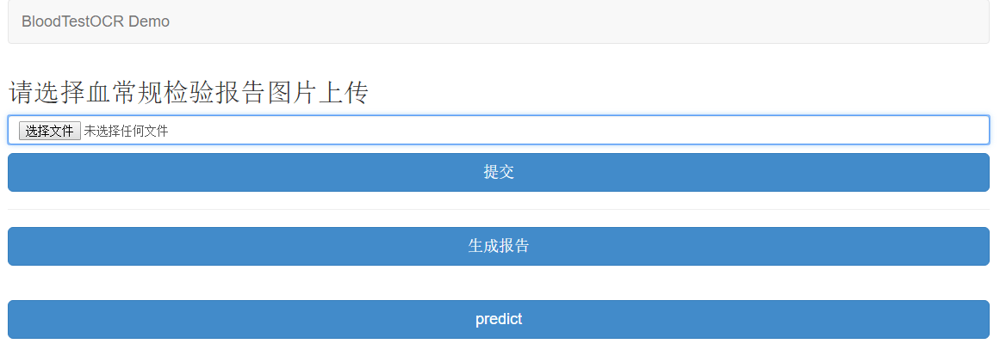
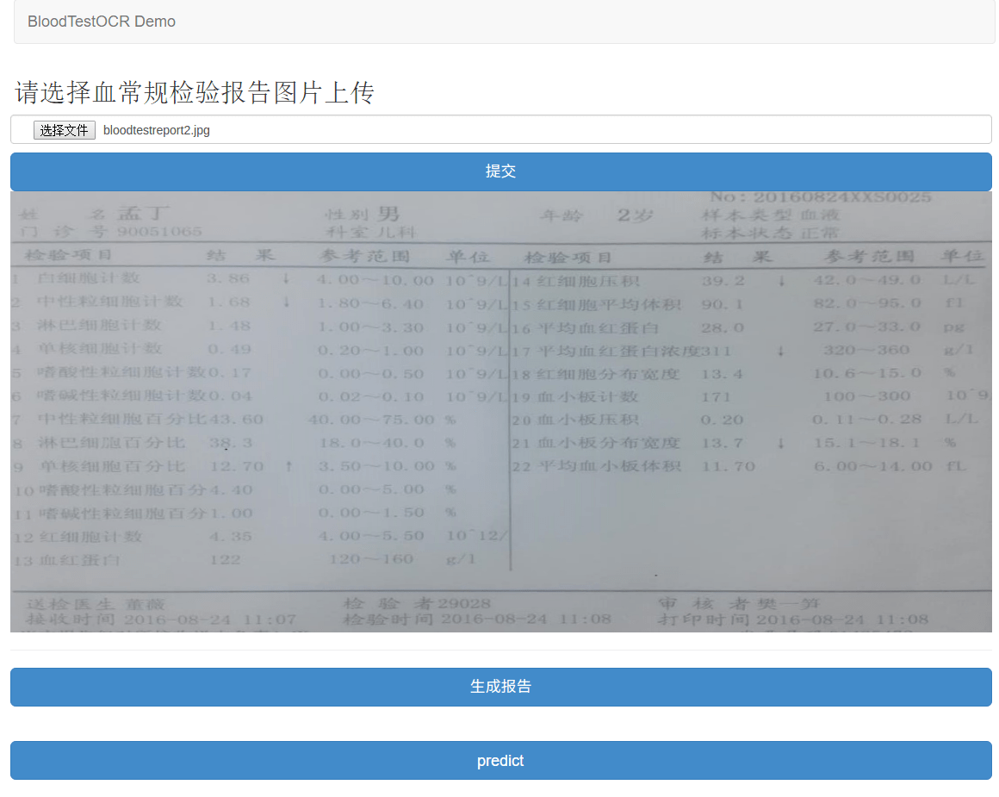
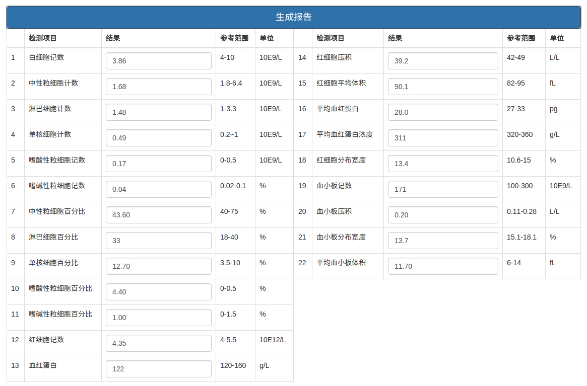
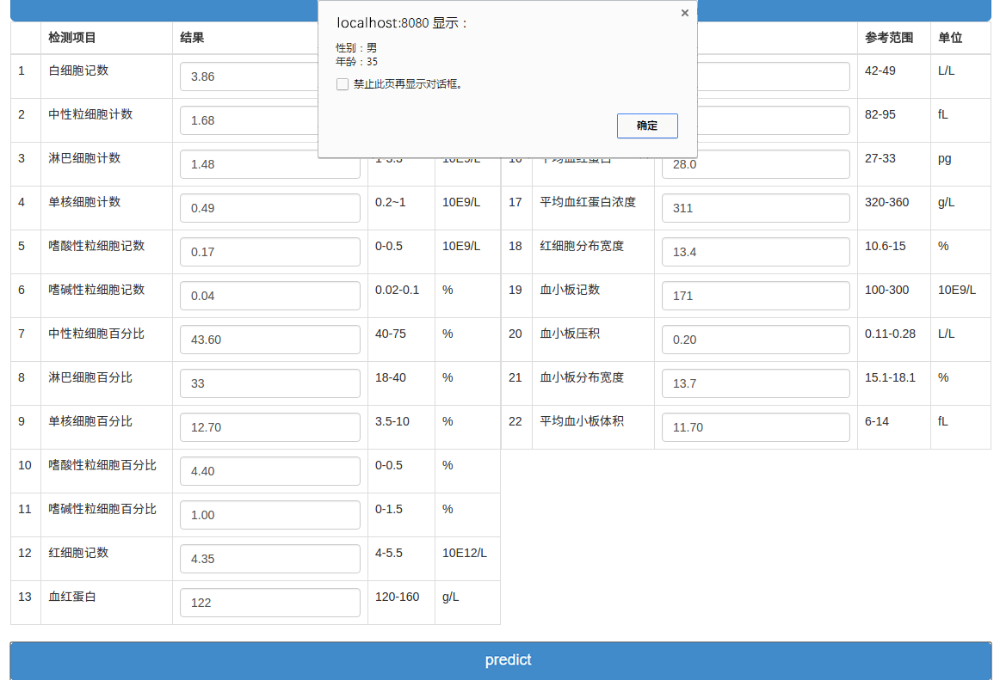
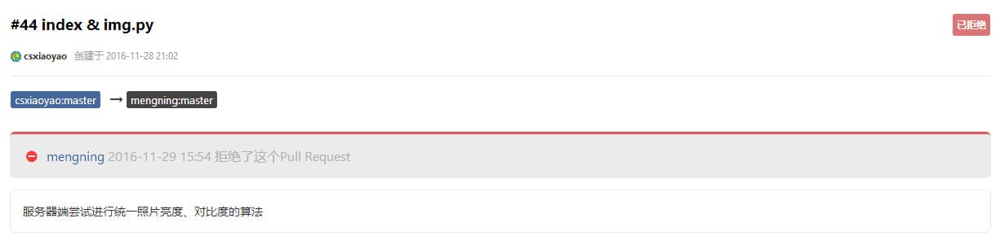
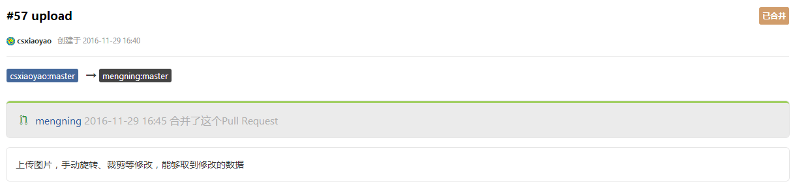

# USTC-NP2016课程学习总结

> Write By [CS逍遥剑仙](http://home.ustc.edu.cn/~cssjf/)   
> 我的主页: [csxiaoyao.com](https://csxiaoyao.com)   
> GitHub: [github.com/csxiaoyaojianxian](https://github.com/csxiaoyaojianxian)   
> Email: [sunjianfeng@csxiaoyao.com](mailto:sunjianfeng@csxiaoyao.com)  
> QQ: [1724338257](http://wpa.qq.com/msgrd?uin=1724338257&site=qq&menu=yes)

* 前言
* 项目介绍
 - 课程目标
 - 项目地址
 - 配置安装方法
* 项目分析
 - 项目演示
 - 模块总述
 - 代码分析
* 学习收获
* 我的贡献
* 心得体会

## 【1】前言
&emsp;&emsp;上学期的网络程序设计课程(12-19week)很快就要结束了，回想起来这两个月的学习，感悟很多。在以往的学习中，常用的一些系统性的简单但易忘的知识点我往往会整理下放在博客上，可以经常进行查阅，从CSDN到博客园到8月份刚建的我的域名博客：[blog.csxiaoyao.com](http://blog.csxiaoyao.com)，可以说以往的博文都是写给自己看的，只能算是个笔记，而这次的博文完全是为了能够向读者阐述我的学习经历和心得。

## 【2】项目介绍
### 【2.1】课程目标
&emsp;&emsp;该课程旨在完成一个基于机器学习神经网络的一个医学辅助诊断系统。首先通过对病人血常规化验单进行图像识别来采集血常规数据，再利用通过大量真实数据训练出来的预测模型对病人的性别和年龄进行预测，通过对各项血常规数据的分析来实现对病人性别和年龄的预测，由于时间和数据限制，未完成A4：根据患者病情资料自动生成诊断报告。

### 【2.2】项目地址
项目托管地址：
[coding.net 对血常规检验报告的OCR识别、深度学习与分析](https://coding.net/u/mengning/p/np2016/git)  
课程项目地址：
[NP2016 课程项目地址](http://teamtrac.ustcsz.edu.cn/wiki/NP2016)
我自己的版本库：
[NP2016 我自己的版本库](https://coding.net/u/csxiaoyao/p/np2016/git)

### 【2.3】配置安装方法
#### 安装前置依赖
```
sudo apt-get install python2.7 python2.7-dev python3.2 python3.2-dev
sudo apt-get install build-essential libssl-dev libevent-dev libjpeg-dev libxml2-dev libxslt-dev
```
#### 安装python模块
本例使用的是python2.7
#### 安装pip
```
sudo apt-get install python-pip
```
#### 安装numpy
```
sudo apt-get install python-numpy # http://www.numpy.org/
```
#### 安装opencv
```
sudo apt-get install python-opencv # http://opencv.org/
```
#### 更新环境变量
```
vim /etc/bash.bashrc
#在文件末尾添加两行代码
export PYTHONPATH=$PYTHONPATH:/usr/local/lib/python2.7/dist-packages
export PYTHONPATH="${PYTHONPATH+${PYTHONPATH}:}/usr/local/lib/python2.7/site-packages"
```
#### 安装OCR和预处理的相关依赖
```
sudo apt-get install tesseract-ocr
sudo pip install pytesseract
sudo apt-get install python-tk
sudo pip install pillow
```
#### 安装Flask框架、mongodb
```
sudo pip install Flask
sudo apt-get install mongodb
sudo service mongodb started
sudo pip install pymongo
#若import cv2报no module name cv2，需要从源码编译opencv安装
```
#### 安装tensorflow
```
pip install --upgrade https://storage.googleapis.com/tensorflow/linux/cpu/tensorflow-0.12.0rc0-cp27-none-linux_x86_64.whl
```
#### 运行demo
```
cd  BloodTestReportOCR
python view.py #在浏览器打开http://localhost:8080，上传图像
```
#### 部署到web服务器
关于如何部署到自己的服务器上(Flask + WSGI + Nginx)，可以参考[这篇文章](http://www.cnblogs.com/Ray-liang/p/4173923.html)

## 【3】项目分析
### 【3.1】项目演示
&emsp;&emsp;首先用户在首页选择上传自己的血常规检验报告图片

&emsp;&emsp;点击提交后可以在页面上预览到校正裁剪后的报告单图片

&emsp;&emsp;点击生成按钮，系统识别出图片中的数据，填充在按钮下方的表格中，用户可以修改部分有误差的数据

&emsp;&emsp;点击预测按钮，系统给出性别和年龄的预测结果


### 【3.2】模块总述  
&emsp;&emsp;本项目分三大模块：web可视化模块、图像处理和OCR模块、学习预测模块。

> ##### web可视化模块
&emsp;&emsp;采用Flask搭建web应用；前端采用Bootstrap，jQuery, Vue.js 来实现  
*文件名：view.py*  
Web 端上传图片到服务器，存入mongodb并获取oid; 前端采用了vue.js, mvvm模式

&emsp;
> ##### 图像处理和OCR模块
&emsp;&emsp;根据图像的特点做几何特征提取、识别和预处理等，比如滤波，傅里叶变换，边缘检测等  
*文件名：imageFilter.py*  
对获取到的上传的血常规化验单图片进行预处理，主要是为了减小噪声，以便识别，主要封装了两个方法：对图像透视裁剪和OCR，以便于模块间的交互，规定适当的接口  
*文件名：classifier.py*  
用于判定裁剪矫正后的报告和裁剪出检测项目的编号  
*文件名：imgproc.py*  
将识别的图像进行处理二值化等操作，提高识别率 包括对中文和数字的处理  
*文件名：digits*  
将该文件替换Tesseract-OCR\tessdata\configs中的digits

&emsp;
> ##### 学习预测模块
&emsp;&emsp;对样本数据进行机器学习的神经网络训练，并预测性别和年龄  
*文件名：tf_predict.py*  
对页面上传过来的数据使用训练好的模型进行预测性别和年龄  
*文件名：sex_predict.py、age_predict.py*  
进行样本的训练，训练出性别和年龄的预测模型  
*文件名：train.csv*  
训练数据

### 【3.3】代码分析
#### 【第一部分】：图像处理
##### 1、imageFilter.py 封装了的图像处理函数
对图像透视裁剪和OCR进行了简单的封装，以便于模块间的交互，规定适当的接口。
```
imageFilter = ImageFilter() # 可以传入一个opencv格式打开的图片
num = 22
print imageFilter.ocr(num)
```
##### 2、perspect 透视处理函数
@param 透视参数  
做初步的图片矫正，用于透视image，会缓存一个透视后的opencv numpy矩阵，并返回该矩阵。如果透视失败，则会返回None，并打印不是报告。
预处理流程如下：
```
# 载入图像
img_sp = self.img.shape
ref_lenth = img_sp[0] * img_sp[1] * ref_lenth_multiplier
# 灰度化
img_gray = cv2.cvtColor(self.img, cv2.COLOR_BGR2GRAY)
# 高斯平滑
img_gb = cv2.GaussianBlur(img_gray, (gb_param, gb_param), 0)
# 开闭运算,腐蚀、膨胀
closed = cv2.morphologyEx(img_gb, cv2.MORPH_CLOSE, kernel)
opened = cv2.morphologyEx(closed, cv2.MORPH_OPEN, kernel)
```
###### 线段检测
为了对图片各个数值所在的区域进行定位，需要检测出图片中比较明显的标识，3条黑线，然后利用这三条线对整张图片进行标定。主要用到了以下3个步骤：
```
# 描绘边缘，Canny边缘检测
edges = cv2.Canny(opened, canny_param_lower , canny_param_upper)
# 调用findContours提取轮廓，
contours, hierarchy = cv2.findContours(edges, cv2.RETR_TREE, cv2.CHAIN_APPROX_SIMPLE)
# 求最小外接矩形
def getbox(i):
    rect = cv2.minAreaRect(contours[i])
    box = cv2.cv.BoxPoints(rect)
    box = np.int0(box)
    return box
```
###### 关于param
参数的形式为[p1, p2, p3 ,p4 ,p5]。 p1,p2,p3,p4,p5都是整型，其中p1必须是奇数。  
p1是高斯模糊的参数，p2和p3是canny边缘检测的高低阈值，p4和p5是和筛选有关的乘数。  
如果化验报告单放在桌子上时，有的边缘会稍微翘起，产生比较明显的阴影，这种阴影有可能被识别出来，导致定位失败。 解决的方法是调整p2和p3，来将阴影线筛选掉。但是如果将p2和p3调的比较高，就会导致其他图里的黑线也被筛选掉了。 参数的选择是一个问题，在getinfo.default中设置的是一个较低的阈值，p2=70,p3=30，这个阈值不会屏蔽阴影线。 如果改为p2=70,p3=50则可以屏蔽，但是会导致其他图片识别困难。  
就现在来看，得到较好结果的前提主要有三个：  
1、化验单尽量平整  
2、图片中应该包含全部的三条黑线  
3、图片尽量不要包含化验单的边缘，如果有的话，请尽量避开有阴影的边缘。  
##### 3、filter 过滤图片函数
@param filter参数
过滤掉不合格的或非报告图片  
返回img经过透视过后的PIL格式的Image对象，如果缓存中有PerspectivImg则直接使用，没有先进行透视 过滤失败则返回None。
##### 4、autocut 图像裁剪函数
@num 剪切项目数  
@param 剪切参数  
将图片中性别、年龄、日期和各项目名称数据分别剪切出来  
用于剪切ImageFilter中的img成员，剪切之后临时图片保存在out_path，如果剪切失败，返回-1，成功返回0，剪切出来的图片在BloodTestReportOCR/temp_pics/ 文件夹下，函数输出为data0.jpg,data1.jpg......等一系列图片，分别是白细胞计数，中性粒细胞记数等的数值的图片。
```
#输出年龄
img_age = self.PerspectiveImg[15 : 70, 585 : 690]
cv2.imwrite(self.output_path + 'age.jpg', img_age)

#输出性别
img_gender = self.PerspectiveImg[15 : 58, 365 : 420]
cv2.imwrite(self.output_path + 'gender.jpg', img_gender)

#输出时间
img_time = self.PerspectiveImg[722 : 760, 430 : 630]
cv2.imwrite(self.output_path + 'time.jpg', img_time)

#转换后的图分辨率是已知的，所以直接从这个点开始读数据就可以了
startpoint = [199, 132]
vertical_lenth = 37
lateral_lenth = 80

def getobjname(i, x, y):
    region_roi = self.PerspectiveImg[y : y+vertical_lenth, x : x+170]
    filename = self.output_path + 'p' + str(i) + '.jpg'
    cv2.imwrite(filename, region_roi)

def getobjdata(i, x, y):
    region_roi = self.PerspectiveImg[y : y+vertical_lenth, x : x+lateral_lenth]
    filename = self.output_path + 'data' + str(i) + '.jpg'
    cv2.imwrite(filename, region_roi)

#输出图片
if num <= 13 and num > 0:
    for i in range(num):
        getobjname(int(i), 25, startpoint[1])
        getobjdata(int(i), startpoint[0], startpoint[1])
        startpoint[1] = startpoint[1] + 40
elif num > 13:
    for i in range(13):
        getobjname(int(i), 25, startpoint[1])
        getobjdata(int(i), startpoint[0], startpoint[1])
        startpoint[1] = startpoint[1] + 40
    startpoint = [700, 135]
    for i in range(num-13):
        getobjname(int(i+13), 535, startpoint[1])
        getobjdata(int(i+13), startpoint[0], startpoint[1])
        startpoint[1] = startpoint[1] + 40
```
##### 5、ocr 图像识别函数
@num 规定剪切项目数  
模块主函数返回识别数据，用于对img进行ocr识别，他会先进行剪切，之后进一步做ocr识别，返回一个json对象。如果剪切失败，则返回None。
```
# pytesseract 识别检测项目编号及数字
for i in range(num):
    item = read('temp_pics/p' + str(i) + '.jpg')
    item_num = classifier.getItemNum(item)
    image = read('temp_pics/data' + str(i) + '.jpg')
    image = imgproc.digitsimg(image)
    digtitstr = image_to_string(image)
    digtitstr = digtitstr.replace(" ", '')
    digtitstr = digtitstr.replace("-", '')
    digtitstr = digtitstr.strip(".")
    data['bloodtest'][item_num]['value'] = digtitstr
    json_data = json.dumps(data,ensure_ascii=False,indent=4)
```
#### 【第二部分】：机器学习
##### 6、使用TensorFlow平台训练数据
TensorFlow是谷歌基于DistBelief进行研发的第二代人工智能学习系统，其命名来源于本身的运行原理。Tensor（张量）意味着N维数组，Flow（流）意味着基于数据流图的计算，TensorFlow为张量从流图的一端流动到另一端计算过程。TensorFlow是将复杂的数据结构传输至人工智能神经网中进行分析和处理过程的系统。  
TensorFlow可被用于语音识别或图像识别等多项机器深度学习领域，对2011年开发的深度学习基础架构DistBelief进行了各方面的改进，它可在小到一部智能手机、大到数千台数据中心服务器的各种设备上运行。TensorFlow将完全开源，任何人都可以用。  
TensorFlow对机器学习的大部分函数模型都进行了高度封装，在本课程中，我参考着官方文档学习了TensorFlow的基本使用方法，从下面的代码分析中可以看出使用TensorFlow来进行机器学习十分简便。
##### 7、normalized 归一化处理函数
由于采集的数据可能会由于本身的数值不统一等因素而对机器学习结果造成影响，因此需要对样本集进行一定的预处理，如去均值与归一化。  
去均值的具体做法是在每个样本上减去数据的统计平均值，去均值的意义主要在于扩大分类的效果。查看TensorFlow的MNIST源码时可以看到，程序中对每个像素点的像素值都减去了128，这就是去均值操作。  
数据尺度归一化的原因是：数据中每个维度表示的意义不同，所以有可能导致该维度的变化范围不同，因此有必要将他们都归一化到一个固定的范围，一般情况下是归一化到[0 1]或者[-1 1]。同样在TensorFlow的MNIST源码中可以看到，去均值后，会将每点的像素值除以128，进行了归一化操作。
项目中的去均值和归一化操作如下：
```
def normalized(a,b):
    for i in range(22):
        # 去均值
        tmp = np.mean(a[:, i])
        a[:, i] = a[:, i] - tmp
        b[:, i] = b[:, i] - tmp
        # 归一化
        if np.min(a[:, i]) != np.max(a[:, i]):
            b[:, i] = 2 * (b[:, i] - np.min(a[:, i])) / (np.max(a[:, i]) - np.min(a[:, i])) - 1
        else:
            b[:, i] = 0
    return b
```
##### 8、定义模型
在TensorFlow中定义模型
```
#建立性别模型，年龄模型类似
x_sex = tf.placeholder("float", [None, n_input])
y_sex = tf.placeholder("float", [None, n_classes_sex])
def multilayer_perceptron_sex(x_sex, weights_sex, biases_sex):
    # Hidden layer with RELU activation
    layer_1 = tf.add(tf.matmul(x_sex, weights_sex['h1']), biases_sex['b1'])
    layer_1 = tf.nn.relu(layer_1)
    # Hidden layer with RELU activation
    layer_2 = tf.add(tf.matmul(layer_1, weights_sex['h2']), biases_sex['b2'])
    layer_2 = tf.nn.relu(layer_2)
    # Output layer with linear activation
    out_layer = tf.matmul(layer_2, weights_sex['out']) + biases_sex['out']
    return out_layer
weights_sex = {
    'h1': tf.Variable(tf.random_normal([n_input, n_hidden_1_sex])),
    'h2': tf.Variable(tf.random_normal([n_hidden_1_sex, n_hidden_2_sex])),
    'out': tf.Variable(tf.random_normal([n_hidden_2_sex, n_classes_sex]))
}
biases_sex = {
    'b1': tf.Variable(tf.random_normal([n_hidden_1_sex])),
    'b2': tf.Variable(tf.random_normal([n_hidden_2_sex])),
    'out': tf.Variable(tf.random_normal([n_classes_sex]))
}
pred_sex = multilayer_perceptron_sex(x_sex, weights_sex, biases_sex)
# 定义损失函数和优化函数
cost = tf.reduce_mean(tf.nn.softmax_cross_entropy_with_logits(pred, y))
optimizer = tf.train.AdamOptimizer(learning_rate=learning_rate).minimize(cost)
```
##### 9、数据读取方式
读取数据为ndarray类型
```
data = np.loadtxt(open("./data.csv","rb"),delimiter=",",skiprows=0)
tmp = normalized(data[:,2:])
# 转化标签为one-hot格式(类别为两类，男和女)
tmp_label_sex = one_hot(data[:,0:1],data.shape[0])
# 数据划分为训练和预测两部分
train_label_sex = tmp_label_sex[:1858, :]
test_label_sex = tmp_label_sex[1858:, :]
train_data = tmp[:1858,:]
test_data = tmp[1858:,:]
```
##### 10、训练
```
# 激活计算图
sess.run(init_op)
# 启动队列
threads = tf.train.start_queue_runners(sess=sess)
# 迭代次数 = 10000
for i in range(10000):
    # batch
    image, label = sess.run([img_batch, label_batch])
    # 输出局部正确率
    if i % 100 == 0:
        train_accuracy = accuracy.eval(feed_dict={x: image, y_:dense_to_one_hot(label)})
        print("step %d, training accuracy %g" % (i, train_accuracy))
        result = sess.run(merged,feed_dict={x:image,y_:dense_to_one_hot(label)})
        writer.add_summary(result,i)
    train_step.run(feed_dict={x: image, y_: dense_to_one_hot(label)})
# 加载测试集
test_img, test_label = sess.run([test_img_batch, test_label_batch])
# 输出整体正确率
print("test accuracy %g" % accuracy.eval(feed_dict={x: test_img, y_: dense_to_one_hot(test_label)}))
# 保存模型
save_path = saver.save(sess, cwd + "/ckpt_sex/sex.ckpt", write_meta_graph=None)
print("Model saved in file: %s" % save_path)
```
##### 11、预测
```
saver.restore(sess, "./model.ckpt")
print ("load model success!")
p_sex = sess.run(pred_sex, feed_dict={x_sex: data_predict})
p_age = sess.run(pred_age, feed_dict={x_age: data_predict})
```
## 【4】学习收获
&emsp;&emsp;半个学期的课程真的很短，感觉刚刚入了门就要结束了，现在还是意犹未尽，这门课让我学到很多东西，总结一下：
**1. linux和Git的使用**
&emsp;&emsp;说来丢人，以前大部分的开发都是在windows下的，linux虽然有所接触，但使用不多，只会一些很基本的命令，只能应付下服务器的部署之类的操作，通过这次课程的学习让我对linux系统的使用更加熟练。说到Git，这个自然是个好东西，然而受先入为主的影响，以前一直在用可视化的svn进行代码控制，一直想切换到git上，这次我不仅让我熟悉了git的基本操作，更是学会了使用git进行多人协作开发，这在别的课程里是学不到的，很有用。
**2. python的学习使用**
&emsp;&emsp;一直听说“生命短暂，我用python”，想学习一下一直没时间，正好有这样的机会跟着课程学习了一下python，跟着廖雪峰的博客简单快速地学习了一遍python，虽说python从语法和逻辑上来说比其他语言简单，而且开发效率高，但是高度封装带来的后果就是增加了很多其他语言没有的api，跟着本次项目边学边写，效果很好。
**3. PIL、opencv、numpy库的学习使用**
&emsp;&emsp;python最突出的优势就是它丰富的库，这次用的PIL和opencv是python图像处理的库，而numpy是科学计算库，自带的函数很多，效率很高，很好用。
**4. 图像处理入门**
&emsp;&emsp;以前总觉得图像处理高大上，只有搞这方面学术研究的人才能玩得转。通过这次课程中几位大神的实践，揭开了图像处理的神秘面纱，从图像的数据结构到存储方式，还有常见的处理方式，我体会到了图像处理是一件很有趣、要发挥想象力的事情，以后这方面我还会继续探索。
**5. 机器学习实践**
&emsp;&emsp;都说互联网时代已经过去，现在已经是大数据、云计算、机器学习的时代。在以往的认知中，让机器具有思维是一件多么不可思议的事情。我一直认为程式的执行是一成不变的，这是从学习C语言开始老师给我们灌输的思想，神经网络的运用，尤其是BP算法，反向传播的理念让我感受到了计算机世界的美妙，最关键的是，机器学习不是那么深不可测、高不可攀，虽说它的数学理论基础具有一定的复杂性，但是前人已经总结了大量具有通用性的算法，再加上各大深度学习平台（TensorFlow、Spark等）已经高度封装了机器学习的算法，直接调用相应的api可以以很少的代码量对数据进行训练和预测。由此看来，未来一定是AI的时代，而且AI的门槛也会逐步降低，开发者甚至可能只需要掌握一些基本的原理，剩下的就是结合经验调参，机器学习也是可以如此快捷的。
**6. 开放共享的学习理念**
&emsp;&emsp;以往的学习都是吸收加自我探索，这对打好基础还是很重要的。但是在未来的工作中，在团队中学习成长才能事半功倍。团队协作和分享交流是很重要的一部分，我一直认为，只有能把别人讲懂才算真懂，不惧别人的提问，才能做到了然于胸，课程设置的分享展示环节很棒，有助于我们更加快速地拓宽知识面和更加深入地理解，同时共享代码库的方式，也有助于我们取长补短，提高编码能力。
## 【5】我的贡献
&emsp;&emsp;惭愧的是，课程让我感受到了基础的薄弱，虽说花了不少时间学习基础知识，也奈何总比前面的大神慢一拍，自己一心想为团队做贡献，奈何每次学完后写了一些小demo，准备pull到代码库中，发现已经有大神提交上去了，不过学习其他人的代码也是提高自己编码能力的过程，不过也很有挫败感。
&emsp;&emsp;由于自己写的代码都是在本地项目外的工程里执行的，不打算pull就不会commit到自己的库中，因此翻阅了自己fork的分支的操作记录，没找到重要的commit记录。虽说无从考证，我还是说明下自己做过的一些尝试，算是苦劳：
### 1、图像预处理(skimage)
&emsp;&emsp;之前对图像处理是一点概念都没有，我尝试使用python的skimage图像处理库来调整图像参数，考虑到不同手机摄像头拍摄到的照片亮度等参数不同，我首先通过threshold_isodata函数确定图像的阈值，并将不同图片的强度修改到一致，方法如下：
(1)计算图像的RGB像素均值 – M
(2)对图像的每个像素点Remove平均值 - M
(3)对去掉平均值以后的像素点 P 乘以对比度系数
(4)对步骤上处理以后的像素P加上 M 乘以亮度系统
(5)对像素点RGB值进行二值化后完成重新赋值（即完成亮暗调节）
&emsp;&emsp;然后对提取到的像素点判断图片的倾斜角度并旋转裁剪(不过倾斜角度一直计算不准确，旋转裁剪也就放弃了)
#### #44 已拒绝

### 2、图像拍照上传以及手动裁剪
&emsp;&emsp;考虑到用户上传的照片可能不规整，为了提高后台对图像的识别度，我使用H5、Bootstrap、Jquery和Angular设计了一个图片上传预览、旋转、手动裁剪的功能，后来尝试了使用H5调用摄像头在指定区域内拍照的功能，后期发现后台已经可以完美做到裁剪功能，所以代码库里已经去掉了这部分代码。
#### #57 已合并

### 3、TensorFlow实现神经网络
&emsp;&emsp;刚开始接触TensorFlow觉得很有趣，官方文档也很详尽，有很多也翻译成了中文，但在数据读取这块我花费了大量的精力，也是请教了其他同学后才算是明白了TensorFlow的数据读取方式，并写了神经网络预测性别和年龄的demo，个人觉得仅仅做了取数据和常规的神经网络训练，并没有什么实质性的特殊算法，因此没有提交pull/request。后面的时间一方面学习了其他的机器学习算法，另一方面尝试了spark平台的使用。
#### #未提交  
## 【6】心得体会
&emsp;&emsp;网络程序设计课程即将结束，还记得当初选课的时候，孟宁老师第一次课的一席话就吓跑了近一半的学生，正如老师所说，这个课程和其他课程有很大区别。  
&emsp;&emsp;首先是互动协作与分享学习模式，通过在coding.net上的多人协作方式，每人通过学习新的知识，为代码库做贡献，协作完成一个项目，这在其他的课程里是很少见的（据说孟老师的高级软件工程也是这样的，下学期选了试试）。这种模式的优势在于领先的同学可以提早贡献自己的代码，尽快搭建起项目结构，为项目的发展指明方向；而基础薄弱的同学（比如我）可以在学习的过程中参考借鉴大神们的代码，缩短学习的周期，尽快跟上，并提出自己的见解，修复程序中的Bug。每周五，同学们会准备一些自己所学与大家分享，互动参与的过程让我们在有限的时间内接触到更多的知识。  
&emsp;&emsp;其次，课程有难度，对自主学习要求高。课程有难度，难度还不小，压力也比较大，这是因为这学期所学的机器学习对我而言是一门完全陌生的学科，从前期的图像处理技术，小到git的多人协作，大到使用python语言来实践机器学习的各种理论算法，各种处理库的学习，再到后来的各大平台实战，以及项目功能整合部署，对我而言都是全新的，完全陌生的，这门课程的学习过程中很多知识点也是现学现卖，跟着一群大神往前走，不断踩坑，不断解决。  
&emsp;&emsp;现在想来没有退课是一个明智的选择，在这门课程中，我不仅接触到了图像处理、机器学习的应用，更是学到了一些学习的方法。都说学校是培养学习能力的地方，从这个角度来说，这门课真是太值了。 再次感谢孟宁老师这半个学期来的精心指导。

