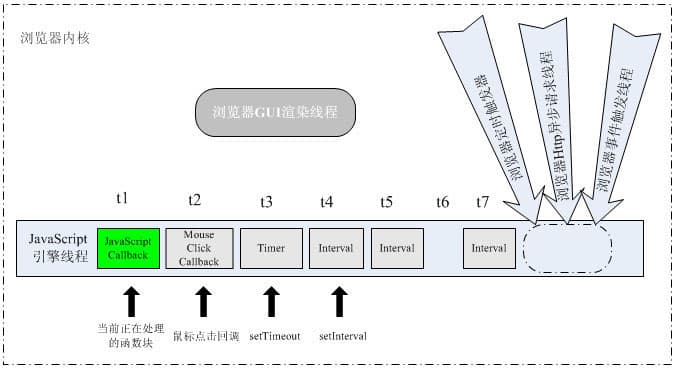
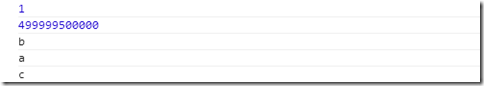
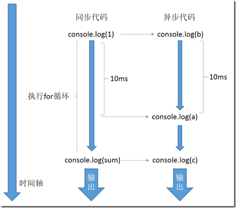
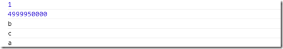
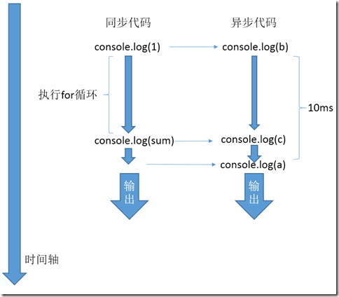
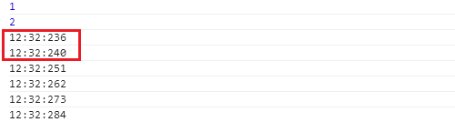

# 从setTimeout分析浏览器线程

> Write By [CS逍遥剑仙](http://home.ustc.edu.cn/~cssjf/)   
> 我的主页: [csxiaoyao.com](https://csxiaoyao.com)   
> GitHub: [github.com/csxiaoyaojianxian](https://github.com/csxiaoyaojianxian)   
> Email: [sunjianfeng@csxiaoyao.com](mailto:sunjianfeng@csxiaoyao.com)  
> QQ: [1724338257](http://wpa.qq.com/msgrd?uin=1724338257&site=qq&menu=yes)

&emsp;&emsp;今天接到阿里的面试电话，面试官很和善，聊聊天的形式不知不觉就是一个小时。本人接触前端不深，面试的时候问的几个问题也让我发现自身学习过程中思考太少，其中一个就是问到了setTimeout的工作机理，当时简单讲了讲我自己的想法，面试官也指出了其中的问题，现查阅资料重新整理记录。
## 1. setTimeout的表象
&emsp;&emsp;setTimeout的定义很简单，教科书上说，setTimeout() 方法用于在指定的毫秒数后调用函数或计算表达式。回想平时的开发，setTimeout多用于定时器，轮播图，动画效果，自动滚动等。
### 1.1 案例一
```
var startTime = new Date();
setTimeout(function () {
	console.log(new Date() - startTime);
}, 100);
```
&emsp;&emsp;答案取决于同步执行的js需要占用的时间，MAX(同步执行的时间, 100)
### 1.2 案例二
```
setTimeout(function () {
	func1();
}, 0)
func2();
```
&emsp;&emsp;此处func2先执行，func1后执行
### 1.3 案例三
```
setTimeout(function () {
	func1（）
}, 0)
```
与
```
setTimeout(function () {
	func1（）
})
```
&emsp;&emsp;0秒延迟，此回调将会放到一个能立即执行的时段进行触发。javascript代码大体上是自顶向下的，但中间穿插着有关DOM渲染，事件回应等异步代码，他们将组成一个队列，零秒延迟将会实现插队操作。不写第二个参数，浏览器自动配置时间，在IE，FireFox中，第一次配可能给个很大的数字，100ms上下，往后会缩小到最小时间间隔，Safari，chrome，opera则多为10ms上下。
## 2. 浏览器内核线程分析
&emsp;&emsp;初学JavaScript时出现过一个误区：JavaScript引擎是多线程的，定时器回调函数是异步执行的。 事实上，JavaScript引擎是单线程的，其实单线程也有单线程的好处，可以简化很多问题。  
&emsp;&emsp;想说明白js的运行机制，不得不提到浏览器内核线程。通常来说，一个浏览器内核的实现至少有三个常驻线程：javascript引擎线程、GUI渲染线程、浏览器事件触发线程。此外还有些执行完即终止的线程，如Http请求线程，这些异步线程会产生不同的异步事件,下图阐明单线程JavaScript引擎与其他线程的通信。  

&emsp;&emsp;由图可看出,浏览器中的JavaScript引擎基于事件驱动，由于是单线程，所有事件在队列中排队等待执行。  
&emsp;&emsp;上图 t1 - t2 ... tn 表示不同时间点，t1时刻其他线程的工作状态为：  
【GUI渲染线程】  
&emsp;&emsp;该线程负责渲染浏览器界面的HTML元素，当界面需要重绘(Repaint)或由于某种操作引发回流(reflow)时，该线程就会执行。该线程与JavaScript引擎线程互斥，因为JavaScript脚本是可操纵DOM元素的，在修改这些元素属性同时渲染界面，那么渲染线程前后获得的元素数据就可能不一致。在JavaScript引擎运行脚本期间，浏览器渲染线程处于挂起状态。所以在脚本中执行对界面的更新操作，如添加、删除结点或改变结点的外观等更新并不会立即体现出来，这些操作将保存在一个队列中，待JavaScript引擎空闲时才有机会渲染出来。
【事件触发线程】  
&emsp;&emsp;JavaScript脚本的执行不影响html元素事件的触发，在t1时间段内，用户点击鼠标被浏览器事件触发线程捕捉后形成一个鼠标点击事件，由其它线程异步传到任务队列尾。
【定时触发线程】
&emsp;&emsp;浏览器模型定时计数器并不是由JavaScript引擎计数，因为单线程的JavaScript引擎处于阻塞状态无法计时，必须依赖外部来计时并触发，所以队列中的定时事件也是异步事件。  
>案例1 详见后面的案例分析
setTimeout与setInterval 

```
setTimeout(function() {
	/* 代码块... */
	setTimeout(arguments.callee, 10);
}, 10);
setInterval(function(){
	/* 代码块... */
}, 10);
```
&emsp;&emsp;两段代码看似效果相同，其实不然，第一段中回调函数内的setTimeout是JavaScript引擎执行后再设置新的setTimeout定时，理论时间间隔>=10ms；第二段自setInterval设置定时后，定时触发线程会不断的每隔10ms产生异步定时事件并放到任务队列尾，理论时间间隔<=10ms
>案例2
ajax异步请求是否真异步

&emsp;&emsp;XMLHttpRequest请求在连接后是异步的，请求是由浏览器新开一个线程，当请求状态变更时，若设置回调函数，异步线程产生状态变更事件放到JavaScript引擎的处理队列中以单线程等待处理
## 3. setTimeout()与setInterval()运行实例分析
### 3.1 setTimeout() 案例1
【代码1】
```
console.log(1)
setTimeout(function () {console.log('a')}, 10);
setTimeout(function () {console.log('b')}, 0);
var sum = 0;
for (var i = 0; i < 1000000; i ++) {
	sum += i;
}
console.log(sum);
setTimeout(function () {console.log('c');}, 0);
```
【结果1】

【流程1】


### 3.2 setTimeout() 案例2
【代码2】: for循环规模缩小
```
console.log(1)
setTimeout(function () {console.log('a')}, 10);
setTimeout(function () {console.log('b')}, 0);
var sum = 0;
for (var i = 0; i < 100000; i ++) {
    sum += i;
}
console.log(sum);
setTimeout(function () {console.log('c');}, 0);
```
【结果2】

【流程2】


### 3.3 setTimeout() 结果分析
&emsp;&emsp;两段代码的区别在于for循环执行的时间不同，第一段代码的for循环执行时间大于10ms，所以console.log('a')先被插入任务队列，等for循环执行结束后，console.log('c')才被插入任务队列。第二段代码的for循环执行时间小于10ms，所以console.log('c')先被插入任务队列。
### 3.4 setInterval()
&emsp;&emsp;setInterval()的执行方式与setTimeout()有不同。假如执行setInterval(fn, 10)，则每隔10ms，定时器的事件就会被触发。与setTimeout()相同的是，如果当前没有同步代码在执行（JavaScript引擎空闲），则定时器对应的方法fn会被立即执行，否则，fn就会被加入到任务队列中。由于定时器的事件是每隔10ms就触发一次，有可能某一次事件触发的时候，上一次事件的处理方法fn还没有机会得到执行，仍然在等待队列中，这个时候，这个新的定时器事件就被丢弃，继续开始下一次计时。需要注意的是，由于JavaScript引擎这种单线程异步的执行方式，有可能两次fn的实际执行时间间隔小于设定的时间间隔。比如上一个定时器事件的处理方法触发之后，等待了5ms才获得被执行的机会。而第二个定时器事件的处理方法被触发之后，马上就被执行了。那么这两者之间的时间间隔实际上只有5ms。因此，setInterval()并不适合实现精确的按固定间隔的调度操作。
【代码】
```
console.log(1)
var interval = setInterval(function () {
	var date = new Date();
	console.log(date.getMinutes() + ':' + date.getSeconds() + ':' + date.getMilliseconds());
}, 10);
var sum = 0;
for (var i = 0; i < 1000000; i ++) {
	sum += i;
}
console.log(2);
// 清除定时器
setTimeout(function () {
	clearInterval(interval);
}, 100);
```
【结果】

&emsp;&emsp;可以看出，setInterval()前两次的间隔时间只有4ms。因为setInterval()第一次被触发后，里面的方法并没有马上被执行，而是等待同步代码执行结束后才被执行，这个过程用了6ms。所以当第一次方法执行过后4ms，第二次方法也被执行了。从setInterval()第二次被触发开始，后面几次的执行都没有被阻塞，所以间隔时间都在11ms左右。
### 3.5 setTimeout()与setInterval()案例总结
&emsp;&emsp;总的来说，setTimeout()和setInterval()都不能满足精确的时间间隔。假如设定的时间间隔为10ms，则setTimeout(fn, 10)中的fn执行的时间间隔可能大于10ms，而setInterval(fn, 10)中fn执行的时间间隔可能小于10ms。
## 4. 利用setTimeout实现伪多线程优化交互
&emsp;&emsp;javascript是单线程的，特点就是容易出现阻塞。如果一段程序处理时间很长，很容易导致整个页面hold住。
&emsp;&emsp;setTimeout一个很关键的用法就是分片，如果一段程序过大，我们可以拆分成若干细小的块。例如上面的情况，我们将那一段复杂的逻辑拆分处理，分片塞入队列。这样即使在复杂程序没有处理完时，我们操作页面，也是能得到即使响应的。其实就是将交互插入到了复杂程序中执行。
```
Concurrent.Thread.create(function(){
	for (var i = 0;i<1000000;i++) {
		console.log(i);
	};
});
$('#test').click(function  () {
	alert(1);
});
```
&emsp;&emsp;对复杂代码段使用setTimeout分片执行实现了交互的优化
## 5. 真正的多线程：HTML5 Web Workers
&emsp;&emsp;在HTML4中，js创建的程序都是单线程的，Web Workers 是在HTML5中新增的，用来在web应用程序中实现后台处理的一种技术。使用这个API可以非常容易的创建在后台运行的线程：
```
var worker = new Worker('*.js');
// 后台线程是不能访问页面或窗口对象的
// 但可通过发送消息和接受消息与后台线程传递数据
worker.onmessage = function (e) {};
worker.postMessage = function (e) {};
```

